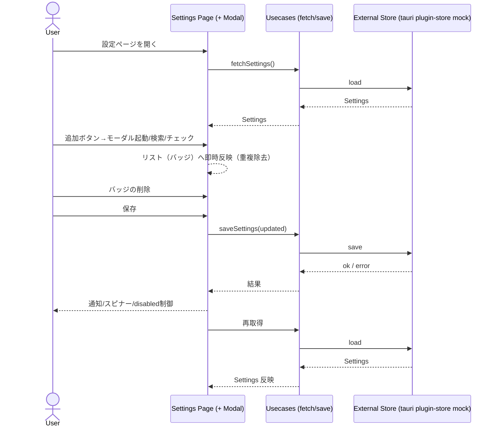

# 設計書: 設定ページの言語カスタマイズ統合テスト追加

## 概要

本設計は、設定ページにおける「学習対象言語（learningTargetLanguages）」「説明言語（explanationLanguages）」のカスタマイズ操作（表示/追加/検索/削除/保存/再読込）をブラウザモード統合テストで担保するための具体的な試験設計を定義する。重要点: これはフロントエンド全体の統合テストであり、ユースケース/リポジトリ等のユーザーコードはモックせず実物を通す。モック対象は Tauri 系の外部依存（plugin-store/stronghold/api など）のみ。

### 目標

- R1/R2 の操作系列（表示→追加/検索→削除→保存→再読込）を UI 経由で検証
- R3 の名称表示の一貫性を検証（表示名＝`bcp47ToLanguageName`、翻訳はモーダル内で利用）
- R4 の保存失敗/読込失敗時の通知・状態遷移を検証

### 非目標

- API キー表示/アプリ情報表示等の周辺機能のリグレッション
- 最低選択数や並び順ルールの導入/変更（現行準拠）

## アーキテクチャ方針

- 実行モード: Vitest Browser Mode（`npm run test:browser`）
- レイヤ依存関係（既存遵守）: Presentation（Settings 画面/Modal）→ Application（`fetchSettings`/`saveSettings`）→ Infrastructure（実装そのもの）／Domain（`Settings`）
- モック対象は外部のみ: `@tauri-apps/plugin-store`, `@tauri-apps/plugin-stronghold`, `@tauri-apps/api/{core,path,app}` 等。
- i18n は `i18nStore` の既存辞書を使用（英語/日本語）。言語名は `src/lib/utils/language.ts` の `bcp47ToLanguageName` を参照。



## 試験対象 UI とセレクタ方針

- 既存の `src/integration-tests/episode-*.browser.test.ts` と同様、ロール/ラベル/テキストを優先して要素取得。
- 取得が難しい箇所のみ最小限のアクセシビリティ属性を追加。
  - 提案: バッジ内の削除ボタンに `aria-label="Remove <LanguageName>"` を付与（例: `Remove English`）。これで安定してクリック可能。
  - 追加ボタンは文言（`Add Language`/`Add Explanation Language`）で取得。

## テストケース設計

前提: 外部のみモック。`@tauri-apps/plugin-store` は stateful なモックインスタンスを返し、`get/set/save` が同一インスタンスのメモリ状態に反映される（永続化の再読込検証を可能にする）。ユースケース/リポジトリはモックしない。

### TC1: 学習対象言語の表示/追加/検索/削除/保存/再読込（R1）

手順

1. 初期設定: `learningTargetLanguages=[]`。
2. `load()`→`render()` し、`Learning Target Languages` に `None (All languages are targeted)` が見える。
3. `Add Language` をクリック→モーダル表示。
4. 検索 UI があれば `jap` 入力→`Japanese` をチェック。
5. モーダルを閉じる。
6. 画面に `Japanese` バッジが 1 個表示、重複無し。
7. `Save` クリック→ボタン disabled / `Saving...` 表示。
8. `invalidateAll` をモックして `load()`→`rerender()` を実行（既存 Episode 系テストの手法）。同一ストアのメモリ状態を参照して `Japanese` が表示維持される。

検証ポイント

- 追加の即時反映、重複禁止
- 保存中の UI 状態（disabled + spinner）
- save → load の持続性

### TC2: 学習対象言語の削除（R1.4）

手順

1. 初期設定: `learningTargetLanguages=["ja","en"]`。
2. `Remove English` をクリック。
3. `English` が消え、`Japanese` は残る。
4. 保存→再取得後も `en` が復活しないこと。

### TC3: 説明言語の表示/追加/削除/保存/再読込（R2）

手順（TC1 と同様の流れを `expl-*` で実施）

1. 初期設定: `explanationLanguages=["en"]`。
2. `Add Explanation Language` → `Japanese` を選択。
3. 説明言語側に `Japanese` バッジが出現し、重複無し。
4. 保存→再取得で `en, ja` が表示維持。

### TC4: 名称の一貫性（R3）

検証

- バッジ表示名が `bcp47ToLanguageName(code)` の戻り値と一致すること。
- モーダル内の表示は i18n 翻訳キーを利用可能（存在すれば翻訳名、無ければ英語名）。

実装補助

- テスト側で `bcp47ToLanguageName` を直接参照し、期待名を組み立てて照合。

### TC5: 保存失敗時の UI（R4.1）

手順

1. plugin-store の `save` を一時的に `Promise.reject` させる。
2. 保存を実行→`settings-toast` に `settings.notifications.saveError` の文言が出る。
3. スピナーが停止し、`settings-save-btn` の `disabled` が解除。

### TC6: 読込失敗時の UI（R4.2）

手順

1. 初回 `storeLoad` を `Promise.reject` にして、設定取得を失敗させる（結果として `load()` がエラーキーを返す）。
2. `settings-toast` に `settings.notifications.loadError` 表示。

## 実装方針（テストコード）

- ランナ/環境: `vitest-browser-svelte`（既存と同一）
- 配置: `src/integration-tests/settings.languages.browser.test.ts`
- スタイル: `episode-group.browser.test.ts` / `episode-list.browser.test.ts` を踏襲
- 再描画: `invalidateAll` をモックして `load()`→`rerender()`（Episode 系と同じ）
- セレクタ: ロール/テキスト優先。必要最小限の `aria-label` 追加で補助。

擬似コード例

```ts
// src/integration-tests/settings.languages.browser.test.ts
import { i18nStore } from '$lib/application/stores/i18n.svelte';
import { bcp47ToLanguageName } from '$lib/utils/language';
import { render } from 'vitest-browser-svelte';
import { page } from 'vitest/browser';
import Component from '../routes/settings/+page.svelte';
import { load } from '../routes/settings/+page';
import { outputCoverage } from './lib/outputCoverage';

vi.mock('@tauri-apps/plugin-store');
vi.mock('@tauri-apps/plugin-stronghold');
vi.mock('@tauri-apps/api/core');
vi.mock('@tauri-apps/api/path');
vi.mock('@tauri-apps/api/app');

import { load as storeLoad } from '@tauri-apps/plugin-store';
import { getVersion } from '@tauri-apps/api/app';
import { invoke } from '@tauri-apps/api/core';
import { appDataDir } from '@tauri-apps/api/path';
import { invalidateAll } from '$app/navigation';

function createStatefulStore(
  initial = { language: 'en', ltl: [] as string[], expl: [] as string[] }
) {
  const state = { ...initial };
  return {
    get: vi.fn(async (k: string) => {
      if (k === 'language') return state.language;
      if (k === 'learningTargetLanguages') return state.ltl;
      if (k === 'explanationLanguages') return state.expl;
      return null;
    }),
    set: vi.fn(async (k: string, v: unknown) => {
      if (k === 'language') state.language = String(v);
      if (k === 'learningTargetLanguages') state.ltl = v as string[];
      if (k === 'explanationLanguages') state.expl = v as string[];
    }),
    save: vi.fn(async () => void 0),
  } as const;
}

beforeEach(() => {
  i18nStore.init('en');
  vi.clearAllMocks();
});

afterAll(async () => {
  await outputCoverage(import.meta.url);
});

test('R1: LTL add/save/reload end-to-end', async () => {
  const store = createStatefulStore({ language: 'en', ltl: [], expl: [] });
  vi.mocked(storeLoad).mockResolvedValue(store as never);
  vi.mocked(invoke).mockResolvedValue('pw');
  vi.mocked(appDataDir).mockResolvedValue('/tmp');
  vi.mocked(getVersion).mockResolvedValue('1.0.0');

  const data = await load({} as never);
  const rr = render(Component, { data, params: {} });

  vi.mocked(invalidateAll).mockImplementation(async () => {
    const refreshed = await load({} as never);
    await rr.rerender({ data: refreshed, params: {} });
  });

  await expect.element(page.getByText('None (All languages are targeted)')).toBeInTheDocument();
  await page.getByRole('button', { name: 'Add Language' }).click();
  await page.getByRole('checkbox', { name: 'Japanese' }).check();
  await page.getByRole('button', { name: 'Save' }).click();

  await expect.element(page.getByText(bcp47ToLanguageName('ja')!)).toBeInTheDocument();
});
```

## モック/スタブ戦略（外部のみ）

- `@tauri-apps/plugin-store`: stateful モック（単一インスタンス）。`get/set/save` が内部状態を反映。
- `@tauri-apps/plugin-stronghold`: 既存 `setupStrongholdMock` を利用（API キー有無シナリオ）。
- `@tauri-apps/api/{core,path,app}`: `invoke/appDataDir/getVersion` を既存テスト同様にモック。
- i18n: 既存ロケールをロード。テストは英語ロケール中心。
- 再描画: `invalidateAll` をモックして `load()`→`rerender()`（Episode 系と同パターン）。

## 受け入れ基準トレーサビリティ

- R1.1〜R1.6 → TC1/TC2
- R2.1〜R2.4 → TC3
- R3.1〜R3.2 → TC4
- R4.1 → TC5、R4.2 → TC6

## リスクと対策

- モーダルの閉じ方の差異（ボタン/オーバーレイ）→ ヘルパで両対応
- バッジ内のアイコンボタンは `aria-label` で安定取得（アクセシビリティ向上にも寄与）
- ブラウザモードと実機の差 → 統合テストは UI のみを担保、リリース前は Tauri 結合の E2E で補完

## 実装タスク（次工程の入力）

- テストファイル `src/integration-tests/settings.languages.browser.test.ts` 追加
- `src/integration-tests/lib/mockFactories.ts` に stateful な Store モックを追加（既存 `createMockStore` を拡張 or 新関数追加）
- `invalidateAll` の再描画モックを導入
- 可能であれば `+page.svelte` の削除ボタンに `aria-label` を付与
