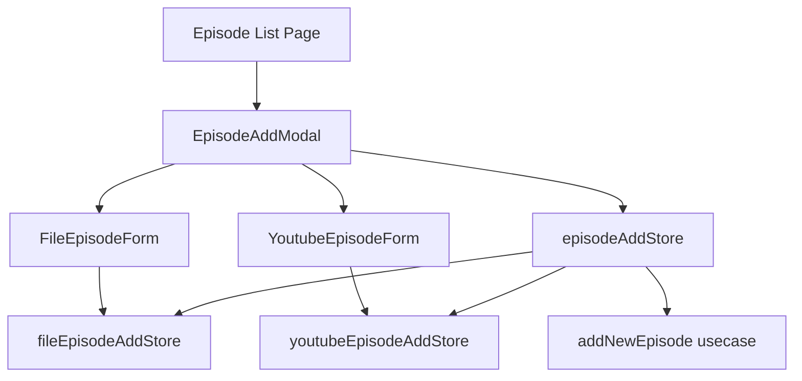
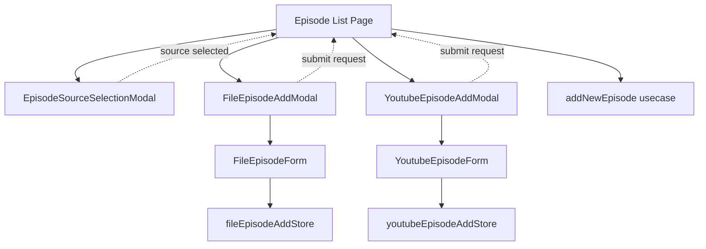
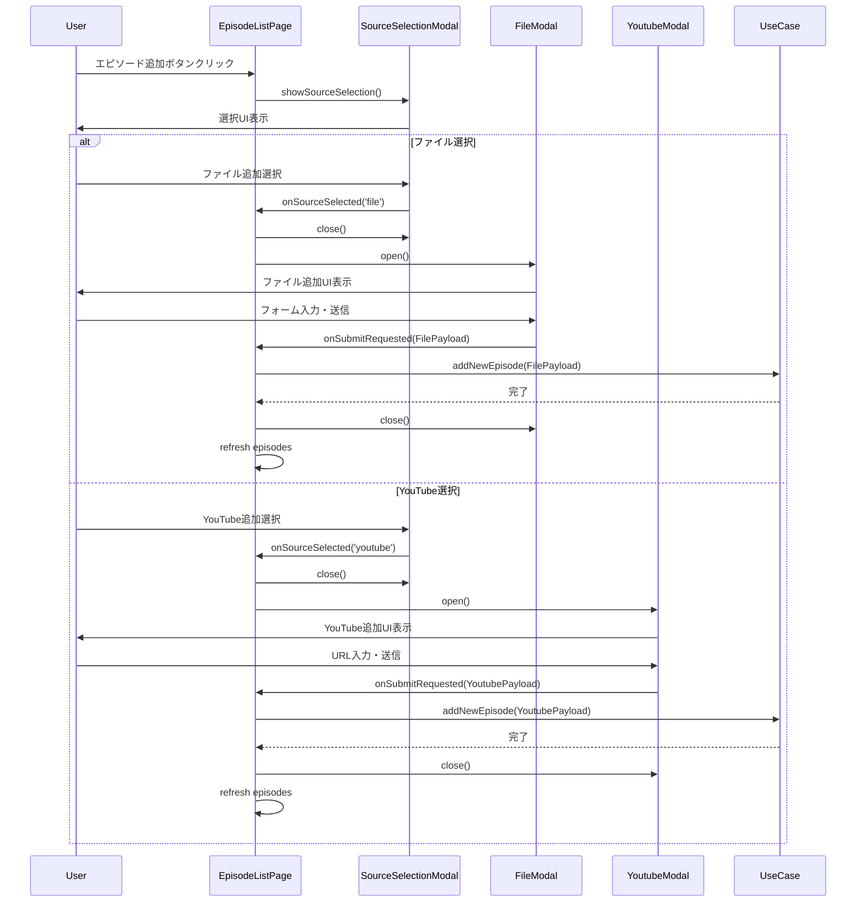
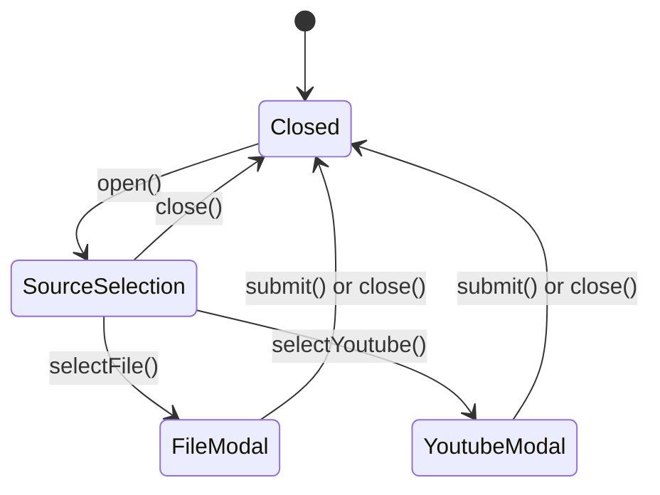

# 技術設計書

## 概要

エピソード追加機能を、事前選択ダイアログによってファイル追加とYouTube追加の独立したダイアログに分離するリファクタリングプロジェクトです。現在の統合された`EpisodeAddModal`を削除し、各機能に特化した専用ダイアログを実装することで、相互依存を除去し保守性を向上させます。

## 要件トレーサビリティ

### 要件1: エピソード追加方法選択UI

- **対応コンポーネント**: `EpisodeSourceSelectionModal`
- **実装アプローチ**: シンプルなモーダルダイアログでファイル/YouTube選択を提供

### 要件2: ファイル追加専用ダイアログ

- **対応コンポーネント**: `FileEpisodeAddModal`
- **実装アプローチ**: 既存`FileEpisodeForm`を独立モーダルに昇格

### 要件3: YouTube動画追加専用ダイアログ

- **対応コンポーネント**: `YoutubeEpisodeAddModal`
- **実装アプローチ**: 既存`YoutubeEpisodeForm`を独立モーダルに昇格

### 要件4: ダイアログ間の独立性確保

- **対応コンポーネント**: 分離されたストアとモーダルコンポーネント
- **実装アプローチ**: 既存独立ストア活用と共有状態の除去

### 要件5: 統合コンポーネント・ストアの削除

- **対応アプローチ**: `EpisodeAddModal`と`episodeAddStore`の段階的削除

### 要件6: 既存機能との互換性

- **対応アプローチ**: 既存ユースケースAPIとペイロード形式の維持

## アーキテクチャパターンと境界マップ

### 現在のアーキテクチャ



### ターゲットアーキテクチャ



注：点線は状態通知・リクエストを表し、実線は直接的な制御関係を表します。ユースケースは routes レベル（Episode List Page）でのみ利用。

### アーキテクチャ境界

**Presentation Layer**:

- `EpisodeSourceSelectionModal`: ソース選択専用
- `FileEpisodeAddModal`: ファイル追加専用モーダル
- `YoutubeEpisodeAddModal`: YouTube追加専用モーダル

**Application Layer**:

- 既存の独立ストア（`fileEpisodeAddStore`、`youtubeEpisodeAddStore`）を維持
- `addNewEpisode` ユースケースは変更なし

**Domain & Infrastructure Layer**:

- 変更なし（既存のペイロード型とリポジトリを維持）

## 技術スタックとアライメント

### 使用技術

- **Framework**: Svelte 5 + SvelteKit（既存）
- **State Management**: Svelte Runes（既存パターン）
- **UI Library**: Flowbite-Svelte Modal コンポーネント
- **Type System**: TypeScript（既存型定義を再利用）

### 既存パターンへの準拠

- **3層アーキテクチャ**: Presentation → Application → Infrastructure の順守
- **ユースケース駆動**: プレゼンテーション層からのユースケース呼び出し
- **Repository 抽象化**: インフラ層での外部I/O抽象化
- **Type Safety**: TypeScript strict モードと既存エンティティ型の活用

## コンポーネントとインターフェース契約

### EpisodeSourceSelectionModal

```typescript
interface EpisodeSourceSelectionModalProps {
  open: boolean;
  onClose: () => void;
  onSourceSelected: (source: 'file' | 'youtube') => void;
}
```

**責任**:

- エピソード追加方法の選択UI提供
- 選択結果の親ページへの通知
- 選択キャンセル時の状態リセット

**依存関係**: なし（プレゼンテーション層のみ、ステートレス）

**重要制約**: Flowbite Svelteモーダルから別モーダルを直接開くことはできないため、選択結果は親ページ（Episode List Page）に委譲

### FileEpisodeAddModal

```typescript
interface FileEpisodeAddModalProps {
  open: boolean;
  onClose: () => void;
  onSubmitRequested: (payload: FileEpisodeAddPayload) => Promise<void>;
  onTsvFileSelected: (filePath: string) => Promise<void>;
  onTtsEnabled: () => Promise<void>;
  onDetectScriptLanguage: () => Promise<void>;
}

interface FileEpisodeAddModalStore {
  readonly show: boolean;
  readonly isSubmitting: boolean;
  open(): void;
  close(): void;
  requestSubmit(): Promise<void>;
  buildPayload(): FileEpisodeAddPayload | null;
}
```

**責任**:

- ファイルベースエピソード追加のみの UI 管理
- TSV設定、TTS設定、言語検出機能の統合
- ファイル選択とバリデーション
- フォーム送信時の親ページへの通知

**依存関係**:

- `fileEpisodeAddStore`（状態管理）
- `FileEpisodeForm`（フォームUI）
- 親ページ（Episode List Page）への送信リクエスト通知のみ

### YoutubeEpisodeAddModal

```typescript
interface YoutubeEpisodeAddModalProps {
  open: boolean;
  onClose: () => void;
  onSubmitRequested: (payload: YoutubeEpisodeAddPayload) => Promise<void>;
  onYoutubeUrlChanged: (url: string) => Promise<void>;
}

interface YoutubeEpisodeAddModalStore {
  readonly show: boolean;
  readonly isSubmitting: boolean;
  open(): void;
  close(): void;
  requestSubmit(): Promise<void>;
  buildPayload(): YoutubeEpisodeAddPayload | null;
}
```

**責任**:

- YouTubeベースエピソード追加のみの UI 管理
- URL入力、メタデータ取得、言語サポート確認
- YouTube固有のバリデーション
- フォーム送信時の親ページへの通知

**依存関係**:

- `youtubeEpisodeAddStore`（状態管理）
- `YoutubeEpisodeForm`（フォームUI）
- 親ページ（Episode List Page）への送信リクエスト通知のみ

### State Management Integration

```typescript
// 既存ストアの再利用
interface FileEpisodeAddStore {
  // 既存インターフェース維持
  buildPayload(): FileEpisodeAddPayload | null;
  reset(): void;
  // ... 既存メソッド
}

interface YoutubeEpisodeAddStore {
  // 既存インターフェース維持
  buildPayload(): YoutubeEpisodeAddPayload | null;
  reset(): void;
  // ... 既存メソッド
}

// Episode List Page レベルでのモーダル状態管理
interface EpisodeModalController {
  readonly activeModal: 'none' | 'source-selection' | 'file' | 'youtube';
  showSourceSelection(): void;
  showFileModal(): void;
  showYoutubeModal(): void;
  closeAll(): void;
  handleSourceSelected(source: 'file' | 'youtube'): void;
}
```

## データモデル

### 既存データモデルの維持

```typescript
// 変更なし - 既存型を継続使用
type EpisodeAddPayload = FileEpisodeAddPayload | YoutubeEpisodeAddPayload;

interface FileEpisodeAddPayload {
  readonly source: 'file';
  readonly title: string;
  readonly audioFilePath: string;
  readonly scriptFilePath: string;
  readonly learningLanguage: string;
  readonly tsvConfig?: TsvConfig;
}

interface YoutubeEpisodeAddPayload {
  readonly source: 'youtube';
  readonly metadata: YoutubeMetadata;
  readonly url: string;
}
```

### 新規状態モデル

```typescript
// Episode List Page レベルでの状態管理
interface EpisodeModalState {
  readonly showSourceSelection: boolean;
  readonly showFileModal: boolean;
  readonly showYoutubeModal: boolean;
  readonly activeModal: ModalType;
}

type ModalType = 'none' | 'source-selection' | 'file' | 'youtube';

// Svelte Runes パターン
interface EpisodeModalController {
  // 状態
  readonly activeModal: { readonly value: ModalType };

  // アクション
  showSourceSelection(): void;
  showFileModal(): void;
  showYoutubeModal(): void;
  closeAll(): void;
  handleSourceSelected(source: 'file' | 'youtube'): void;
}
```

### APIとイベント契約

### 内部API契約

**Episode List Page でのモーダル制御**:

```typescript
// Episode List Page の責任
interface EpisodeListPageModalControl {
  // ソース選択開始
  handleAddEpisodeClick(): void;

  // ソース選択結果の処理
  handleSourceSelected(source: 'file' | 'youtube'): void;

  // エピソード追加処理（ユースケース利用）
  handleFileEpisodeSubmit(payload: FileEpisodeAddPayload): Promise<void>;
  handleYoutubeEpisodeSubmit(payload: YoutubeEpisodeAddPayload): Promise<void>;

  // モーダル状態管理
  closeSourceSelection(): void;
  openFileModal(): void;
  openYoutubeModal(): void;
  closeAllModals(): void;
}

// Modal → Parent Page のコールバック
interface ModalCallbacks {
  onModalClosed(): void;
  onSourceSelected?: (source: 'file' | 'youtube') => void;
  onSubmitRequested?: (payload: EpisodeAddPayload) => Promise<void>;
}
```

### 外部API契約（既存維持）

**ユースケース呼び出し**:

```typescript
// 変更なし - 既存契約を維持
// Episode List Page でのみ利用
async function addNewEpisode(payload: EpisodeAddPayload, groupId: string): Promise<Episode>;
```

**イベントハンドリング**:

```typescript
// 既存パターンを継続
interface EpisodeAddCallbacks {
  onTsvFileSelected: (filePath: string) => Promise<void>;
  onYoutubeUrlChanged: (url: string) => Promise<void>;
  onTtsEnabled: () => Promise<void>;
  onDetectScriptLanguage: () => Promise<void>;
}
```

## 実装フロー

### エピソード追加フロー



### 状態管理フロー



## エラーハンドリング

### エラー分類と責任

**SourceSelectionModal**:

- エラーなし（選択のみ、副作用なし）

**FileEpisodeAddModal**:

```typescript
interface FileModalErrors {
  fileSelection: 'FILE_NOT_FOUND' | 'INVALID_FORMAT';
  languageDetection: 'DETECTION_FAILED' | 'UNSUPPORTED_LANGUAGE';
  ttsSetup: 'VOICE_UNAVAILABLE' | 'MODEL_DOWNLOAD_REQUIRED';
  submission: 'NETWORK_ERROR' | 'VALIDATION_FAILED';
}
```

**YoutubeEpisodeAddModal**:

```typescript
interface YoutubeModalErrors {
  urlValidation: 'INVALID_URL' | 'VIDEO_UNAVAILABLE';
  metadata: 'FETCH_FAILED' | 'NO_CAPTIONS';
  languageSupport: 'UNSUPPORTED_LANGUAGE';
  submission: 'NETWORK_ERROR' | 'DOWNLOAD_FAILED';
}
```

### エラー境界戦略

- **局所化**: 各モーダルは独自のエラー状態を管理
- **非伝播**: 一方のモーダルエラーは他方に影響しない
- **リセット**: モーダルクローズ時にエラー状態をリセット
- **ユーザビリティ**: 具体的でアクション可能なエラーメッセージ

## セキュリティ考慮事項

### ファイルアクセスセキュリティ

- **File Selection**: Tauri dialog プラグインによる安全なファイル選択
- **Path Validation**: ファイルパスのサニタイゼーション（既存実装継続）

### YouTube API セキュリティ

- **API Key Protection**: Stronghold による秘匿情報管理（既存方式）
- **URL Validation**: YouTube URL の厳密な検証（既存実装継続）

### 状態管理セキュリティ

- **State Isolation**: モーダル間の状態分離によるデータ漏洩防止
- **Sensitive Data**: 機密情報の適切なクリーンアップ

## パフォーマンス・スケーラビリティ

### レンダリング最適化

- **Lazy Loading**: モーダルのオンデマンド表示
- **Component Splitting**: 大きなフォームコンポーネントの分割
- **State Localization**: グローバル状態の最小化

### メモリ管理

- **State Cleanup**: モーダルクローズ時の状態リセット
- **Event Listener Management**: 適切なリスナー削除
- **Store Optimization**: 未使用状態の自動ガベージコレクション

### 拡張性設計

- **Modal Pattern**: 新しいソースタイプの追加が容易
- **Store Pattern**: 独立ストアによる機能拡張の容易性
- **Component Reuse**: 共通UIコンポーネントの再利用可能性

## テスト戦略

### 限定スコープ

このリファクタリングでは、以下の理由により最小限のテストのみを追加します：

- **FileEpisodeAddModal**: 今後のフロー見直し予定のためテスト追加を延期
- **ストアのユニットテスト**: 既存ストアを再利用するため新規テスト不要
- **E2Eテスト**: スコープ範囲外

### 統合テスト（追加対象）

統合テストは routes の画面をレンダリングしてフロントエンド全体を動作させ、Tauri (Rust) 部分などユーザーコード以外の外部のものをモックする形で行う。
既存の src/integration-tests/\*.browser.test.ts を参考に、以下の統合テストを追加実装します。

```typescript
// episode-list 画面での EpisodeSourceSelectionModal を利用する動作の統合テスト
describe('episode-list.source.browser.test.ts', () => {
  test('renders file and YouTube selection options', async () => {
    // ファイル追加とYouTube追加の選択肢が表示されることを確認
  });

  test('handles file source selection', async () => {
    // ファイル追加選択時に FileEpisodeAddModal が開くことを確認
  });

  test('handles YouTube source selection', async () => {
    // YouTube追加選択時に YoutubeEpisodeAddModal が開くことを確認
  });

  test('closes on cancel button click', async () => {
    // キャンセルボタンクリック時に EpisodeSourceSelectionModal が閉じることを確認
  });

  test('closes on overlay click', async () => {
    // モーダルオーバーレイクリック時の動作確認（Flowbite Svelte標準動作）
  });
});

// episode-list 画面での YoutubeEpisodeAddModal を利用する動作の統合テスト
describe('episode-list.youtube.browser.test.ts', () => {
  test('renders YouTube episode form', async () => {
    // YouTubeEpisodeForm コンポーネントが適切にレンダリングされることを確認
  });

  test('handles URL input and validation', async () => {
    // YouTube URL入力時の検証動作とメタデータ取得を確認
  });

  test('handles submit request with valid payload', async () => {
    // フォーム送信成功時のページ遷移イベントが発生することを確認
  });

  test('handles form validation errors', async () => {
    // 入力エラー時のエラー表示とsubmitブロックを確認
  });

  test('closes on cancel', async () => {
    // キャンセル時にモーダルが閉じることを確認
  });
});
```

### テスト配置

- **ファイル配置**: `src/integration-tests/` ディレクトリ
- **命名規則**: `*.browser.test.ts` （既存パターンに合わせて）
- **テスト環境**: Vitest Browser モード使用

### 既存テストの継続

```
// 影響を受ける可能性のある既存テスト
- `src/integration-tests/episode-list.browser.test.ts;
// Episode List Page でのモーダル呼び出し部分の動作確認
```

## 移行計画

### Phase 1: 新規コンポーネント作成

1. `EpisodeSourceSelectionModal` の実装
2. `FileEpisodeAddModal` の実装
3. `YoutubeEpisodeAddModal` の実装
4. 新規ストア（`sourceSelectionStore`）の作成

### Phase 2: 統合とテスト

1. `episode-list` ページでのモーダル制御ロジック実装
2. 3つのモーダル間の状態遷移実装
3. 既存フォームコンポーネントの再利用
4. 統合テストの実装
5. Flowbite Svelteモーダル制約の動作確認

### Phase 3: 旧コンポーネント削除

1. `EpisodeAddModal` の参照削除
2. `episodeAddStore` の参照削除
3. 旧ファイルの物理削除
4. ビルド確認とクリーンアップ

### 互換性保証

- **ユースケース API**: 変更なし
- **ペイロード形式**: 既存形式を維持
- **テストケース**: 既存テストの継続合格
- **機能完全性**: 全ての既存機能を新しいダイアログで実現

## 実装完了の成功基準

### 機能要件

- ✅ 3つのモーダルが独立して動作
- ✅ ファイル追加の全機能（TSV、TTS、言語検出）が利用可能
- ✅ YouTube追加の全機能（メタデータ、バリデーション）が利用可能
- ✅ 旧コンポーネント（`EpisodeAddModal`、`episodeAddStore`）が完全削除

### 技術要件

- ✅ TypeScript strict mode でのコンパイル成功
- ✅ 既存テストケースの継続合格
- ✅ ESLint、Prettier チェックの通過
- ✅ ビルドプロセスでの警告・エラーなし

### 品質要件

- ✅ 各モーダルの独立性（状態の相互依存なし）
- ✅ エラー処理の局所化
- ✅ ユーザビリティの維持・向上
- ✅ パフォーマンスの劣化なし

### テスト要件（限定スコープ）

- ✅ `EpisodeSourceSelectionModal` 利用の統合テスト合格
- ✅ `YoutubeEpisodeAddModal` 利用の統合テスト合格
- ✅ 既存の `episode-list.browser.test.ts` の継続合格
- ❌ `FileEpisodeAddModal` のテスト（今後のフロー見直し後に実施）
- ❌ 新規ストアのユニットテスト（既存ストア再利用のため不要）
- ❌ E2Eテスト（スコープ範囲外）
