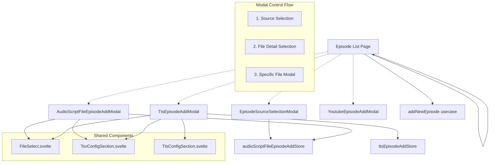
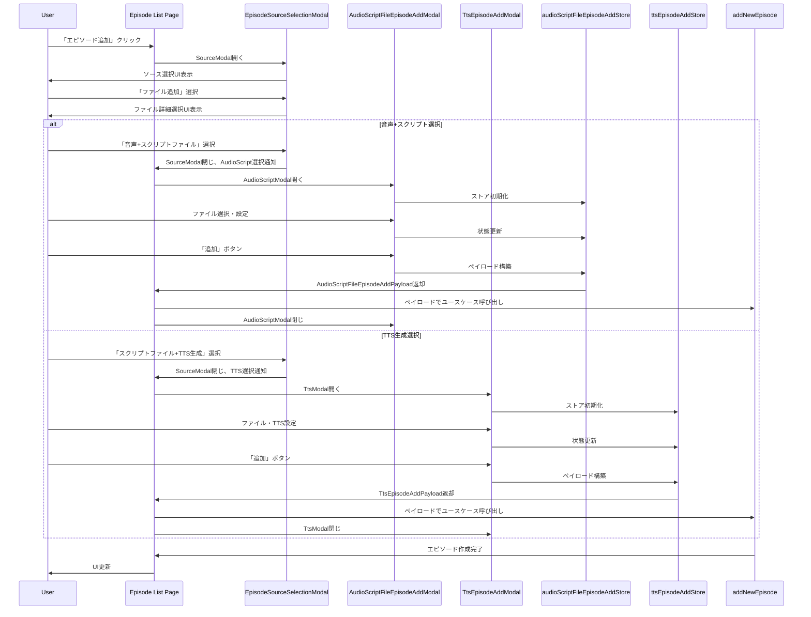

# 技術設計書

## 概要

### 機能説明

既存のFileEpisodeAddModalを音声+スクリプトファイル専用とTTS音声生成専用の独立したダイアログに分離し、EpisodeSourceSelectionModalを拡張してファイル追加方法の詳細選択を可能にする。これにより、各ワークフローに最適化されたUXと明確な責任分離を実現する。

### 主要目標

- **UI複雑性軽減**: シナリオ別に特化したダイアログで操作を簡素化
- **機能独立性**: 音声ファイル処理とTTS処理の完全分離
- **保守性向上**: 明確な責任境界による開発・テスト効率化
- **段階的移行**: 既存機能を破損させない安全な移行プロセス

### 影響範囲

**変更対象**:

- `EpisodeSourceSelectionModal.svelte` — ファイル詳細選択機能追加
- `FileEpisodeAddModal.svelte` → 削除予定
- `fileEpisodeAddStore.svelte.ts` → 削除予定（段階的）
- 新規: `AudioScriptFileEpisodeAddModal.svelte`, `TtsEpisodeAddModal.svelte`
- 新規: `audioScriptFileEpisodeAddStore.svelte.ts`, `ttsEpisodeAddStore.svelte.ts`
- `src/routes/episode-list/[groupId]/+page.svelte` — 全Modal制御とユースケース呼び出し追加

**影響なし**:

- `addNewEpisode` ユースケースAPI
- データベーススキーマ
- 既存テストケース（互換性維持）

## アーキテクチャパターンと境界マップ

### 全体アーキテクチャ



注: ここで FileSelect コンポーネントは音声ファイル選択とスクリプトファイル選択の両方に対応している。TtsEpisodeAddModal では音声ファイル選択UIは表示されないが、スクリプトファイル選択のために FileSelect コンポーネントを使用する。

### コンポーネント境界

**プレゼンテーション層**:

- `Episode List Page` — 全Modalの制御と表示管理、ユースケース呼び出し
- `EpisodeSourceSelectionModal` — ソース選択とファイル詳細ナビゲーション
- `AudioScriptFileEpisodeAddModal` — 音声+スクリプトファイル両方提供専用UI
- `TtsEpisodeAddModal` — TTS音声生成専用UI

**アプリケーション層**:

- `audioScriptFileEpisodeAddStore` — 音声+スクリプトファイル両方提供ワークフロー状態管理
- `ttsEpisodeAddStore` — TTS生成ワークフロー状態管理
- `addNewEpisode` — 統一エピソード作成ユースケース（変更なし）

**境界ルール**:

- **Modal制御**: Episode List Pageが全てのModalの開閉を管理（Flowbite制約対応）
- **ユースケース呼び出し**: Episode List Pageのみがusecaseを呼び出し
- **状態管理**: 各Modalは専用ストアのみ参照、ストアはusecaseを呼び出さない
- **データフロー**: Modal → Store → Episode List Page → Usecase

## 技術スタックとアライメント

### 使用技術

**フロントエンド**:

- Svelte 5 + runes（`$state`, `$derived`、`$effect`は必要最小限で使用）
- Flowbite-Svelte（Modal, Button, Input, Select コンポーネント）
- TypeScript strict モード

**Svelte 5 runes使用方針**:

- `$state`: 基本的なリアクティブ状態管理
- `$derived`: 計算プロパティとして積極活用
- `$effect`: 公式推奨に従い、どうしても必要な場合以外は使用を控える

**パターン準拠**:

- 3層アーキテクチャ（Presentation → Application → Infrastructure）
- Svelte runes ベース状態管理
- Repository パターンによる外部I/O抽象化

### ステアリング原則適合

**構造パターン準拠**:

- ユースケース主導フロー維持
- ストア責任分離原則
- コンポーネント再利用パターン

**技術標準準拠**:

- TypeScript strict type safety
- Svelte 5 最新パターン
- ESLint + Prettier コード品質

## コンポーネントとインターフェース契約

### Episode List Page（拡張）

**責任**: 全Modal制御、ユースケース呼び出し、UI状態管理

```typescript
interface EpisodeListPageModalState {
  sourceSelectionOpen: boolean;
  audioScriptFileModalOpen: boolean;
  ttsModalOpen: boolean;
  youtubeModalOpen: boolean;

  // Modal間遷移制御
  selectedFileType: 'audio-script' | 'script-tts' | null;
}

interface EpisodeListPageMethods {
  // Modal制御
  openSourceSelection(): void;
  closeAllModals(): void;

  // ユースケース呼び出し
  handleEpisodeSubmit(
    payload: AudioScriptFileEpisodeAddPayload | TtsEpisodeAddPayload
  ): Promise<void>;

  // Modal間遷移
  handleSourceSelected(source: EpisodeSource | FileDetailType): void;
  handleModalCancelled(): void;
}
```

### EpisodeSourceSelectionModal（拡張）

**責任**: エピソード追加ソース選択とファイル詳細ナビゲーション

```typescript
interface EpisodeSourceSelectionModalProps {
  open: boolean;
  onClose: () => void;
  onSourceSelected: (source: EpisodeSource | FileDetailType) => void;
}

type EpisodeSource = 'file' | 'youtube';
type FileDetailType = 'audio-script' | 'script-tts';

// 拡張されたイベントハンドリング
type SourceSelectionEvent = EpisodeSource | FileDetailType;
```

**内部状態**:

```typescript
interface ModalInternalState {
  currentView: 'source-selection' | 'file-detail-selection';
  selectedSource: EpisodeSource | null;
}
```

### AudioScriptFileEpisodeAddModal（新規）

**責任**: 音声+スクリプトファイル両方提供専用エピソード追加UI

```typescript
interface AudioScriptFileEpisodeAddModalProps {
  open: boolean;
  onClose: () => void;
  onSubmitRequested: (payload: AudioScriptFileEpisodeAddPayload | null) => void;
  onTsvFileSelected: (filePath: string) => Promise<void>;
  onDetectScriptLanguage: () => Promise<void>;
}

interface AudioScriptFileEpisodeAddPayload {
  readonly source: 'file';
  readonly title: string;
  readonly audioFilePath: string;
  readonly scriptFilePath: string;
  readonly learningLanguage: string;
  readonly tsvConfig?: TsvConfig;
}
```

**機能スコープ**:

- 音声ファイル選択必須
- スクリプトファイル選択
- TSV設定（該当時）
- 言語検出・選択
- **除外**: TTS関連機能一切

### TtsEpisodeAddModal（新規）

**責任**: TTS音声生成専用エピソード追加UI

```typescript
interface TtsEpisodeAddModalProps {
  open: boolean;
  onClose: () => void;
  onSubmitRequested: (payload: TtsEpisodeAddPayload | null) => void;
  onTsvFileSelected: (filePath: string) => Promise<void>;
  onDetectScriptLanguage: () => Promise<void>;
  onTtsEnabled: () => Promise<void>;
}

interface TtsEpisodeAddPayload {
  readonly source: 'file';
  readonly title: string;
  readonly audioFilePath: string; // TTS生成ファイルパス
  readonly scriptFilePath: string;
  readonly learningLanguage: string;
  readonly tsvConfig?: TsvConfig;
}
```

**機能スコープ**:

- スクリプトファイル選択必須
- TSV設定（該当時）
- TTS設定とボイス選択
- TTS音声生成
- **除外**: 音声ファイル選択UI

### Store Architecture

**audioScriptFileEpisodeAddStore**:

```typescript
interface AudioScriptFileEpisodeAddStore {
  // 基本状態
  title: string;
  audioFilePath: string | null;
  scriptFilePath: string | null;
  selectedStudyLanguage: string | null;
  errorMessage: string;

  // サブストア
  tsv: TsvConfigStore;

  // メソッド（ユースケース呼び出しなし）
  buildPayload(): AudioScriptFileEpisodeAddPayload | null;
  reset(): void;
  completeLanguageDetection(language: string | null, supportedLanguages: readonly string[]): void;
  validateForm(): boolean;
}
```

**ttsEpisodeAddStore**:

```typescript
interface TtsEpisodeAddStore {
  // 基本状態
  title: string;
  scriptFilePath: string | null;
  selectedStudyLanguage: string | null;
  errorMessage: string;

  // サブストア
  tsv: TsvConfigStore;
  tts: TtsConfigStore;

  // メソッド（ユースケース呼び出しなし）
  buildPayload(): TtsEpisodeAddPayload | null;
  reset(): void;
  completeLanguageDetection(language: string | null, supportedLanguages: readonly string[]): void;
  validateForm(): boolean;
}
```

## データフローと状態遷移

### ユーザーフロー



### 状態管理パターン

**責任分離の実装**:

- **Episode List Page**: Modal開閉制御、ユースケース呼び出し、全体フロー管理
- **各Modal**: UI表示とユーザー入力処理、専用ストアとの連携
- **各Store**: フォーム状態管理、バリデーション、ペイロード構築（ユースケース呼び出しなし）

**データフロー制御**:

- Modal → Store（状態更新）→ Episode List Page（ペイロード受け取り）→ Usecase
- 各Storeはユースケースを直接呼び出さず、ペイロード構築まで
- Episode List Pageが全ての非同期処理（ユースケース呼び出し）を担当

**状態リセット戦略**:

- Episode List Page主導でのModal開閉時リセット
- エラー状態の適切なクリア
- サブストア（TSV, TTS）の連動リセット

## エラーハンドリング戦略

### エラー分類と対応

**入力検証エラー**:

- 必須フィールド未入力 → ローカルバリデーション、即座フィードバック
- ファイル形式不正 → ファイル選択時検証、エラーメッセージ表示

**システムエラー**:

- ファイル読込失敗 → try-catch、ユーザーフレンドリーメッセージ
- TTS生成失敗 → TTS設定の再確認促進、代替手段提示

**ネットワークエラー**:

- 言語検出API失敗 → 手動言語選択モードに切替
- LLM API失敗 → エラーログ記録、後続処理継続

### エラー伝播ルール

```typescript
// ダイアログレベル
interface DialogErrorHandling {
  displayUserMessage(error: UserFacingError): void;
  logSystemError(error: SystemError): void;
  resetErrorState(): void;
}

// ストアレベル
interface StoreErrorHandling {
  setErrorMessage(message: string): void;
  clearError(): void;
  validateInputs(): ValidationResult;
}
```

## パフォーマンス考慮事項

### コンポーネント最適化

**レンダリング効率**:

- `$derived` による計算プロパティ最適化
- 条件分岐レンダリング（`{#if}`）の適切な使用
- 不要な再レンダリング抑制

**メモリ管理**:

- ダイアログ閉時のストア状態クリア
- イベントリスナーの適切な削除
- ファイル参照の適切な解放

### データ処理効率

**ファイル処理**:

- ストリーミング読込による大容量ファイル対応
- TSV解析の増分処理
- プレビュー表示の遅延読込

## セキュリティ考慮事項

### 入力サニテーション

**ファイル検証**:

- ファイル拡張子と内容の整合性検証
- サイズ制限の強制
- パス・トラバーサル攻撃の防止

**テキスト入力**:

- HTMLインジェクション防止
- SQL インジェクション対策（バインドパラメータ使用）
- XSS対策（DOMPurify適用）

### 機密情報処理

**一時データ**:

- メモリ内ファイル内容の適切なクリア
- エラーログでの機密情報マスキング
- ストア状態の暗号化検討（将来拡張）

## テスト戦略

### テスト範囲

**統合テスト（ブラウザ）**:

- `episode-list.file.browser.test.ts` — 既存テストの新仕様対応
  - 音声+スクリプトファイル選択フロー
  - TTS音声生成選択フロー
  - ソース選択からファイル詳細選択への遷移
  - 各ダイアログの独立動作確認
- ダイアログ開閉とModal制御フロー
- ファイル選択・処理統合テスト
- エラー処理シナリオ検証

### テストダブル戦略

**モック対象**:

- ファイルシステムアクセス
- TTS API呼び出し
- 言語検出API
- `addNewEpisode` ユースケース

**実データテスト**:

- UI状態遷移とModal制御
- ファイル選択フロー
- ダイアログ間遷移ロジック

## 移行計画

### フェーズ1: 新規コンポーネント実装

**実装対象**:

- `AudioScriptFileEpisodeAddModal.svelte`
- `TtsEpisodeAddModal.svelte`
- `audioScriptFileEpisodeAddStore.svelte.ts`
- `ttsEpisodeAddStore.svelte.ts`

**検証項目**:

- 独立動作確認
- 既存API互換性検証
- 統合テスト合格

### フェーズ2: EpisodeSourceSelectionModal拡張

**実装対象**:

- ファイル詳細選択UI追加
- ナビゲーション状態管理
- 戻る・キャンセル操作

**検証項目**:

- 既存YouTube選択フロー影響なし
- 新ファイル詳細フロー完動
- UI/UXの一貫性確認

### フェーズ3: 統合とFileEpisodeAddModal削除

**実装対象**:

- episode-listページの統合更新
- 既存FileEpisodeAddModal削除
- 不要import・参照クリーンアップ

**検証項目**:

- `episode-list.file.browser.test.ts` 更新版合格
- パフォーマンス劣化なし
- 統合テストワークフロー完全動作

### 後方互換性保証

**API契約維持**:

- `addNewEpisode` ユースケースシグネチャ維持
- ペイロード型の後方互換性
- データベーススキーマ変更なし

**段階的移行**:

- フィーチャフラグによる新旧切替（必要時）
- 移行期間中のロールバック準備
- 本番稼働での段階検証

## 要件マッピング

| 要件                              | 実装コンポーネント                                                  | 検証方法                                                   |
| --------------------------------- | ------------------------------------------------------------------- | ---------------------------------------------------------- |
| 要件1: ファイル追加方法選択UI     | `EpisodeSourceSelectionModal` 拡張                                  | 統合テスト: ファイル詳細選択フロー                         |
| 要件2: 音声ファイル付きダイアログ | `AudioScriptFileEpisodeAddModal` + `audioScriptFileEpisodeAddStore` | 統合: 音声+スクリプト完全フロー                            |
| 要件3: TTS音声生成ダイアログ      | `TtsEpisodeAddModal` + `ttsEpisodeAddStore`                         | 統合: TTS生成完全フロー                                    |
| 要件4: ダイアログ間独立性         | 独立ストア設計 + 明確境界                                           | 統合: 状態分離検証                                         |
| 要件5: 段階的移行                 | 3フェーズ移行計画                                                   | 移行テスト: 各フェーズ検証                                 |
| 要件6: 既存機能互換性             | `addNewEpisode` API維持                                             | 統合テスト: `episode-list.file.browser.test.ts` 更新版合格 |

## 実装ガイダンス

### 開発優先順位

1. **Core stores** — `audioScriptFileEpisodeAddStore`, `ttsEpisodeAddStore`
2. **Modal components** — 独立動作可能な状態で実装
3. **Source selection extension** — 既存フロー影響最小化
4. **Integration** — episode-listページとの統合
5. **Migration** — 既存コンポーネント削除

### コード品質基準

**TypeScript**:

- `any` 型の使用禁止
- 全public関数の型注釈必須
- discriminated unionによる型安全性確保

**Svelte**:

- runes（`$state`, `$derived`）の積極活用、`$effect`は必要最小限
- レガシーリアクティブ構文（`$:`）の回避
- コンポーネント責任の明確化

**テスト**:

- 既存 `episode-list.file.browser.test.ts` の新仕様対応完了
- 重要パス（エピソード作成フロー）統合テスト100%カバレッジ
- エラーシナリオの網羅的検証
