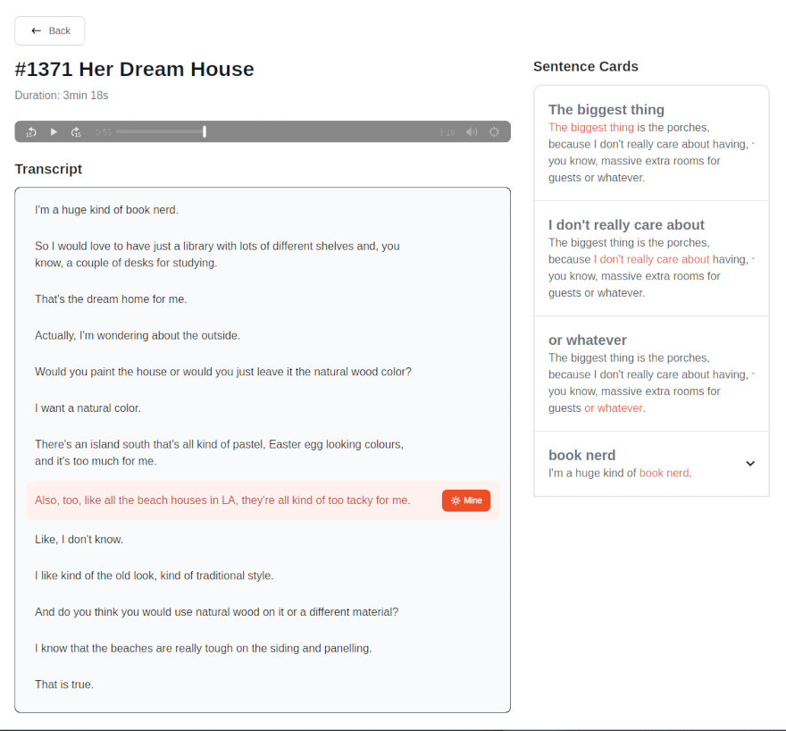
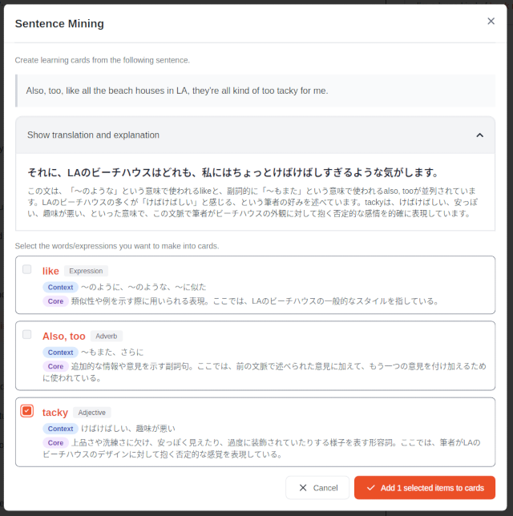

# Kotonoha

Kotonoha is a desktop application for language learning, centered around AI-powered sentence mining. Import your audio and transcript files, and as you study, you can select any sentence to have the AI instantly extract and explain key vocabulary and expressions. This on-demand analysis helps you learn language in its original context. The tool is versatile enough for any learner, whether you're engaged in immersion learning, using textbook materials, preparing for tests like the TOEIC, or working with other language content.

> ⚠️ **Warning:** This application is in early development. Please do not expect a stable experience.




## ✨ Features

- **AI-Powered Sentence Mining**: Automatically extract key vocabulary and expressions from sentences using Google Gemini AI, with contextual explanations tailored to your learning needs.
- **Smart Content Analysis**: Select any sentence and let AI identify important words, phrasal verbs, idioms, and collocations with detailed explanations.
- **Multiple Content Sources**:
  - Local audio + transcript file pairs with native audio player
  - Transcript-only import with TTS audio synthesis using [Piper](https://github.com/OHF-Voice/piper1-gpl)
  - YouTube videos with embedded player and automatic subtitle extraction
- **Episode Management**: Organize your learning materials into groups and episodes for structured study.
- **Interactive Transcript Viewer**: View synchronized transcripts with media playback (local audio or embedded YouTube) and click-to-analyze functionality.
- **Contextual Learning Cards**: Generate study cards with sentences, highlighted target expressions, and AI-generated explanations.

## 🗺️ Roadmap

We are continuously working to improve Kotonoha. Here's a look at our planned features and future ideas:

### Near-term (v1.x)

- **Cross-Platform Support**: Official installers and support for Windows and macOS.
- **Multiple Content Sources**:
  - Audio-only import with ASR transcript generation
  - Real-time audio capture with live ASR transcription
- **Card Management**:
  - Hide/suspend cards that you have already learned.
  - A toggle to show/hide suspended cards.
  - Functionality to unsuspend cards.
- **Anki Export**: Export your sentence cards to an Anki-compatible format (e.g., CSV).

### Future Ideas

- **Multi-language Support**: Full internationalization of the app interface, and support for a wider range of learning and explanation languages.
- **Cloud Sync**: Sync your learning data across multiple devices via services like Google Drive.
- **Mobile App**: A mobile version of the application for learning on the go.

## 📥 Installation

### Prerequisites

- **Google Gemini API Key**: Required for AI-powered sentence mining. You can obtain one from the [Google AI Studio](https://aistudio.google.com/).
- **YouTube Data API Key** (optional): Required only if you plan to import YouTube videos. You can obtain one from the [Google Cloud Console](https://console.cloud.google.com/).
- **For Linux users:** A secret service implementation (e.g., GNOME Keyring, KWallet) is required to securely store application credentials. Please ensure one is installed and configured on your system.

### Download

1. Go to the [Releases](https://github.com/your-username/kotonoha/releases) page
2. Download the appropriate installer for your operating system
3. Run the installer and follow the setup instructions

## 🚀 Getting Started

1.  **Prepare Your Materials**:

    Kotonoha supports two types of content sources:

    - **Local Files**: Pairs of audio and transcript files.
      - Audio formats: MP3, M4A, WAV, and OGG
      - Transcript formats: SRT (`.srt`), SSWT (`.sswt`), TSV (`.tsv`), or VTT (`.vtt`)
      - If you only have audio files, you can use our companion app [Kotonoha-ASR](https://github.com/k5n/kotonoha-asr) to generate SSWT subtitle files. Download releases from [here](https://github.com/k5n/kotonoha-asr/releases). You can also use transcription tools like [Whisper](https://github.com/openai/whisper) to generate SRT files from your audio/video content.
    - **YouTube Videos**: Simply provide a YouTube URL and Kotonoha will automatically fetch the video metadata and available subtitles for you.

2.  **Launch Kotonoha**: Start the application.

3.  **Configure API Settings**: On first launch, you'll need to configure API keys in the settings:

    - **Google Gemini API Key** (required): For AI-powered sentence mining
    - **YouTube Data API Key** (optional): Required only if you plan to import YouTube videos with automatic subtitle extraction

4.  **Import Your Episode**:

    - Create an **Album** to store your episodes. You can also create Folders to organize your Albums, but episodes can only be added directly to an Album.
    - Click the "Add Episode" button within an Album and either:
      - Select your local audio and transcript file pair, or
      - Enter a YouTube URL to import video content with automatic subtitle extraction

5.  **Start Studying**: Open an episode to view the synchronized transcript and begin your sentence mining session.

## 📄 Supported Subtitle Formats

Kotonoha supports the following subtitle formats:

### SRT (SubRip Subtitle)

The standard SRT format is widely used and compatible with most subtitle tools. Each entry consists of a sequence number, a time range, and the subtitle text.

### SSWT (Simple Subtitle With Timestamps)

SSWT is a simple, original format designed for Kotonoha. Each line represents a single subtitle and includes a time range and the text:

```
[HH:MM:SS.mmm -> HH:MM:SS.mmm] Subtitle text here
```

- `HH:MM:SS.mmm` is the start and end time (hours:minutes:seconds.milliseconds)
- `->` separates the start and end times
- The subtitle text follows after the time range

**Example:**

```
[00:00:01.000 -> 00:00:02.500] This is a test sentence.
[00:00:05.500 -> 00:00:07.000] And here is line two.
[00:00:07.100 -> 00:00:09.900] Finally, the third line.
```

**Note:** SSWT is a Kotonoha-specific format and is not compatible with other subtitle tools. SRT remains fully supported for interoperability.

**Automatic Speech Recognition (ASR):**
Kotonoha does not include built-in ASR functionality. If you only have audio files, please use our companion app [Kotonoha-ASR](https://github.com/k5n/kotonoha-asr) to generate SRT or SSWT subtitle files. Download releases from [here](https://github.com/k5n/kotonoha-asr/releases).

### TSV (Tab-Separated Values)

Kotonoha supports importing subtitles in a simple TSV (Tab-Separated Values) format.  
Each row should contain at least a start time and the dialogue text. Optionally, you can include an end time column.

**Supported columns:**

- **Start Time** (required): The start time of the dialogue.
  - Supported formats: `HH:MM:SS.mmm`, `MM:SS.mmm`, `SS.mmm`, or seconds (e.g., `2.5`, `4s`)
- **End Time** (optional): The end time of the dialogue. If omitted, only the start time is used.
- **Text** (required): The dialogue or subtitle text.

**Example with start and end times:**

```
StartTime	EndTime	Text
00:01.500	00:02.200	Hello world.
00:02.500	00:04.000	This is a test.
```

**Example with only start time:**

```
Time	Subtitle
2s	Hello world.
1:08	This is a test.
```

**Notes:**

- The first row is treated as a header and skipped during import.
- Time columns accept flexible formats (see above).
- Rows with invalid or missing required fields will be skipped.

---

## 📄 License

This project is licensed under the GPLv3. See the [LICENSE](./LICENSE) file for details.

---

## 🛠️ Development

### Tech Stack

- **Frontend**: [Svelte + SvelteKit](https://svelte.dev/)
- **Desktop App Framework**: [Tauri](https://tauri.app/)
- **Component Library**: [Flowbite Svelte](https://flowbite-svelte.com/)
- **Styling**: [Tailwind CSS](https://tailwindcss.com/)
- **Language**: [TypeScript](https://www.typescriptlang.org/)
- **Testing**: [Vitest](https://vitest.dev/)

### Architecture

This application employs a layered architecture to separate concerns and enhance maintainability, testability, and scalability. The codebase is organized into the following layers:

- **`presentation`**: The UI layer, containing Svelte components and UI-related logic.
- **`application`**: The application layer, which orchestrates use cases and connects the UI to the domain logic.
- **`domain`**: The core of the application, containing business logic and entities.
- **`infrastructure`**: The infrastructure layer, responsible for communication with external systems like databases and APIs.

For a more detailed explanation of the architecture, please refer to [`doc/technical_specifications.md`](./doc/technical_specifications.md).

### Development Setup

#### Prerequisites

- [Node.js](https://nodejs.org/en/download) (v20 or later)
- [Rust](https://www.rust-lang.org/tools/install)

#### Installation

1. Clone the repository:

   ```bash
   git clone https://github.com/your-username/kotonoha.git
   cd kotonoha
   ```

2. Install the dependencies:

   ```bash
   npm install
   ```

3. Run the development server:
   ```bash
   npm run tauri dev
   ```

### Browser development (mocked Tauri APIs)

You can run the frontend in a regular web browser without launching the Tauri runtime by using the repository's "browser-mode" which replaces many Tauri imports with local mock implementations. This is useful for fast UI development and component work when native Tauri features are not required.

- Why use it:
  - Faster iteration when you only work on the UI or Svelte components.
  - No Rust/Tauri toolchain required for basic frontend development.
- How it works:
  - The Vite configuration enables an alias map when `VITE_RUN_MODE=browser` is set. The aliases replace Tauri and Tauri-plugin imports with mock modules under `src/lib/infrastructure/mocks`.
  - A convenience npm script is provided:
    ```bash
    npm run dev:browser
    ```
- Where the mocks live:
  - Mock implementations are in `src/lib/infrastructure/mocks/` (for example, `src/lib/infrastructure/mocks/plugin-store.ts`, `src/lib/infrastructure/mocks/plugin-stronghold.ts`, ...).
  - The alias mapping that activates the mocks is in `vite.config.js`.
- Limitations:
  - Browser-mode stubs many native features; expect differences or missing functionality for native integrations.
  - Use browser-mode mainly for UI and component work. For integration testing or features that depend on native behavior, run the full Tauri dev environment:
    ```bash
    npm run dev
    ```

If the UI needs additional mocked behavior, extend the modules under `src/lib/infrastructure/mocks/` to match the API surface required by the frontend.

### Available Scripts

- `npm run dev`: Starts the development server.
- `npm run build`: Builds the application for production.
- `npm run test`: Runs the test suite.
- `npm run lint`: Lints the codebase for errors.
- `npm run check`: Run svelte-check to validate Svelte components.
- `npm run format`: Formats the code.
- `npm run test:browser`: Runs browser mode integration tests.
- `npm run test:all`: Runs all tests (unit, browser mode).
- `npm run generate:graph`: Generates dependency graph diagrams and lists and saves them to [`doc/dependency-graph.md`](./doc/dependency-graph.md) and [`AGENTS.md`](./AGENTS.md).

### Testing

Kotonoha uses a multi-layered testing approach:

#### Unit Tests

Test pure domain logic and services without external dependencies.

```bash
npm run test:unit
```

- Location: `*.test.ts` files next to the code being tested
- Framework: Vitest with jsdom

#### Browser Mode Integration Tests

Test frontend integration and page-level workflows in a real browser environment.

```bash
npm run test:browser
```

- Location:
  - Component tests: `*.browser.test.ts` next to components
  - **Route integration tests**: `src/integration-tests/*.browser.test.ts`
- Framework: Vitest Browser Mode with Playwright (Chromium)
- Mocking: Tauri (Rust) modules are mocked using Vitest's `vi.mock()` with shared mock factories in `src/integration-tests/lib/`

#### E2E Tests

Test the complete application stack including Tauri backend and Rust commands.

Currently, E2E tests are supported only on Linux. You have to build the Tauri app (AppImage) first before running E2E tests.

```bash
cd e2e-tests
npm install
npm test
```

- Location: `e2e-tests/specs/*.e2e.ts`
- Framework: WebdriverIO + Mocha
- See `e2e-tests/README.md` for details

#### Run All Tests

```bash
npm run test:all
```

#### When to Use Each Test Type

- **Unit tests**: Domain services and pure functions
- **Browser mode integration tests**: Frontend workflows, page-level integration (Rust mocked)
- **E2E tests**: Full application stack validation (frontend + backend)

### Environment Isolation

Kotonoha uses different database files depending on the environment:

- **Development environment**: `dev_app.db`
- **Release environment**: `app.db`
- **E2E test environment**: `e2e_app.db`

The environment is determined by the `PUBLIC_APP_ENV` variable:

- Set to `dev` in `.env.development` for development builds
- Set to `e2e` by the E2E test runner for test execution
- Unset (or empty) for release builds

This environment separation extends to other resources as well:

- Media files: `dev_media/`, `media/`, `e2e_media/`
- TTS models: `dev_models/`, `models/`, `e2e_models/`
- Settings: `dev_settings.json`, `settings.json`, `e2e_settings.json`

Both the TypeScript frontend and Rust backend read this variable and apply the appropriate prefix to ensure that development, release, and test data remain isolated.

### Building AppImage Locally on Linux (for Developers)

If you are developing on Linux, you can build the AppImage package locally using Docker and Docker Compose. This provides a reproducible environment similar to the official GitHub Actions workflow.

#### Prerequisites

- [Docker](https://docs.docker.com/get-docker/)
- [Docker Compose](https://docs.docker.com/compose/install/)

#### Steps

1. **Set your user ID and group ID**

   To ensure build artifacts are owned by your user, create a `.env` file in the project root with your UID and GID:

   ```sh
   echo "UID=$(id -u)" > .env
   echo "GID=$(id -g)" >> .env
   ```

2. **Build and run the container**

   ```sh
   docker-compose up
   ```

   This will install all dependencies, build the project, and generate the AppImage file in `src-tauri/target/release/bundle/appimage`.

3. **Check the build output**

   The build progress will be shown in your terminal. After completion, you can find the generated `.AppImage` file in the above directory.

#### Notes

- This workflow is intended for **local development only**. Official release builds are performed by GitHub Actions.
- The container uses your UID/GID to avoid permission issues with build artifacts.
- If you encounter permission errors related to Rust or Node.js, ensure your UID/GID are set correctly in `.env`.

If you build the AppImage without using the provided Docker environment (Ubuntu 22.04), you may encounter issues related to WebKitGTK version compatibility (such as problems with WebKitGTK 2.48).

References:

- [Tauri GitHub issue #9662](https://github.com/tauri-apps/tauri/issues/9662)
- [Tauri GitHub issue #13183](https://github.com/tauri-apps/tauri/issues/13183)
- [Tauri GitHub issue #13204](https://github.com/tauri-apps/tauri/issues/13204)
- [Tauri GitHub issue #13899](https://github.com/tauri-apps/tauri/issues/13899)
- [Tauri GitHub issue #13885](https://github.com/tauri-apps/tauri/issues/13885)
