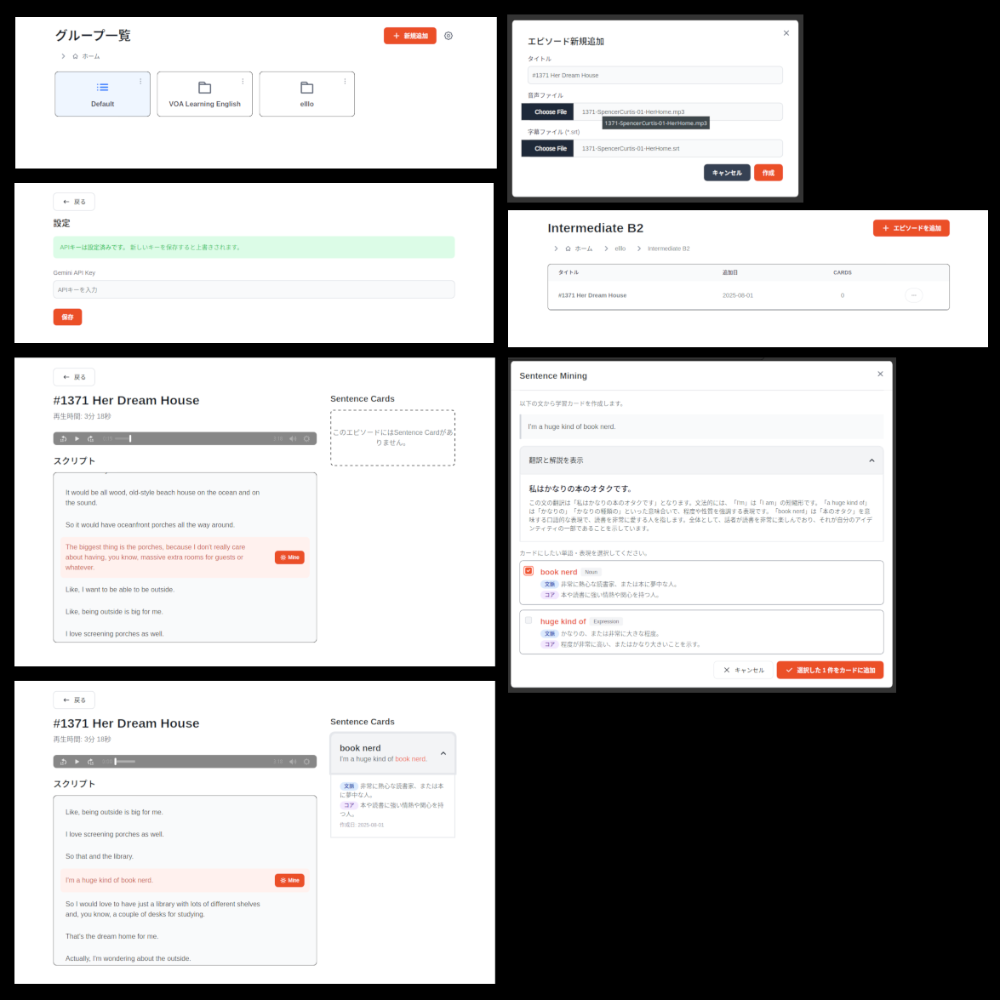

# Kotonoha

Kotonoha is a desktop application for language learning, centered around AI-powered sentence mining. Import your audio and transcript files, and as you study, you can select any sentence to have the AI instantly extract and explain key vocabulary and expressions. This on-demand analysis helps you learn language in its original context. The tool is versatile enough for any learner, whether you're engaged in immersion learning, using textbook materials, preparing for tests like the TOEIC, or working with other language content.

> ⚠️ **Warning:** This application is in early development. Please do not expect a stable experience.



## ✨ Features

- **AI-Powered Sentence Mining**: Automatically extract key vocabulary and expressions from sentences using Google Gemini AI, with contextual explanations tailored to your learning needs.
- **Smart Content Analysis**: Select any sentence and let AI identify important words, phrasal verbs, idioms, and collocations with detailed explanations.
- **Episode Management**: Organize your learning materials (audio + transcripts) into groups and episodes for structured study.
- **Interactive Transcript Viewer**: View synchronized transcripts with audio playback and click-to-analyze functionality.
- **Contextual Learning Cards**: Generate study cards with sentences, highlighted target expressions, and AI-generated explanations.

## 🗺️ Roadmap

We are continuously working to improve Kotonoha. Here's a look at our planned features and future ideas:

### Near-term (v1.x)

- **Cross-Platform Support**: Official installers and support for Windows and macOS.
- **Audio-Synchronized Learning**: Listen to original audio while studying extracted vocabulary in context.
- **Card Management**:
  - Hide/suspend cards that you have already learned.
  - A toggle to show/hide suspended cards.
  - Functionality to unsuspend cards.
- **Anki Export**: Export your sentence cards to an Anki-compatible format (e.g., CSV).

### Future Ideas

- **AI-Powered Transcription (ASR)**: To streamline the import process, we are exploring an Automatic Speech Recognition (ASR) feature for users who only have audio files. This may be integrated directly into Kotonoha or offered as a separate, specialized companion app.
- **Multi-language Support**: Full internationalization of the app interface, and support for a wider range of learning and explanation languages.
- **Cloud Sync**: Sync your learning data across multiple devices via services like Google Drive.
- **Mobile App**: A mobile version of the application for learning on the go.

## 📥 Installation

### Prerequisites

- **Google Gemini API Key**: You'll need a Google Gemini API key to enable AI-powered sentence mining. You can obtain one from the [Google AI Studio](https://aistudio.google.com/).
- **For Linux users:** A secret service implementation (e.g., GNOME Keyring, KWallet) is required to securely store application credentials. Please ensure one is installed and configured on your system.

### Download

1. Go to the [Releases](https://github.com/your-username/kotonoha/releases) page
2. Download the appropriate installer for your operating system
3. Run the installer and follow the setup instructions

## 🚀 Getting Started

1.  **Prepare Your Materials**:

    - Kotonoha works with pairs of audio and transcript files.
    - The audio can be in common formats like MP3, M4A, WAV, and OGG.
    - The transcript **must be in SRT (`.srt`) format**. You can use transcription tools like [Whisper](https://github.com/openai/whisper) to generate SRT files from your audio/video content.

2.  **Launch Kotonoha**: Start the application.

3.  **Configure AI Settings**: On first launch, you'll need to set up your Google Gemini API key in the settings to enable AI-powered sentence mining.

4.  **Import Your Episode**:

    - Create an **Album** to store your episodes. You can also create Folders to organize your Albums, but episodes can only be added directly to an Album.
    - Click the "Add Episode" button within an Album and select your audio and SRT transcript file pair.

5.  **Start Studying**: Open an episode to view the synchronized transcript and begin your sentence mining session.

## 📄 License

This project is licensed under the GPLv3. See the [LICENSE](./LICENSE) file for details.

---

## 🛠️ Development

### Tech Stack

- **Frontend**: [Svelte + SvelteKit](https://svelte.dev/)
- **Desktop App Framework**: [Tauri](https://tauri.app/)
- **Component Library**: [Flowbite Svelte](https://flowbite-svelte.com/)
- **Styling**: [Tailwind CSS](https://tailwindcss.com/)
- **Language**: [TypeScript](https://www.typescriptlang.org/)
- **Testing**: [Vitest](https://vitest.dev/)

### Architecture

This application employs a layered architecture to separate concerns and enhance maintainability, testability, and scalability. The codebase is organized into the following layers:

- **`presentation`**: The UI layer, containing Svelte components and UI-related logic.
- **`application`**: The application layer, which orchestrates use cases and connects the UI to the domain logic.
- **`domain`**: The core of the application, containing business logic and entities.
- **`infrastructure`**: The infrastructure layer, responsible for communication with external systems like databases and APIs.

For a more detailed explanation of the architecture, please refer to [`doc/architecture.md`](./doc/architecture.md).

### Development Setup

#### Prerequisites

- [Node.js](https://nodejs.org/en/download) (v20 or later)
- [Rust](https://www.rust-lang.org/tools/install)

#### Installation

1. Clone the repository:

   ```bash
   git clone https://github.com/your-username/kotonoha.git
   cd kotonoha
   ```

2. Install the dependencies:

   ```bash
   npm install
   ```

3. Run the development server:
   ```bash
   npm run tauri dev
   ```

### Available Scripts

- `npm run dev`: Starts the development server.
- `npm run build`: Builds the application for production.
- `npm run test`: Runs the test suite.
- `npm run lint`: Lints the codebase for errors.
- `npm run check`: Run svelte-check to validate Svelte components.
- `npm run format`: Formats the code.
- `npm run generate:graph`: Generates a dependency graph diagram and saves it to [`doc/dependency-graph.md`](./doc/dependency-graph.md).

### Database Usage

Kotonoha uses different database files depending on the build environment:

- **Development build**: `dev.db`
- **Release build**: `app.db`

This is controlled by the `PUBLIC_APP_DB_NAME` variable set in `.env.development`. Both the TypeScript and Rust sides of the application read this variable and switch the database file accordingly.  
This ensures that development and production data are kept separate.
