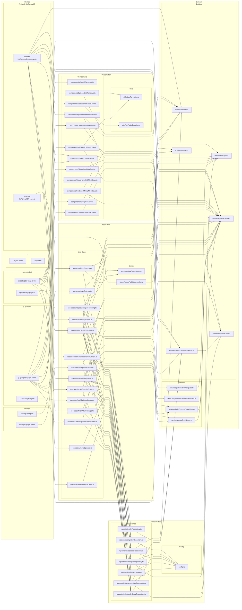

# Src Dependency Graph

```mermaid
graph LR
    subgraph "Routes"
        subgraph "/"
            routes_layout_svelte["+layout.svelte"]
            routes_layout_ts["+layout.ts"]
        end
        subgraph "/[...groupId]"
            routes_...groupId__page_svelte["[...groupId]/+page.svelte"]
            routes_...groupId__page_ts["[...groupId]/+page.ts"]
        end
        subgraph "/episode-list/[groupId]"
            routes_episode-list__groupId___page_svelte["episode-list/[groupId]/+page.svelte"]
            routes_episode-list__groupId___page_ts["episode-list/[groupId]/+page.ts"]
        end
        subgraph "/episode/[id]"
            routes_episode__id___page_svelte["episode/[id]/+page.svelte"]
            routes_episode__id___page_ts["episode/[id]/+page.ts"]
        end
        subgraph "/settings"
            routes_settings__page_svelte["settings/+page.svelte"]
            routes_settings__page_ts["settings/+page.ts"]
        end
    end

    subgraph "Presentation"
        subgraph "Components"
            presentation_components_AudioPlayer_svelte["components/AudioPlayer.svelte"]
            presentation_components_Breadcrumbs_svelte["components/Breadcrumbs.svelte"]
            presentation_components_EpisodeAddModal_svelte["components/EpisodeAddModal.svelte"]
            presentation_components_EpisodeListTable_svelte["components/EpisodeListTable.svelte"]
            presentation_components_EpisodeMoveModal_svelte["components/EpisodeMoveModal.svelte"]
            presentation_components_GroupAddModal_svelte["components/GroupAddModal.svelte"]
            presentation_components_GroupGrid_svelte["components/GroupGrid.svelte"]
            presentation_components_GroupMoveModal_svelte["components/GroupMoveModal.svelte"]
            presentation_components_GroupNameEditModal_svelte["components/GroupNameEditModal.svelte"]
            presentation_components_SentenceCardList_svelte["components/SentenceCardList.svelte"]
            presentation_components_SentenceMiningModal_svelte["components/SentenceMiningModal.svelte"]
            presentation_components_TranscriptViewer_svelte["components/TranscriptViewer.svelte"]
        end
        subgraph "Utils"
            presentation_utils_dateFormatter_ts["utils/dateFormatter.ts"]
            presentation_utils_getAudioDuration_ts["utils/getAudioDuration.ts"]
        end
    end

    subgraph "Application"
        subgraph "Stores"
            application_stores_apiKeyStore_svelte_ts["stores/apiKeyStore.svelte.ts"]
            application_stores_groupPathStore_svelte_ts["stores/groupPathStore.svelte.ts"]
        end
        subgraph "Use Cases"
            application_usecases_addEpisodeGroup_ts["usecases/addEpisodeGroup.ts"]
            application_usecases_addNewEpisode_ts["usecases/addNewEpisode.ts"]
            application_usecases_addSentenceCards_ts["usecases/addSentenceCards.ts"]
            application_usecases_analyzeDialogueForMining_ts["usecases/analyzeDialogueForMining.ts"]
            application_usecases_fetchAlbumGroups_ts["usecases/fetchAlbumGroups.ts"]
            application_usecases_fetchAvailableParentGroups_ts["usecases/fetchAvailableParentGroups.ts"]
            application_usecases_fetchEpisodeDetail_ts["usecases/fetchEpisodeDetail.ts"]
            application_usecases_fetchEpisodeGroups_ts["usecases/fetchEpisodeGroups.ts"]
            application_usecases_fetchEpisodes_ts["usecases/fetchEpisodes.ts"]
            application_usecases_fetchSettings_ts["usecases/fetchSettings.ts"]
            application_usecases_moveEpisode_ts["usecases/moveEpisode.ts"]
            application_usecases_moveEpisodeGroup_ts["usecases/moveEpisodeGroup.ts"]
            application_usecases_saveSettings_ts["usecases/saveSettings.ts"]
            application_usecases_updateEpisodeGroupName_ts["usecases/updateEpisodeGroupName.ts"]
        end
    end

    subgraph "Domain"
        subgraph "Entities"
            domain_entities_dialogue_ts["entities/dialogue.ts"]
            domain_entities_episode_ts["entities/episode.ts"]
            domain_entities_episodeGroup_ts["entities/episodeGroup.ts"]
            domain_entities_sentenceAnalysisResult_ts["entities/sentenceAnalysisResult.ts"]
            domain_entities_sentenceCard_ts["entities/sentenceCard.ts"]
            domain_entities_settings_ts["entities/settings.ts"]
        end
        subgraph "Services"
            domain_services_buildEpisodeGroupTree_ts["services/buildEpisodeGroupTree.ts"]
            domain_services_generateEpisodeFilenames_ts["services/generateEpisodeFilenames.ts"]
            domain_services_groupTreeHelper_ts["services/groupTreeHelper.ts"]
            domain_services_parseSrtToDialogues_ts["services/parseSrtToDialogues.ts"]
        end
    end

    subgraph "Infrastructure"
        subgraph "Repositories"
            infrastructure_repositories_apiKeyRepository_ts["repositories/apiKeyRepository.ts"]
            infrastructure_repositories_dialogueRepository_ts["repositories/dialogueRepository.ts"]
            infrastructure_repositories_episodeGroupRepository_ts["repositories/episodeGroupRepository.ts"]
            infrastructure_repositories_episodeRepository_ts["repositories/episodeRepository.ts"]
            infrastructure_repositories_fileRepository_ts["repositories/fileRepository.ts"]
            infrastructure_repositories_llmRepository_ts["repositories/llmRepository.ts"]
            infrastructure_repositories_sentenceCardRepository_ts["repositories/sentenceCardRepository.ts"]
        end
        subgraph "Config"
            infrastructure_config_ts["config.ts"]
        end
    end

    routes_...groupId__page_svelte --> application_stores_groupPathStore_svelte_ts
    routes_...groupId__page_svelte --> application_usecases_addEpisodeGroup_ts
    routes_...groupId__page_svelte --> application_usecases_fetchAvailableParentGroups_ts
    routes_...groupId__page_svelte --> application_usecases_moveEpisodeGroup_ts
    routes_...groupId__page_svelte --> application_usecases_updateEpisodeGroupName_ts
    routes_...groupId__page_svelte --> domain_entities_episodeGroup_ts
    routes_...groupId__page_svelte --> presentation_components_Breadcrumbs_svelte
    routes_...groupId__page_svelte --> presentation_components_GroupAddModal_svelte
    routes_...groupId__page_svelte --> presentation_components_GroupGrid_svelte
    routes_...groupId__page_svelte --> presentation_components_GroupMoveModal_svelte
    routes_...groupId__page_svelte --> presentation_components_GroupNameEditModal_svelte
    routes_...groupId__page_ts --> application_usecases_fetchEpisodeGroups_ts
    routes_episode-list__groupId___page_svelte --> application_usecases_addNewEpisode_ts
    routes_episode-list__groupId___page_svelte --> application_usecases_fetchAlbumGroups_ts
    routes_episode-list__groupId___page_svelte --> application_usecases_moveEpisode_ts
    routes_episode-list__groupId___page_svelte --> domain_entities_episode_ts
    routes_episode-list__groupId___page_svelte --> domain_entities_episodeGroup_ts
    routes_episode-list__groupId___page_svelte --> presentation_components_Breadcrumbs_svelte
    routes_episode-list__groupId___page_svelte --> presentation_components_EpisodeAddModal_svelte
    routes_episode-list__groupId___page_svelte --> presentation_components_EpisodeListTable_svelte
    routes_episode-list__groupId___page_svelte --> presentation_components_EpisodeMoveModal_svelte
    routes_episode-list__groupId___page_ts --> application_usecases_fetchEpisodes_ts
    routes_episode__id___page_svelte --> application_usecases_addSentenceCards_ts
    routes_episode__id___page_svelte --> application_usecases_analyzeDialogueForMining_ts
    routes_episode__id___page_svelte --> domain_entities_dialogue_ts
    routes_episode__id___page_svelte --> domain_entities_sentenceAnalysisResult_ts
    routes_episode__id___page_svelte --> presentation_components_AudioPlayer_svelte
    routes_episode__id___page_svelte --> presentation_components_SentenceCardList_svelte
    routes_episode__id___page_svelte --> presentation_components_SentenceMiningModal_svelte
    routes_episode__id___page_svelte --> presentation_components_TranscriptViewer_svelte
    routes_episode__id___page_ts --> application_usecases_fetchEpisodeDetail_ts
    routes_settings__page_svelte --> application_usecases_saveSettings_ts
    routes_settings__page_ts --> application_usecases_fetchSettings_ts

    presentation_components_Breadcrumbs_svelte --> domain_entities_episodeGroup_ts
    presentation_components_EpisodeAddModal_svelte --> presentation_utils_getAudioDuration_ts
    presentation_components_EpisodeListTable_svelte --> domain_entities_episode_ts
    presentation_components_EpisodeListTable_svelte --> presentation_utils_dateFormatter_ts
    presentation_components_EpisodeMoveModal_svelte --> domain_entities_episode_ts
    presentation_components_EpisodeMoveModal_svelte --> domain_entities_episodeGroup_ts
    presentation_components_GroupAddModal_svelte --> domain_entities_episodeGroup_ts
    presentation_components_GroupGrid_svelte --> domain_entities_episodeGroup_ts
    presentation_components_GroupMoveModal_svelte --> domain_entities_episodeGroup_ts
    presentation_components_SentenceCardList_svelte --> domain_entities_sentenceCard_ts
    presentation_components_SentenceCardList_svelte --> presentation_utils_dateFormatter_ts
    presentation_components_SentenceMiningModal_svelte --> domain_entities_dialogue_ts
    presentation_components_SentenceMiningModal_svelte --> domain_entities_sentenceAnalysisResult_ts
    presentation_components_TranscriptViewer_svelte --> domain_entities_dialogue_ts

    application_stores_groupPathStore_svelte_ts --> domain_entities_episodeGroup_ts
    application_usecases_addEpisodeGroup_ts --> domain_entities_episodeGroup_ts
    application_usecases_addEpisodeGroup_ts --> infrastructure_repositories_episodeGroupRepository_ts
    application_usecases_addNewEpisode_ts --> domain_services_generateEpisodeFilenames_ts
    application_usecases_addNewEpisode_ts --> domain_services_parseSrtToDialogues_ts
    application_usecases_addNewEpisode_ts --> infrastructure_repositories_dialogueRepository_ts
    application_usecases_addNewEpisode_ts --> infrastructure_repositories_episodeRepository_ts
    application_usecases_addNewEpisode_ts --> infrastructure_repositories_fileRepository_ts
    application_usecases_addSentenceCards_ts --> infrastructure_repositories_sentenceCardRepository_ts
    application_usecases_analyzeDialogueForMining_ts --> application_stores_apiKeyStore_svelte_ts
    application_usecases_analyzeDialogueForMining_ts --> domain_entities_dialogue_ts
    application_usecases_analyzeDialogueForMining_ts --> domain_entities_sentenceAnalysisResult_ts
    application_usecases_analyzeDialogueForMining_ts --> infrastructure_repositories_apiKeyRepository_ts
    application_usecases_analyzeDialogueForMining_ts --> infrastructure_repositories_dialogueRepository_ts
    application_usecases_analyzeDialogueForMining_ts --> infrastructure_repositories_llmRepository_ts
    application_usecases_analyzeDialogueForMining_ts --> infrastructure_repositories_sentenceCardRepository_ts
    application_usecases_fetchAlbumGroups_ts --> domain_services_buildEpisodeGroupTree_ts
    application_usecases_fetchAlbumGroups_ts --> infrastructure_repositories_episodeGroupRepository_ts
    application_usecases_fetchAvailableParentGroups_ts --> domain_entities_episodeGroup_ts
    application_usecases_fetchAvailableParentGroups_ts --> domain_services_buildEpisodeGroupTree_ts
    application_usecases_fetchAvailableParentGroups_ts --> domain_services_groupTreeHelper_ts
    application_usecases_fetchAvailableParentGroups_ts --> infrastructure_repositories_episodeGroupRepository_ts
    application_usecases_fetchEpisodeDetail_ts --> domain_entities_dialogue_ts
    application_usecases_fetchEpisodeDetail_ts --> domain_entities_episode_ts
    application_usecases_fetchEpisodeDetail_ts --> domain_entities_sentenceCard_ts
    application_usecases_fetchEpisodeDetail_ts --> infrastructure_repositories_dialogueRepository_ts
    application_usecases_fetchEpisodeDetail_ts --> infrastructure_repositories_episodeRepository_ts
    application_usecases_fetchEpisodeDetail_ts --> infrastructure_repositories_fileRepository_ts
    application_usecases_fetchEpisodeDetail_ts --> infrastructure_repositories_sentenceCardRepository_ts
    application_usecases_fetchEpisodeGroups_ts --> domain_entities_episodeGroup_ts
    application_usecases_fetchEpisodeGroups_ts --> infrastructure_repositories_episodeGroupRepository_ts
    application_usecases_fetchEpisodes_ts --> domain_entities_episode_ts
    application_usecases_fetchEpisodes_ts --> domain_entities_episodeGroup_ts
    application_usecases_fetchEpisodes_ts --> infrastructure_repositories_episodeGroupRepository_ts
    application_usecases_fetchEpisodes_ts --> infrastructure_repositories_episodeRepository_ts
    application_usecases_fetchSettings_ts --> application_stores_apiKeyStore_svelte_ts
    application_usecases_fetchSettings_ts --> domain_entities_settings_ts
    application_usecases_fetchSettings_ts --> infrastructure_repositories_apiKeyRepository_ts
    application_usecases_moveEpisode_ts --> infrastructure_repositories_episodeRepository_ts
    application_usecases_moveEpisodeGroup_ts --> domain_entities_episodeGroup_ts
    application_usecases_moveEpisodeGroup_ts --> domain_services_groupTreeHelper_ts
    application_usecases_moveEpisodeGroup_ts --> infrastructure_repositories_episodeGroupRepository_ts
    application_usecases_saveSettings_ts --> domain_entities_settings_ts
    application_usecases_saveSettings_ts --> infrastructure_repositories_apiKeyRepository_ts
    application_usecases_updateEpisodeGroupName_ts --> domain_entities_episodeGroup_ts
    application_usecases_updateEpisodeGroupName_ts --> infrastructure_repositories_episodeGroupRepository_ts

    domain_entities_sentenceAnalysisResult_ts --> domain_entities_sentenceCard_ts
    domain_services_buildEpisodeGroupTree_ts --> domain_entities_episodeGroup_ts
    domain_services_groupTreeHelper_ts --> domain_entities_episodeGroup_ts
    domain_services_parseSrtToDialogues_ts --> domain_entities_dialogue_ts

    infrastructure_repositories_apiKeyRepository_ts --> infrastructure_config_ts
    infrastructure_repositories_dialogueRepository_ts --> domain_entities_dialogue_ts
    infrastructure_repositories_dialogueRepository_ts --> infrastructure_config_ts
    infrastructure_repositories_episodeGroupRepository_ts --> domain_entities_episodeGroup_ts
    infrastructure_repositories_episodeGroupRepository_ts --> infrastructure_config_ts
    infrastructure_repositories_episodeRepository_ts --> domain_entities_episode_ts
    infrastructure_repositories_episodeRepository_ts --> infrastructure_config_ts
    infrastructure_repositories_fileRepository_ts --> infrastructure_config_ts
    infrastructure_repositories_llmRepository_ts --> domain_entities_sentenceAnalysisResult_ts
    infrastructure_repositories_sentenceCardRepository_ts --> domain_entities_sentenceAnalysisResult_ts
    infrastructure_repositories_sentenceCardRepository_ts --> domain_entities_sentenceCard_ts
    infrastructure_repositories_sentenceCardRepository_ts --> infrastructure_config_ts
```