# Frontend Dependency Graphs

These graphs are automatically generated by running `npm run generate:graph` using `tools/generate-dependency-graph.ts`.
They visualize dependencies within the frontend codebase, organized by architectural layers and folder structure.

## Legend

```mermaid
graph TB
    classDef cssSvelteComponent fill:#325;
    classDef cssSvelteScript fill:#535;
    classDef cssTypeScript fill:#352;
    svelte["Svelte Component (*.svelte)"]:::cssSvelteComponent
    svelte_script["Svelte Script (*.svelte.ts)"]:::cssSvelteScript
    typescript["TypeScript (*.ts)"]:::cssTypeScript
```

# Presentation Layer Dependency Graph

Note: `src/lib/application/stores/i18n.svelte.ts` is omitted from presentation graphs to reduce noise.

### Screen: /[...groupId]

Dependencies for the `/[...groupId]` screen.

```mermaid
graph LR
    classDef cssSvelteComponent fill:#325;
    classDef cssSvelteScript fill:#535;
    classDef cssTypeScript fill:#352;
        subgraph sg_lib ["lib"]
            subgraph sg_lib_application ["application"]
                subgraph sg_lib_application_stores ["stores"]
                    src_lib_application_stores_groupPathStore_svelte_ts["groupPathStore"]
                end
            end
            subgraph sg_lib_presentation ["presentation"]
                subgraph sg_lib_presentation_components ["components"]
                    subgraph sg_lib_presentation_components_presentational ["presentational"]
                        src_lib_presentation_components_presentational_Breadcrumbs_svelte["Breadcrumbs"]
                        src_lib_presentation_components_presentational_ConfirmModal_svelte["ConfirmModal"]
                        src_lib_presentation_components_presentational_EmptyStateDisplay_svelte["EmptyStateDisplay"]
                        src_lib_presentation_components_presentational_ErrorWarningToast_svelte["ErrorWarningToast"]
                        src_lib_presentation_components_presentational_LoadErrorAlert_svelte["LoadErrorAlert"]
                        src_lib_presentation_components_presentational_PageLoadingSpinner_svelte["PageLoadingSpinner"]
                    end
                end
            end
        end
        subgraph sg_routes ["routes"]
            subgraph sg_routes_____groupId_ ["[...groupId]"]
                src_routes_____groupId___page_svelte["+page"]
                subgraph sg_routes_____groupId__presentational ["presentational"]
                    src_routes_____groupId__presentational_GroupAddModal_svelte["GroupAddModal"]
                    src_routes_____groupId__presentational_GroupGrid_svelte["GroupGrid"]
                    src_routes_____groupId__presentational_GroupMoveModal_svelte["GroupMoveModal"]
                    src_routes_____groupId__presentational_GroupNameEditModal_svelte["GroupNameEditModal"]
                end
            end
        end
    src_routes_____groupId___page_svelte --> src_lib_application_stores_groupPathStore_svelte_ts
    src_routes_____groupId___page_svelte --> src_lib_presentation_components_presentational_Breadcrumbs_svelte
    src_routes_____groupId___page_svelte --> src_lib_presentation_components_presentational_ConfirmModal_svelte
    src_routes_____groupId___page_svelte --> src_lib_presentation_components_presentational_EmptyStateDisplay_svelte
    src_routes_____groupId___page_svelte --> src_lib_presentation_components_presentational_ErrorWarningToast_svelte
    src_routes_____groupId___page_svelte --> src_lib_presentation_components_presentational_LoadErrorAlert_svelte
    src_routes_____groupId___page_svelte --> src_lib_presentation_components_presentational_PageLoadingSpinner_svelte
    src_routes_____groupId___page_svelte --> src_routes_____groupId__presentational_GroupAddModal_svelte
    src_routes_____groupId___page_svelte --> src_routes_____groupId__presentational_GroupGrid_svelte
    src_routes_____groupId___page_svelte --> src_routes_____groupId__presentational_GroupMoveModal_svelte
    src_routes_____groupId___page_svelte --> src_routes_____groupId__presentational_GroupNameEditModal_svelte
    class src_lib_application_stores_groupPathStore_svelte_ts cssSvelteScript
    class src_lib_presentation_components_presentational_Breadcrumbs_svelte cssSvelteComponent
    class src_lib_presentation_components_presentational_ConfirmModal_svelte cssSvelteComponent
    class src_lib_presentation_components_presentational_EmptyStateDisplay_svelte cssSvelteComponent
    class src_lib_presentation_components_presentational_ErrorWarningToast_svelte cssSvelteComponent
    class src_lib_presentation_components_presentational_LoadErrorAlert_svelte cssSvelteComponent
    class src_lib_presentation_components_presentational_PageLoadingSpinner_svelte cssSvelteComponent
    class src_routes_____groupId___page_svelte cssSvelteComponent
    class src_routes_____groupId__presentational_GroupAddModal_svelte cssSvelteComponent
    class src_routes_____groupId__presentational_GroupGrid_svelte cssSvelteComponent
    class src_routes_____groupId__presentational_GroupMoveModal_svelte cssSvelteComponent
    class src_routes_____groupId__presentational_GroupNameEditModal_svelte cssSvelteComponent
```
### Screen: /episode-list/[groupId]

Dependencies for the `/episode-list/[groupId]` screen.

```mermaid
graph LR
    classDef cssSvelteComponent fill:#325;
    classDef cssSvelteScript fill:#535;
    classDef cssTypeScript fill:#352;
        subgraph sg_lib ["lib"]
            subgraph sg_lib_application ["application"]
                subgraph sg_lib_application_stores ["stores"]
                    src_lib_application_stores_groupPathStore_svelte_ts["groupPathStore"]
                end
            end
            subgraph sg_lib_presentation ["presentation"]
                subgraph sg_lib_presentation_components ["components"]
                    subgraph sg_lib_presentation_components_presentational ["presentational"]
                        src_lib_presentation_components_presentational_Breadcrumbs_svelte["Breadcrumbs"]
                        src_lib_presentation_components_presentational_ConfirmModal_svelte["ConfirmModal"]
                        src_lib_presentation_components_presentational_EmptyStateDisplay_svelte["EmptyStateDisplay"]
                        src_lib_presentation_components_presentational_ErrorWarningToast_svelte["ErrorWarningToast"]
                        src_lib_presentation_components_presentational_FileSelect_svelte["FileSelect"]
                        src_lib_presentation_components_presentational_LoadErrorAlert_svelte["LoadErrorAlert"]
                        src_lib_presentation_components_presentational_PageLoadingSpinner_svelte["PageLoadingSpinner"]
                    end
                end
                subgraph sg_lib_presentation_utils ["utils"]
                    src_lib_presentation_utils_dateFormatter_ts["dateFormatter"]
                end
            end
        end
        subgraph sg_routes ["routes"]
            subgraph sg_routes_episode_list ["episode-list"]
                subgraph sg_routes_episode_list__groupId_ ["[groupId]"]
                    subgraph sg_routes_episode_list__groupId__container ["container"]
                        src_routes_episode_list__groupId__container_AudioScriptFileEpisodeAddContainer_svelte["AudioScriptFileEpisodeAddContainer"]
                        src_routes_episode_list__groupId__container_EpisodeAddContainer_svelte["EpisodeAddContainer"]
                        src_routes_episode_list__groupId__container_fileBasedEpisodeAddController_svelte_ts["fileBasedEpisodeAddController"]
                        src_routes_episode_list__groupId__container_tsvConfigController_svelte_ts["tsvConfigController"]
                        src_routes_episode_list__groupId__container_ttsConfigController_svelte_ts["ttsConfigController"]
                        src_routes_episode_list__groupId__container_TtsEpisodeAddContainer_svelte["TtsEpisodeAddContainer"]
                        src_routes_episode_list__groupId__container_ttsExecutionController_svelte_ts["ttsExecutionController"]
                        src_routes_episode_list__groupId__container_ttsModelDownloadController_svelte_ts["ttsModelDownloadController"]
                        src_routes_episode_list__groupId__container_YoutubeEpisodeAddContainer_svelte["YoutubeEpisodeAddContainer"]
                    end
                    src_routes_episode_list__groupId___page_svelte["+page"]
                    subgraph sg_routes_episode_list__groupId__presentational ["presentational"]
                        src_routes_episode_list__groupId__presentational_AudioFileSelect_svelte["AudioFileSelect"]
                        src_routes_episode_list__groupId__presentational_EpisodeListTable_svelte["EpisodeListTable"]
                        src_routes_episode_list__groupId__presentational_EpisodeMoveModal_svelte["EpisodeMoveModal"]
                        src_routes_episode_list__groupId__presentational_EpisodeNameEditModal_svelte["EpisodeNameEditModal"]
                        src_routes_episode_list__groupId__presentational_EpisodeSourceSelectionModal_svelte["EpisodeSourceSelectionModal"]
                        src_routes_episode_list__groupId__presentational_FileEpisodeModal_svelte["FileEpisodeModal"]
                        src_routes_episode_list__groupId__presentational_ScriptFileSelect_svelte["ScriptFileSelect"]
                        src_routes_episode_list__groupId__presentational_TsvConfigSection_svelte["TsvConfigSection"]
                        src_routes_episode_list__groupId__presentational_TtsConfigSection_svelte["TtsConfigSection"]
                        src_routes_episode_list__groupId__presentational_TtsExecutionModal_svelte["TtsExecutionModal"]
                        src_routes_episode_list__groupId__presentational_TtsModelDownloadModal_svelte["TtsModelDownloadModal"]
                        src_routes_episode_list__groupId__presentational_YoutubeEpisodeAddModal_svelte["YoutubeEpisodeAddModal"]
                    end
                end
            end
        end
    src_routes_episode_list__groupId___page_svelte --> src_lib_application_stores_groupPathStore_svelte_ts
    src_routes_episode_list__groupId___page_svelte --> src_lib_presentation_components_presentational_Breadcrumbs_svelte
    src_routes_episode_list__groupId___page_svelte --> src_lib_presentation_components_presentational_ConfirmModal_svelte
    src_routes_episode_list__groupId___page_svelte --> src_lib_presentation_components_presentational_EmptyStateDisplay_svelte
    src_routes_episode_list__groupId___page_svelte --> src_lib_presentation_components_presentational_ErrorWarningToast_svelte
    src_routes_episode_list__groupId___page_svelte --> src_lib_presentation_components_presentational_LoadErrorAlert_svelte
    src_routes_episode_list__groupId___page_svelte --> src_lib_presentation_components_presentational_PageLoadingSpinner_svelte
    src_routes_episode_list__groupId___page_svelte --> src_routes_episode_list__groupId__container_EpisodeAddContainer_svelte
    src_routes_episode_list__groupId___page_svelte --> src_routes_episode_list__groupId__presentational_EpisodeListTable_svelte
    src_routes_episode_list__groupId___page_svelte --> src_routes_episode_list__groupId__presentational_EpisodeMoveModal_svelte
    src_routes_episode_list__groupId___page_svelte --> src_routes_episode_list__groupId__presentational_EpisodeNameEditModal_svelte
    src_routes_episode_list__groupId__container_EpisodeAddContainer_svelte --> src_routes_episode_list__groupId__container_AudioScriptFileEpisodeAddContainer_svelte
    src_routes_episode_list__groupId__container_EpisodeAddContainer_svelte --> src_routes_episode_list__groupId__container_TtsEpisodeAddContainer_svelte
    src_routes_episode_list__groupId__container_EpisodeAddContainer_svelte --> src_routes_episode_list__groupId__container_YoutubeEpisodeAddContainer_svelte
    src_routes_episode_list__groupId__container_EpisodeAddContainer_svelte --> src_routes_episode_list__groupId__presentational_EpisodeSourceSelectionModal_svelte
    src_routes_episode_list__groupId__presentational_EpisodeListTable_svelte --> src_lib_presentation_utils_dateFormatter_ts
    src_routes_episode_list__groupId__container_AudioScriptFileEpisodeAddContainer_svelte --> src_routes_episode_list__groupId__container_fileBasedEpisodeAddController_svelte_ts
    src_routes_episode_list__groupId__container_AudioScriptFileEpisodeAddContainer_svelte --> src_routes_episode_list__groupId__container_tsvConfigController_svelte_ts
    src_routes_episode_list__groupId__container_AudioScriptFileEpisodeAddContainer_svelte --> src_routes_episode_list__groupId__presentational_AudioFileSelect_svelte
    src_routes_episode_list__groupId__container_AudioScriptFileEpisodeAddContainer_svelte --> src_routes_episode_list__groupId__presentational_FileEpisodeModal_svelte
    src_routes_episode_list__groupId__container_AudioScriptFileEpisodeAddContainer_svelte --> src_routes_episode_list__groupId__presentational_ScriptFileSelect_svelte
    src_routes_episode_list__groupId__container_AudioScriptFileEpisodeAddContainer_svelte --> src_routes_episode_list__groupId__presentational_TsvConfigSection_svelte
    src_routes_episode_list__groupId__container_TtsEpisodeAddContainer_svelte --> src_routes_episode_list__groupId__container_fileBasedEpisodeAddController_svelte_ts
    src_routes_episode_list__groupId__container_TtsEpisodeAddContainer_svelte --> src_routes_episode_list__groupId__container_tsvConfigController_svelte_ts
    src_routes_episode_list__groupId__container_TtsEpisodeAddContainer_svelte --> src_routes_episode_list__groupId__container_ttsConfigController_svelte_ts
    src_routes_episode_list__groupId__container_TtsEpisodeAddContainer_svelte --> src_routes_episode_list__groupId__container_ttsExecutionController_svelte_ts
    src_routes_episode_list__groupId__container_TtsEpisodeAddContainer_svelte --> src_routes_episode_list__groupId__container_ttsModelDownloadController_svelte_ts
    src_routes_episode_list__groupId__container_TtsEpisodeAddContainer_svelte --> src_routes_episode_list__groupId__presentational_FileEpisodeModal_svelte
    src_routes_episode_list__groupId__container_TtsEpisodeAddContainer_svelte --> src_routes_episode_list__groupId__presentational_ScriptFileSelect_svelte
    src_routes_episode_list__groupId__container_TtsEpisodeAddContainer_svelte --> src_routes_episode_list__groupId__presentational_TsvConfigSection_svelte
    src_routes_episode_list__groupId__container_TtsEpisodeAddContainer_svelte --> src_routes_episode_list__groupId__presentational_TtsConfigSection_svelte
    src_routes_episode_list__groupId__container_TtsEpisodeAddContainer_svelte --> src_routes_episode_list__groupId__presentational_TtsExecutionModal_svelte
    src_routes_episode_list__groupId__container_TtsEpisodeAddContainer_svelte --> src_routes_episode_list__groupId__presentational_TtsModelDownloadModal_svelte
    src_routes_episode_list__groupId__container_YoutubeEpisodeAddContainer_svelte --> src_routes_episode_list__groupId__presentational_YoutubeEpisodeAddModal_svelte
    src_routes_episode_list__groupId__presentational_AudioFileSelect_svelte --> src_lib_presentation_components_presentational_FileSelect_svelte
    src_routes_episode_list__groupId__presentational_ScriptFileSelect_svelte --> src_lib_presentation_components_presentational_FileSelect_svelte
    class src_lib_application_stores_groupPathStore_svelte_ts cssSvelteScript
    class src_lib_presentation_components_presentational_Breadcrumbs_svelte cssSvelteComponent
    class src_lib_presentation_components_presentational_ConfirmModal_svelte cssSvelteComponent
    class src_lib_presentation_components_presentational_EmptyStateDisplay_svelte cssSvelteComponent
    class src_lib_presentation_components_presentational_ErrorWarningToast_svelte cssSvelteComponent
    class src_lib_presentation_components_presentational_FileSelect_svelte cssSvelteComponent
    class src_lib_presentation_components_presentational_LoadErrorAlert_svelte cssSvelteComponent
    class src_lib_presentation_components_presentational_PageLoadingSpinner_svelte cssSvelteComponent
    class src_lib_presentation_utils_dateFormatter_ts cssTypeScript
    class src_routes_episode_list__groupId__container_AudioScriptFileEpisodeAddContainer_svelte cssSvelteComponent
    class src_routes_episode_list__groupId__container_EpisodeAddContainer_svelte cssSvelteComponent
    class src_routes_episode_list__groupId__container_fileBasedEpisodeAddController_svelte_ts cssSvelteScript
    class src_routes_episode_list__groupId__container_tsvConfigController_svelte_ts cssSvelteScript
    class src_routes_episode_list__groupId__container_ttsConfigController_svelte_ts cssSvelteScript
    class src_routes_episode_list__groupId__container_TtsEpisodeAddContainer_svelte cssSvelteComponent
    class src_routes_episode_list__groupId__container_ttsExecutionController_svelte_ts cssSvelteScript
    class src_routes_episode_list__groupId__container_ttsModelDownloadController_svelte_ts cssSvelteScript
    class src_routes_episode_list__groupId__container_YoutubeEpisodeAddContainer_svelte cssSvelteComponent
    class src_routes_episode_list__groupId___page_svelte cssSvelteComponent
    class src_routes_episode_list__groupId__presentational_AudioFileSelect_svelte cssSvelteComponent
    class src_routes_episode_list__groupId__presentational_EpisodeListTable_svelte cssSvelteComponent
    class src_routes_episode_list__groupId__presentational_EpisodeMoveModal_svelte cssSvelteComponent
    class src_routes_episode_list__groupId__presentational_EpisodeNameEditModal_svelte cssSvelteComponent
    class src_routes_episode_list__groupId__presentational_EpisodeSourceSelectionModal_svelte cssSvelteComponent
    class src_routes_episode_list__groupId__presentational_FileEpisodeModal_svelte cssSvelteComponent
    class src_routes_episode_list__groupId__presentational_ScriptFileSelect_svelte cssSvelteComponent
    class src_routes_episode_list__groupId__presentational_TsvConfigSection_svelte cssSvelteComponent
    class src_routes_episode_list__groupId__presentational_TtsConfigSection_svelte cssSvelteComponent
    class src_routes_episode_list__groupId__presentational_TtsExecutionModal_svelte cssSvelteComponent
    class src_routes_episode_list__groupId__presentational_TtsModelDownloadModal_svelte cssSvelteComponent
    class src_routes_episode_list__groupId__presentational_YoutubeEpisodeAddModal_svelte cssSvelteComponent
```
### Screen: /episode/[id]

Dependencies for the `/episode/[id]` screen.

```mermaid
graph LR
    classDef cssSvelteComponent fill:#325;
    classDef cssSvelteScript fill:#535;
    classDef cssTypeScript fill:#352;
        subgraph sg_lib ["lib"]
            subgraph sg_lib_application ["application"]
                subgraph sg_lib_application_stores ["stores"]
                    src_lib_application_stores_mediaPlayerStore_svelte_ts["mediaPlayerStore"]
                end
            end
            subgraph sg_lib_presentation ["presentation"]
                subgraph sg_lib_presentation_actions ["actions"]
                    src_lib_presentation_actions_keyboardShortcuts_ts["keyboardShortcuts"]
                end
                subgraph sg_lib_presentation_components ["components"]
                    subgraph sg_lib_presentation_components_presentational ["presentational"]
                        src_lib_presentation_components_presentational_ConfirmModal_svelte["ConfirmModal"]
                        src_lib_presentation_components_presentational_LoadErrorAlert_svelte["LoadErrorAlert"]
                    end
                end
                subgraph sg_lib_presentation_utils ["utils"]
                    src_lib_presentation_utils_dateFormatter_ts["dateFormatter"]
                end
            end
        end
        subgraph sg_routes ["routes"]
            subgraph sg_routes_episode ["episode"]
                subgraph sg_routes_episode__id_ ["[id]"]
                    src_routes_episode__id___page_svelte["+page"]
                    subgraph sg_routes_episode__id__presentational ["presentational"]
                        src_routes_episode__id__presentational_AudioPlayer_svelte["AudioPlayer"]
                        src_routes_episode__id__presentational_SentenceCardList_svelte["SentenceCardList"]
                        src_routes_episode__id__presentational_SentenceMiningModal_svelte["SentenceMiningModal"]
                        src_routes_episode__id__presentational_TranscriptViewer_svelte["TranscriptViewer"]
                    end
                end
            end
        end
    src_routes_episode__id___page_svelte --> src_lib_application_stores_mediaPlayerStore_svelte_ts
    src_routes_episode__id___page_svelte --> src_lib_presentation_actions_keyboardShortcuts_ts
    src_routes_episode__id___page_svelte --> src_lib_presentation_components_presentational_ConfirmModal_svelte
    src_routes_episode__id___page_svelte --> src_lib_presentation_components_presentational_LoadErrorAlert_svelte
    src_routes_episode__id___page_svelte --> src_routes_episode__id__presentational_AudioPlayer_svelte
    src_routes_episode__id___page_svelte --> src_routes_episode__id__presentational_SentenceCardList_svelte
    src_routes_episode__id___page_svelte --> src_routes_episode__id__presentational_SentenceMiningModal_svelte
    src_routes_episode__id___page_svelte --> src_routes_episode__id__presentational_TranscriptViewer_svelte
    src_routes_episode__id__presentational_SentenceCardList_svelte --> src_lib_presentation_utils_dateFormatter_ts
    class src_lib_application_stores_mediaPlayerStore_svelte_ts cssSvelteScript
    class src_lib_presentation_actions_keyboardShortcuts_ts cssTypeScript
    class src_lib_presentation_components_presentational_ConfirmModal_svelte cssSvelteComponent
    class src_lib_presentation_components_presentational_LoadErrorAlert_svelte cssSvelteComponent
    class src_lib_presentation_utils_dateFormatter_ts cssTypeScript
    class src_routes_episode__id___page_svelte cssSvelteComponent
    class src_routes_episode__id__presentational_AudioPlayer_svelte cssSvelteComponent
    class src_routes_episode__id__presentational_SentenceCardList_svelte cssSvelteComponent
    class src_routes_episode__id__presentational_SentenceMiningModal_svelte cssSvelteComponent
    class src_routes_episode__id__presentational_TranscriptViewer_svelte cssSvelteComponent
```
### Screen: /settings

Dependencies for the `/settings` screen.

```mermaid
graph LR
    classDef cssSvelteComponent fill:#325;
    classDef cssSvelteScript fill:#535;
    classDef cssTypeScript fill:#352;
        subgraph sg_routes ["routes"]
            subgraph sg_routes_settings ["settings"]
                src_routes_settings__page_svelte["+page"]
                subgraph sg_routes_settings_presentational ["presentational"]
                    src_routes_settings_presentational_AppInfoComponent_svelte["AppInfoComponent"]
                    src_routes_settings_presentational_LanguageSelectionModal_svelte["LanguageSelectionModal"]
                    src_routes_settings_presentational_SettingsComponent_svelte["SettingsComponent"]
                end
            end
        end
    src_routes_settings__page_svelte --> src_routes_settings_presentational_AppInfoComponent_svelte
    src_routes_settings__page_svelte --> src_routes_settings_presentational_SettingsComponent_svelte
    src_routes_settings_presentational_SettingsComponent_svelte --> src_routes_settings_presentational_LanguageSelectionModal_svelte
    class src_routes_settings__page_svelte cssSvelteComponent
    class src_routes_settings_presentational_AppInfoComponent_svelte cssSvelteComponent
    class src_routes_settings_presentational_LanguageSelectionModal_svelte cssSvelteComponent
    class src_routes_settings_presentational_SettingsComponent_svelte cssSvelteComponent
```

## Application Layer: Use Case Dependencies
### Use Case: addEpisodeGroup.ts

Shows files that use the `addEpisodeGroup.ts` use case, and the files it depends on.

```mermaid
graph LR
    classDef cssSvelteComponent fill:#325;
    classDef cssSvelteScript fill:#535;
    classDef cssTypeScript fill:#352;
        subgraph sg_lib ["lib"]
            subgraph sg_lib_application ["application"]
                subgraph sg_lib_application_usecases ["usecases"]
                    src_lib_application_usecases_addEpisodeGroup_ts["addEpisodeGroup"]
                end
            end
            subgraph sg_lib_domain ["domain"]
                subgraph sg_lib_domain_entities ["entities"]
                    src_lib_domain_entities_episodeGroup_ts["episodeGroup"]
                end
            end
            subgraph sg_lib_infrastructure ["infrastructure"]
                subgraph sg_lib_infrastructure_repositories ["repositories"]
                    src_lib_infrastructure_repositories_episodeGroupRepository_ts["episodeGroupRepository"]
                end
            end
        end
        subgraph sg_routes ["routes"]
            subgraph sg_routes_____groupId_ ["[...groupId]"]
                src_routes_____groupId___page_svelte["+page"]
            end
        end
    src_lib_application_usecases_addEpisodeGroup_ts --> src_lib_domain_entities_episodeGroup_ts
    src_lib_application_usecases_addEpisodeGroup_ts --> src_lib_infrastructure_repositories_episodeGroupRepository_ts
    src_lib_infrastructure_repositories_episodeGroupRepository_ts --> src_lib_domain_entities_episodeGroup_ts
    src_routes_____groupId___page_svelte --> src_lib_application_usecases_addEpisodeGroup_ts
    src_routes_____groupId___page_svelte --> src_lib_domain_entities_episodeGroup_ts
    class src_lib_application_usecases_addEpisodeGroup_ts cssTypeScript
    class src_lib_domain_entities_episodeGroup_ts cssTypeScript
    class src_lib_infrastructure_repositories_episodeGroupRepository_ts cssTypeScript
    class src_routes_____groupId___page_svelte cssSvelteComponent
```
### Use Case: addNewEpisode.ts

Shows files that use the `addNewEpisode.ts` use case, and the files it depends on.

```mermaid
graph LR
    classDef cssSvelteComponent fill:#325;
    classDef cssSvelteScript fill:#535;
    classDef cssTypeScript fill:#352;
        subgraph sg_lib ["lib"]
            subgraph sg_lib_application ["application"]
                subgraph sg_lib_application_usecases ["usecases"]
                    src_lib_application_usecases_addNewEpisode_ts["addNewEpisode"]
                end
            end
            subgraph sg_lib_domain ["domain"]
                subgraph sg_lib_domain_entities ["entities"]
                    src_lib_domain_entities_episode_ts["episode"]
                    src_lib_domain_entities_tsvConfig_ts["tsvConfig"]
                    src_lib_domain_entities_youtubeMetadata_ts["youtubeMetadata"]
                end
                subgraph sg_lib_domain_services ["services"]
                    src_lib_domain_services_generateEpisodeFilenames_ts["generateEpisodeFilenames"]
                    src_lib_domain_services_parseScriptToScriptSegments_ts["parseScriptToScriptSegments"]
                    src_lib_domain_services_youtubeUrlValidator_ts["youtubeUrlValidator"]
                end
            end
            subgraph sg_lib_infrastructure ["infrastructure"]
                subgraph sg_lib_infrastructure_repositories ["repositories"]
                    src_lib_infrastructure_repositories_dialogueRepository_ts["dialogueRepository"]
                    src_lib_infrastructure_repositories_episodeRepository_ts["episodeRepository"]
                    src_lib_infrastructure_repositories_fileRepository_ts["fileRepository"]
                    src_lib_infrastructure_repositories_youtubeRepository_ts["youtubeRepository"]
                end
            end
            subgraph sg_lib_utils ["utils"]
                src_lib_utils_assertion_ts["assertion"]
                src_lib_utils_language_ts["language"]
            end
        end
        subgraph sg_routes ["routes"]
            subgraph sg_routes_episode_list ["episode-list"]
                subgraph sg_routes_episode_list__groupId_ ["[groupId]"]
                    subgraph sg_routes_episode_list__groupId__container ["container"]
                        src_routes_episode_list__groupId__container_AudioScriptFileEpisodeAddContainer_svelte["AudioScriptFileEpisodeAddContainer"]
                        src_routes_episode_list__groupId__container_EpisodeAddContainer_svelte["EpisodeAddContainer"]
                        src_routes_episode_list__groupId__container_fileBasedEpisodeAddController_svelte_ts["fileBasedEpisodeAddController"]
                        src_routes_episode_list__groupId__container_TtsEpisodeAddContainer_svelte["TtsEpisodeAddContainer"]
                        src_routes_episode_list__groupId__container_YoutubeEpisodeAddContainer_svelte["YoutubeEpisodeAddContainer"]
                    end
                end
            end
        end
    src_lib_application_usecases_addNewEpisode_ts --> src_lib_domain_entities_episode_ts
    src_lib_application_usecases_addNewEpisode_ts --> src_lib_domain_entities_tsvConfig_ts
    src_lib_application_usecases_addNewEpisode_ts --> src_lib_domain_entities_youtubeMetadata_ts
    src_lib_application_usecases_addNewEpisode_ts --> src_lib_domain_services_generateEpisodeFilenames_ts
    src_lib_application_usecases_addNewEpisode_ts --> src_lib_domain_services_parseScriptToScriptSegments_ts
    src_lib_application_usecases_addNewEpisode_ts --> src_lib_domain_services_youtubeUrlValidator_ts
    src_lib_application_usecases_addNewEpisode_ts --> src_lib_infrastructure_repositories_dialogueRepository_ts
    src_lib_application_usecases_addNewEpisode_ts --> src_lib_infrastructure_repositories_episodeRepository_ts
    src_lib_application_usecases_addNewEpisode_ts --> src_lib_infrastructure_repositories_fileRepository_ts
    src_lib_application_usecases_addNewEpisode_ts --> src_lib_infrastructure_repositories_youtubeRepository_ts
    src_lib_application_usecases_addNewEpisode_ts --> src_lib_utils_assertion_ts
    src_lib_application_usecases_addNewEpisode_ts --> src_lib_utils_language_ts
    src_lib_domain_services_parseScriptToScriptSegments_ts --> src_lib_domain_entities_tsvConfig_ts
    src_lib_infrastructure_repositories_episodeRepository_ts --> src_lib_domain_entities_episode_ts
    src_lib_infrastructure_repositories_youtubeRepository_ts --> src_lib_domain_entities_youtubeMetadata_ts
    src_routes_episode_list__groupId__container_fileBasedEpisodeAddController_svelte_ts --> src_lib_application_usecases_addNewEpisode_ts
    src_routes_episode_list__groupId__container_fileBasedEpisodeAddController_svelte_ts --> src_lib_domain_entities_tsvConfig_ts
    src_routes_episode_list__groupId__container_fileBasedEpisodeAddController_svelte_ts --> src_lib_utils_assertion_ts
    src_routes_episode_list__groupId__container_fileBasedEpisodeAddController_svelte_ts --> src_lib_utils_language_ts
    src_routes_episode_list__groupId__container_YoutubeEpisodeAddContainer_svelte --> src_lib_application_usecases_addNewEpisode_ts
    src_routes_episode_list__groupId__container_YoutubeEpisodeAddContainer_svelte --> src_lib_domain_entities_youtubeMetadata_ts
    src_routes_episode_list__groupId__container_YoutubeEpisodeAddContainer_svelte --> src_lib_utils_language_ts
    src_routes_episode_list__groupId__container_TtsEpisodeAddContainer_svelte --> src_lib_application_usecases_addNewEpisode_ts
    src_routes_episode_list__groupId__container_TtsEpisodeAddContainer_svelte --> src_lib_utils_assertion_ts
    src_routes_episode_list__groupId__container_TtsEpisodeAddContainer_svelte --> src_routes_episode_list__groupId__container_fileBasedEpisodeAddController_svelte_ts
    src_routes_episode_list__groupId__container_EpisodeAddContainer_svelte --> src_lib_application_usecases_addNewEpisode_ts
    src_routes_episode_list__groupId__container_EpisodeAddContainer_svelte --> src_lib_domain_entities_episode_ts
    src_routes_episode_list__groupId__container_EpisodeAddContainer_svelte --> src_lib_utils_assertion_ts
    src_routes_episode_list__groupId__container_EpisodeAddContainer_svelte --> src_routes_episode_list__groupId__container_AudioScriptFileEpisodeAddContainer_svelte
    src_routes_episode_list__groupId__container_EpisodeAddContainer_svelte --> src_routes_episode_list__groupId__container_TtsEpisodeAddContainer_svelte
    src_routes_episode_list__groupId__container_EpisodeAddContainer_svelte --> src_routes_episode_list__groupId__container_YoutubeEpisodeAddContainer_svelte
    src_routes_episode_list__groupId__container_AudioScriptFileEpisodeAddContainer_svelte --> src_lib_application_usecases_addNewEpisode_ts
    src_routes_episode_list__groupId__container_AudioScriptFileEpisodeAddContainer_svelte --> src_lib_utils_assertion_ts
    src_routes_episode_list__groupId__container_AudioScriptFileEpisodeAddContainer_svelte --> src_routes_episode_list__groupId__container_fileBasedEpisodeAddController_svelte_ts
    class src_lib_application_usecases_addNewEpisode_ts cssTypeScript
    class src_lib_domain_entities_episode_ts cssTypeScript
    class src_lib_domain_entities_tsvConfig_ts cssTypeScript
    class src_lib_domain_entities_youtubeMetadata_ts cssTypeScript
    class src_lib_domain_services_generateEpisodeFilenames_ts cssTypeScript
    class src_lib_domain_services_parseScriptToScriptSegments_ts cssTypeScript
    class src_lib_domain_services_youtubeUrlValidator_ts cssTypeScript
    class src_lib_infrastructure_repositories_dialogueRepository_ts cssTypeScript
    class src_lib_infrastructure_repositories_episodeRepository_ts cssTypeScript
    class src_lib_infrastructure_repositories_fileRepository_ts cssTypeScript
    class src_lib_infrastructure_repositories_youtubeRepository_ts cssTypeScript
    class src_lib_utils_assertion_ts cssTypeScript
    class src_lib_utils_language_ts cssTypeScript
    class src_routes_episode_list__groupId__container_AudioScriptFileEpisodeAddContainer_svelte cssSvelteComponent
    class src_routes_episode_list__groupId__container_EpisodeAddContainer_svelte cssSvelteComponent
    class src_routes_episode_list__groupId__container_fileBasedEpisodeAddController_svelte_ts cssSvelteScript
    class src_routes_episode_list__groupId__container_TtsEpisodeAddContainer_svelte cssSvelteComponent
    class src_routes_episode_list__groupId__container_YoutubeEpisodeAddContainer_svelte cssSvelteComponent
```
### Use Case: addSentenceCards.ts

Shows files that use the `addSentenceCards.ts` use case, and the files it depends on.

```mermaid
graph LR
    classDef cssSvelteComponent fill:#325;
    classDef cssSvelteScript fill:#535;
    classDef cssTypeScript fill:#352;
        subgraph sg_lib ["lib"]
            subgraph sg_lib_application ["application"]
                subgraph sg_lib_application_usecases ["usecases"]
                    src_lib_application_usecases_addSentenceCards_ts["addSentenceCards"]
                end
            end
            subgraph sg_lib_infrastructure ["infrastructure"]
                subgraph sg_lib_infrastructure_repositories ["repositories"]
                    src_lib_infrastructure_repositories_sentenceCardRepository_ts["sentenceCardRepository"]
                end
            end
        end
        subgraph sg_routes ["routes"]
            subgraph sg_routes_episode ["episode"]
                subgraph sg_routes_episode__id_ ["[id]"]
                    src_routes_episode__id___page_svelte["+page"]
                end
            end
        end
    src_lib_application_usecases_addSentenceCards_ts --> src_lib_infrastructure_repositories_sentenceCardRepository_ts
    src_routes_episode__id___page_svelte --> src_lib_application_usecases_addSentenceCards_ts
    class src_lib_application_usecases_addSentenceCards_ts cssTypeScript
    class src_lib_infrastructure_repositories_sentenceCardRepository_ts cssTypeScript
    class src_routes_episode__id___page_svelte cssSvelteComponent
```
### Use Case: analyzeScriptSegmentForMining.ts

Shows files that use the `analyzeScriptSegmentForMining.ts` use case, and the files it depends on.

```mermaid
graph LR
    classDef cssSvelteComponent fill:#325;
    classDef cssSvelteScript fill:#535;
    classDef cssTypeScript fill:#352;
        subgraph sg_lib ["lib"]
            subgraph sg_lib_application ["application"]
                subgraph sg_lib_application_stores ["stores"]
                    src_lib_application_stores_apiKeyStore_svelte_ts["apiKeyStore"]
                end
                subgraph sg_lib_application_usecases ["usecases"]
                    src_lib_application_usecases_analyzeScriptSegmentForMining_ts["analyzeScriptSegmentForMining"]
                end
            end
            subgraph sg_lib_domain ["domain"]
                subgraph sg_lib_domain_entities ["entities"]
                    src_lib_domain_entities_scriptSegment_ts["scriptSegment"]
                    src_lib_domain_entities_sentenceAnalysisResult_ts["sentenceAnalysisResult"]
                end
            end
            subgraph sg_lib_infrastructure ["infrastructure"]
                subgraph sg_lib_infrastructure_repositories ["repositories"]
                    src_lib_infrastructure_repositories_apiKeyRepository_ts["apiKeyRepository"]
                    src_lib_infrastructure_repositories_dialogueRepository_ts["dialogueRepository"]
                    src_lib_infrastructure_repositories_llmRepository_ts["llmRepository"]
                    src_lib_infrastructure_repositories_sentenceCardRepository_ts["sentenceCardRepository"]
                end
            end
        end
        subgraph sg_routes ["routes"]
            subgraph sg_routes_episode ["episode"]
                subgraph sg_routes_episode__id_ ["[id]"]
                    src_routes_episode__id___page_svelte["+page"]
                end
            end
        end
    src_lib_application_usecases_analyzeScriptSegmentForMining_ts --> src_lib_application_stores_apiKeyStore_svelte_ts
    src_lib_application_usecases_analyzeScriptSegmentForMining_ts --> src_lib_domain_entities_scriptSegment_ts
    src_lib_application_usecases_analyzeScriptSegmentForMining_ts --> src_lib_domain_entities_sentenceAnalysisResult_ts
    src_lib_application_usecases_analyzeScriptSegmentForMining_ts --> src_lib_infrastructure_repositories_apiKeyRepository_ts
    src_lib_application_usecases_analyzeScriptSegmentForMining_ts --> src_lib_infrastructure_repositories_dialogueRepository_ts
    src_lib_application_usecases_analyzeScriptSegmentForMining_ts --> src_lib_infrastructure_repositories_llmRepository_ts
    src_lib_application_usecases_analyzeScriptSegmentForMining_ts --> src_lib_infrastructure_repositories_sentenceCardRepository_ts
    src_lib_infrastructure_repositories_dialogueRepository_ts --> src_lib_domain_entities_scriptSegment_ts
    src_lib_infrastructure_repositories_llmRepository_ts --> src_lib_domain_entities_sentenceAnalysisResult_ts
    src_lib_infrastructure_repositories_sentenceCardRepository_ts --> src_lib_domain_entities_sentenceAnalysisResult_ts
    src_routes_episode__id___page_svelte --> src_lib_application_usecases_analyzeScriptSegmentForMining_ts
    src_routes_episode__id___page_svelte --> src_lib_domain_entities_scriptSegment_ts
    src_routes_episode__id___page_svelte --> src_lib_domain_entities_sentenceAnalysisResult_ts
    class src_lib_application_stores_apiKeyStore_svelte_ts cssSvelteScript
    class src_lib_application_usecases_analyzeScriptSegmentForMining_ts cssTypeScript
    class src_lib_domain_entities_scriptSegment_ts cssTypeScript
    class src_lib_domain_entities_sentenceAnalysisResult_ts cssTypeScript
    class src_lib_infrastructure_repositories_apiKeyRepository_ts cssTypeScript
    class src_lib_infrastructure_repositories_dialogueRepository_ts cssTypeScript
    class src_lib_infrastructure_repositories_llmRepository_ts cssTypeScript
    class src_lib_infrastructure_repositories_sentenceCardRepository_ts cssTypeScript
    class src_routes_episode__id___page_svelte cssSvelteComponent
```
### Use Case: deleteEpisode.ts

Shows files that use the `deleteEpisode.ts` use case, and the files it depends on.

```mermaid
graph LR
    classDef cssSvelteComponent fill:#325;
    classDef cssSvelteScript fill:#535;
    classDef cssTypeScript fill:#352;
        subgraph sg_lib ["lib"]
            subgraph sg_lib_application ["application"]
                subgraph sg_lib_application_usecases ["usecases"]
                    src_lib_application_usecases_deleteEpisode_ts["deleteEpisode"]
                end
            end
            subgraph sg_lib_infrastructure ["infrastructure"]
                subgraph sg_lib_infrastructure_repositories ["repositories"]
                    src_lib_infrastructure_repositories_dialogueRepository_ts["dialogueRepository"]
                    src_lib_infrastructure_repositories_episodeRepository_ts["episodeRepository"]
                    src_lib_infrastructure_repositories_fileRepository_ts["fileRepository"]
                    src_lib_infrastructure_repositories_sentenceCardRepository_ts["sentenceCardRepository"]
                end
            end
        end
        subgraph sg_routes ["routes"]
            subgraph sg_routes_episode_list ["episode-list"]
                subgraph sg_routes_episode_list__groupId_ ["[groupId]"]
                    src_routes_episode_list__groupId___page_svelte["+page"]
                end
            end
        end
    src_lib_application_usecases_deleteEpisode_ts --> src_lib_infrastructure_repositories_dialogueRepository_ts
    src_lib_application_usecases_deleteEpisode_ts --> src_lib_infrastructure_repositories_episodeRepository_ts
    src_lib_application_usecases_deleteEpisode_ts --> src_lib_infrastructure_repositories_fileRepository_ts
    src_lib_application_usecases_deleteEpisode_ts --> src_lib_infrastructure_repositories_sentenceCardRepository_ts
    src_routes_episode_list__groupId___page_svelte --> src_lib_application_usecases_deleteEpisode_ts
    class src_lib_application_usecases_deleteEpisode_ts cssTypeScript
    class src_lib_infrastructure_repositories_dialogueRepository_ts cssTypeScript
    class src_lib_infrastructure_repositories_episodeRepository_ts cssTypeScript
    class src_lib_infrastructure_repositories_fileRepository_ts cssTypeScript
    class src_lib_infrastructure_repositories_sentenceCardRepository_ts cssTypeScript
    class src_routes_episode_list__groupId___page_svelte cssSvelteComponent
```
### Use Case: deleteGroupRecursive.ts

Shows files that use the `deleteGroupRecursive.ts` use case, and the files it depends on.

```mermaid
graph LR
    classDef cssSvelteComponent fill:#325;
    classDef cssSvelteScript fill:#535;
    classDef cssTypeScript fill:#352;
        subgraph sg_lib ["lib"]
            subgraph sg_lib_application ["application"]
                subgraph sg_lib_application_usecases ["usecases"]
                    src_lib_application_usecases_deleteEpisode_ts["deleteEpisode"]
                    src_lib_application_usecases_deleteGroupRecursive_ts["deleteGroupRecursive"]
                end
            end
            subgraph sg_lib_domain ["domain"]
                subgraph sg_lib_domain_entities ["entities"]
                    src_lib_domain_entities_episodeGroup_ts["episodeGroup"]
                end
                subgraph sg_lib_domain_services ["services"]
                    src_lib_domain_services_groupTreeHelper_ts["groupTreeHelper"]
                end
            end
            subgraph sg_lib_infrastructure ["infrastructure"]
                subgraph sg_lib_infrastructure_repositories ["repositories"]
                    src_lib_infrastructure_repositories_episodeGroupRepository_ts["episodeGroupRepository"]
                    src_lib_infrastructure_repositories_episodeRepository_ts["episodeRepository"]
                end
            end
        end
        subgraph sg_routes ["routes"]
            subgraph sg_routes_____groupId_ ["[...groupId]"]
                src_routes_____groupId___page_svelte["+page"]
            end
        end
    src_lib_application_usecases_deleteGroupRecursive_ts --> src_lib_application_usecases_deleteEpisode_ts
    src_lib_application_usecases_deleteGroupRecursive_ts --> src_lib_domain_entities_episodeGroup_ts
    src_lib_application_usecases_deleteGroupRecursive_ts --> src_lib_domain_services_groupTreeHelper_ts
    src_lib_application_usecases_deleteGroupRecursive_ts --> src_lib_infrastructure_repositories_episodeGroupRepository_ts
    src_lib_application_usecases_deleteGroupRecursive_ts --> src_lib_infrastructure_repositories_episodeRepository_ts
    src_lib_domain_services_groupTreeHelper_ts --> src_lib_domain_entities_episodeGroup_ts
    src_lib_infrastructure_repositories_episodeGroupRepository_ts --> src_lib_domain_entities_episodeGroup_ts
    src_lib_application_usecases_deleteEpisode_ts --> src_lib_infrastructure_repositories_episodeRepository_ts
    src_routes_____groupId___page_svelte --> src_lib_application_usecases_deleteGroupRecursive_ts
    src_routes_____groupId___page_svelte --> src_lib_domain_entities_episodeGroup_ts
    class src_lib_application_usecases_deleteEpisode_ts cssTypeScript
    class src_lib_application_usecases_deleteGroupRecursive_ts cssTypeScript
    class src_lib_domain_entities_episodeGroup_ts cssTypeScript
    class src_lib_domain_services_groupTreeHelper_ts cssTypeScript
    class src_lib_infrastructure_repositories_episodeGroupRepository_ts cssTypeScript
    class src_lib_infrastructure_repositories_episodeRepository_ts cssTypeScript
    class src_routes_____groupId___page_svelte cssSvelteComponent
```
### Use Case: detectScriptLanguage.ts

Shows files that use the `detectScriptLanguage.ts` use case, and the files it depends on.

```mermaid
graph LR
    classDef cssSvelteComponent fill:#325;
    classDef cssSvelteScript fill:#535;
    classDef cssTypeScript fill:#352;
        subgraph sg_lib ["lib"]
            subgraph sg_lib_application ["application"]
                subgraph sg_lib_application_usecases ["usecases"]
                    src_lib_application_usecases_detectScriptLanguage_ts["detectScriptLanguage"]
                end
            end
            subgraph sg_lib_domain ["domain"]
                subgraph sg_lib_domain_entities ["entities"]
                    src_lib_domain_entities_tsvConfig_ts["tsvConfig"]
                end
                subgraph sg_lib_domain_services ["services"]
                    src_lib_domain_services_extractScriptText_ts["extractScriptText"]
                end
            end
            subgraph sg_lib_infrastructure ["infrastructure"]
                subgraph sg_lib_infrastructure_repositories ["repositories"]
                    src_lib_infrastructure_repositories_fileRepository_ts["fileRepository"]
                    src_lib_infrastructure_repositories_languageDetectionRepository_ts["languageDetectionRepository"]
                    src_lib_infrastructure_repositories_settingsRepository_ts["settingsRepository"]
                end
            end
            subgraph sg_lib_utils ["utils"]
                src_lib_utils_language_ts["language"]
            end
        end
        subgraph sg_routes ["routes"]
            subgraph sg_routes_episode_list ["episode-list"]
                subgraph sg_routes_episode_list__groupId_ ["[groupId]"]
                    subgraph sg_routes_episode_list__groupId__container ["container"]
                        src_routes_episode_list__groupId__container_fileBasedEpisodeAddController_svelte_ts["fileBasedEpisodeAddController"]
                    end
                end
            end
        end
    src_lib_application_usecases_detectScriptLanguage_ts --> src_lib_domain_entities_tsvConfig_ts
    src_lib_application_usecases_detectScriptLanguage_ts --> src_lib_domain_services_extractScriptText_ts
    src_lib_application_usecases_detectScriptLanguage_ts --> src_lib_infrastructure_repositories_fileRepository_ts
    src_lib_application_usecases_detectScriptLanguage_ts --> src_lib_infrastructure_repositories_languageDetectionRepository_ts
    src_lib_application_usecases_detectScriptLanguage_ts --> src_lib_infrastructure_repositories_settingsRepository_ts
    src_lib_application_usecases_detectScriptLanguage_ts --> src_lib_utils_language_ts
    src_lib_domain_services_extractScriptText_ts --> src_lib_domain_entities_tsvConfig_ts
    src_routes_episode_list__groupId__container_fileBasedEpisodeAddController_svelte_ts --> src_lib_application_usecases_detectScriptLanguage_ts
    src_routes_episode_list__groupId__container_fileBasedEpisodeAddController_svelte_ts --> src_lib_domain_entities_tsvConfig_ts
    src_routes_episode_list__groupId__container_fileBasedEpisodeAddController_svelte_ts --> src_lib_utils_language_ts
    class src_lib_application_usecases_detectScriptLanguage_ts cssTypeScript
    class src_lib_domain_entities_tsvConfig_ts cssTypeScript
    class src_lib_domain_services_extractScriptText_ts cssTypeScript
    class src_lib_infrastructure_repositories_fileRepository_ts cssTypeScript
    class src_lib_infrastructure_repositories_languageDetectionRepository_ts cssTypeScript
    class src_lib_infrastructure_repositories_settingsRepository_ts cssTypeScript
    class src_lib_utils_language_ts cssTypeScript
    class src_routes_episode_list__groupId__container_fileBasedEpisodeAddController_svelte_ts cssSvelteScript
```
### Use Case: downloadTtsModel.ts

Shows files that use the `downloadTtsModel.ts` use case, and the files it depends on.

```mermaid
graph LR
    classDef cssSvelteComponent fill:#325;
    classDef cssSvelteScript fill:#535;
    classDef cssTypeScript fill:#352;
        subgraph sg_lib ["lib"]
            subgraph sg_lib_application ["application"]
                subgraph sg_lib_application_usecases ["usecases"]
                    src_lib_application_usecases_downloadTtsModel_ts["downloadTtsModel"]
                end
            end
            subgraph sg_lib_domain ["domain"]
                subgraph sg_lib_domain_entities ["entities"]
                    src_lib_domain_entities_ttsEvent_ts["ttsEvent"]
                    src_lib_domain_entities_voice_ts["voice"]
                end
            end
            subgraph sg_lib_infrastructure ["infrastructure"]
                subgraph sg_lib_infrastructure_repositories ["repositories"]
                    src_lib_infrastructure_repositories_ttsRepository_ts["ttsRepository"]
                end
            end
        end
        subgraph sg_routes ["routes"]
            subgraph sg_routes_episode_list ["episode-list"]
                subgraph sg_routes_episode_list__groupId_ ["[groupId]"]
                    subgraph sg_routes_episode_list__groupId__container ["container"]
                        src_routes_episode_list__groupId__container_ttsModelDownloadController_svelte_ts["ttsModelDownloadController"]
                    end
                end
            end
        end
    src_lib_application_usecases_downloadTtsModel_ts --> src_lib_domain_entities_ttsEvent_ts
    src_lib_application_usecases_downloadTtsModel_ts --> src_lib_domain_entities_voice_ts
    src_lib_application_usecases_downloadTtsModel_ts --> src_lib_infrastructure_repositories_ttsRepository_ts
    src_lib_infrastructure_repositories_ttsRepository_ts --> src_lib_domain_entities_ttsEvent_ts
    src_lib_infrastructure_repositories_ttsRepository_ts --> src_lib_domain_entities_voice_ts
    src_routes_episode_list__groupId__container_ttsModelDownloadController_svelte_ts --> src_lib_application_usecases_downloadTtsModel_ts
    src_routes_episode_list__groupId__container_ttsModelDownloadController_svelte_ts --> src_lib_domain_entities_ttsEvent_ts
    src_routes_episode_list__groupId__container_ttsModelDownloadController_svelte_ts --> src_lib_domain_entities_voice_ts
    class src_lib_application_usecases_downloadTtsModel_ts cssTypeScript
    class src_lib_domain_entities_ttsEvent_ts cssTypeScript
    class src_lib_domain_entities_voice_ts cssTypeScript
    class src_lib_infrastructure_repositories_ttsRepository_ts cssTypeScript
    class src_routes_episode_list__groupId__container_ttsModelDownloadController_svelte_ts cssSvelteScript
```
### Use Case: executeTts.ts

Shows files that use the `executeTts.ts` use case, and the files it depends on.

```mermaid
graph LR
    classDef cssSvelteComponent fill:#325;
    classDef cssSvelteScript fill:#535;
    classDef cssTypeScript fill:#352;
        subgraph sg_lib ["lib"]
            subgraph sg_lib_application ["application"]
                subgraph sg_lib_application_usecases ["usecases"]
                    src_lib_application_usecases_executeTts_ts["executeTts"]
                end
            end
            subgraph sg_lib_domain ["domain"]
                subgraph sg_lib_domain_entities ["entities"]
                    src_lib_domain_entities_tsvConfig_ts["tsvConfig"]
                    src_lib_domain_entities_ttsEvent_ts["ttsEvent"]
                    src_lib_domain_entities_ttsResult_ts["ttsResult"]
                    src_lib_domain_entities_voice_ts["voice"]
                end
                subgraph sg_lib_domain_services ["services"]
                    src_lib_domain_services_extractScriptText_ts["extractScriptText"]
                end
            end
            subgraph sg_lib_infrastructure ["infrastructure"]
                subgraph sg_lib_infrastructure_repositories ["repositories"]
                    src_lib_infrastructure_repositories_fileRepository_ts["fileRepository"]
                    src_lib_infrastructure_repositories_ttsRepository_ts["ttsRepository"]
                end
            end
        end
        subgraph sg_routes ["routes"]
            subgraph sg_routes_episode_list ["episode-list"]
                subgraph sg_routes_episode_list__groupId_ ["[groupId]"]
                    subgraph sg_routes_episode_list__groupId__container ["container"]
                        src_routes_episode_list__groupId__container_ttsExecutionController_svelte_ts["ttsExecutionController"]
                    end
                end
            end
        end
    src_lib_application_usecases_executeTts_ts --> src_lib_domain_entities_tsvConfig_ts
    src_lib_application_usecases_executeTts_ts --> src_lib_domain_entities_ttsEvent_ts
    src_lib_application_usecases_executeTts_ts --> src_lib_domain_entities_ttsResult_ts
    src_lib_application_usecases_executeTts_ts --> src_lib_domain_entities_voice_ts
    src_lib_application_usecases_executeTts_ts --> src_lib_domain_services_extractScriptText_ts
    src_lib_application_usecases_executeTts_ts --> src_lib_infrastructure_repositories_fileRepository_ts
    src_lib_application_usecases_executeTts_ts --> src_lib_infrastructure_repositories_ttsRepository_ts
    src_lib_domain_services_extractScriptText_ts --> src_lib_domain_entities_tsvConfig_ts
    src_lib_infrastructure_repositories_ttsRepository_ts --> src_lib_domain_entities_ttsEvent_ts
    src_lib_infrastructure_repositories_ttsRepository_ts --> src_lib_domain_entities_ttsResult_ts
    src_lib_infrastructure_repositories_ttsRepository_ts --> src_lib_domain_entities_voice_ts
    src_routes_episode_list__groupId__container_ttsExecutionController_svelte_ts --> src_lib_application_usecases_executeTts_ts
    src_routes_episode_list__groupId__container_ttsExecutionController_svelte_ts --> src_lib_domain_entities_tsvConfig_ts
    src_routes_episode_list__groupId__container_ttsExecutionController_svelte_ts --> src_lib_domain_entities_ttsEvent_ts
    src_routes_episode_list__groupId__container_ttsExecutionController_svelte_ts --> src_lib_domain_entities_voice_ts
    class src_lib_application_usecases_executeTts_ts cssTypeScript
    class src_lib_domain_entities_tsvConfig_ts cssTypeScript
    class src_lib_domain_entities_ttsEvent_ts cssTypeScript
    class src_lib_domain_entities_ttsResult_ts cssTypeScript
    class src_lib_domain_entities_voice_ts cssTypeScript
    class src_lib_domain_services_extractScriptText_ts cssTypeScript
    class src_lib_infrastructure_repositories_fileRepository_ts cssTypeScript
    class src_lib_infrastructure_repositories_ttsRepository_ts cssTypeScript
    class src_routes_episode_list__groupId__container_ttsExecutionController_svelte_ts cssSvelteScript
```
### Use Case: fetchAppInfo.ts

Shows files that use the `fetchAppInfo.ts` use case, and the files it depends on.

```mermaid
graph LR
    classDef cssSvelteComponent fill:#325;
    classDef cssSvelteScript fill:#535;
    classDef cssTypeScript fill:#352;
        subgraph sg_lib ["lib"]
            subgraph sg_lib_application ["application"]
                subgraph sg_lib_application_usecases ["usecases"]
                    src_lib_application_usecases_fetchAppInfo_ts["fetchAppInfo"]
                end
            end
            subgraph sg_lib_domain ["domain"]
                subgraph sg_lib_domain_entities ["entities"]
                    src_lib_domain_entities_appInfo_ts["appInfo"]
                end
            end
            subgraph sg_lib_infrastructure ["infrastructure"]
                subgraph sg_lib_infrastructure_repositories ["repositories"]
                    src_lib_infrastructure_repositories_appInfoRepository_ts["appInfoRepository"]
                end
            end
        end
        subgraph sg_routes ["routes"]
            subgraph sg_routes_settings ["settings"]
                src_routes_settings__page_ts["+page"]
            end
        end
    src_lib_application_usecases_fetchAppInfo_ts --> src_lib_domain_entities_appInfo_ts
    src_lib_application_usecases_fetchAppInfo_ts --> src_lib_infrastructure_repositories_appInfoRepository_ts
    src_lib_infrastructure_repositories_appInfoRepository_ts --> src_lib_domain_entities_appInfo_ts
    src_routes_settings__page_ts --> src_lib_application_usecases_fetchAppInfo_ts
    class src_lib_application_usecases_fetchAppInfo_ts cssTypeScript
    class src_lib_domain_entities_appInfo_ts cssTypeScript
    class src_lib_infrastructure_repositories_appInfoRepository_ts cssTypeScript
    class src_routes_settings__page_ts cssTypeScript
```
### Use Case: fetchAvailableParentGroups.ts

Shows files that use the `fetchAvailableParentGroups.ts` use case, and the files it depends on.

```mermaid
graph LR
    classDef cssSvelteComponent fill:#325;
    classDef cssSvelteScript fill:#535;
    classDef cssTypeScript fill:#352;
        subgraph sg_lib ["lib"]
            subgraph sg_lib_application ["application"]
                subgraph sg_lib_application_usecases ["usecases"]
                    src_lib_application_usecases_fetchAvailableParentGroups_ts["fetchAvailableParentGroups"]
                end
            end
            subgraph sg_lib_domain ["domain"]
                subgraph sg_lib_domain_entities ["entities"]
                    src_lib_domain_entities_episodeGroup_ts["episodeGroup"]
                end
                subgraph sg_lib_domain_services ["services"]
                    src_lib_domain_services_buildEpisodeGroupTree_ts["buildEpisodeGroupTree"]
                    src_lib_domain_services_groupTreeHelper_ts["groupTreeHelper"]
                end
            end
            subgraph sg_lib_infrastructure ["infrastructure"]
                subgraph sg_lib_infrastructure_repositories ["repositories"]
                    src_lib_infrastructure_repositories_episodeGroupRepository_ts["episodeGroupRepository"]
                end
            end
        end
        subgraph sg_routes ["routes"]
            subgraph sg_routes_____groupId_ ["[...groupId]"]
                src_routes_____groupId___page_svelte["+page"]
            end
        end
    src_lib_application_usecases_fetchAvailableParentGroups_ts --> src_lib_domain_entities_episodeGroup_ts
    src_lib_application_usecases_fetchAvailableParentGroups_ts --> src_lib_domain_services_buildEpisodeGroupTree_ts
    src_lib_application_usecases_fetchAvailableParentGroups_ts --> src_lib_domain_services_groupTreeHelper_ts
    src_lib_application_usecases_fetchAvailableParentGroups_ts --> src_lib_infrastructure_repositories_episodeGroupRepository_ts
    src_lib_domain_services_buildEpisodeGroupTree_ts --> src_lib_domain_entities_episodeGroup_ts
    src_lib_domain_services_groupTreeHelper_ts --> src_lib_domain_entities_episodeGroup_ts
    src_lib_infrastructure_repositories_episodeGroupRepository_ts --> src_lib_domain_entities_episodeGroup_ts
    src_routes_____groupId___page_svelte --> src_lib_application_usecases_fetchAvailableParentGroups_ts
    src_routes_____groupId___page_svelte --> src_lib_domain_entities_episodeGroup_ts
    class src_lib_application_usecases_fetchAvailableParentGroups_ts cssTypeScript
    class src_lib_domain_entities_episodeGroup_ts cssTypeScript
    class src_lib_domain_services_buildEpisodeGroupTree_ts cssTypeScript
    class src_lib_domain_services_groupTreeHelper_ts cssTypeScript
    class src_lib_infrastructure_repositories_episodeGroupRepository_ts cssTypeScript
    class src_routes_____groupId___page_svelte cssSvelteComponent
```
### Use Case: fetchAvailableTargetGroupsForEpisodeMove.ts

Shows files that use the `fetchAvailableTargetGroupsForEpisodeMove.ts` use case, and the files it depends on.

```mermaid
graph LR
    classDef cssSvelteComponent fill:#325;
    classDef cssSvelteScript fill:#535;
    classDef cssTypeScript fill:#352;
        subgraph sg_lib ["lib"]
            subgraph sg_lib_application ["application"]
                subgraph sg_lib_application_usecases ["usecases"]
                    src_lib_application_usecases_fetchAvailableTargetGroupsForEpisodeMove_ts["fetchAvailableTargetGroupsForEpisodeMove"]
                end
            end
            subgraph sg_lib_domain ["domain"]
                subgraph sg_lib_domain_entities ["entities"]
                    src_lib_domain_entities_episodeGroup_ts["episodeGroup"]
                end
            end
            subgraph sg_lib_infrastructure ["infrastructure"]
                subgraph sg_lib_infrastructure_repositories ["repositories"]
                    src_lib_infrastructure_repositories_episodeGroupRepository_ts["episodeGroupRepository"]
                end
            end
        end
        subgraph sg_routes ["routes"]
            subgraph sg_routes_episode_list ["episode-list"]
                subgraph sg_routes_episode_list__groupId_ ["[groupId]"]
                    src_routes_episode_list__groupId___page_svelte["+page"]
                end
            end
        end
    src_lib_application_usecases_fetchAvailableTargetGroupsForEpisodeMove_ts --> src_lib_domain_entities_episodeGroup_ts
    src_lib_application_usecases_fetchAvailableTargetGroupsForEpisodeMove_ts --> src_lib_infrastructure_repositories_episodeGroupRepository_ts
    src_lib_infrastructure_repositories_episodeGroupRepository_ts --> src_lib_domain_entities_episodeGroup_ts
    src_routes_episode_list__groupId___page_svelte --> src_lib_application_usecases_fetchAvailableTargetGroupsForEpisodeMove_ts
    src_routes_episode_list__groupId___page_svelte --> src_lib_domain_entities_episodeGroup_ts
    class src_lib_application_usecases_fetchAvailableTargetGroupsForEpisodeMove_ts cssTypeScript
    class src_lib_domain_entities_episodeGroup_ts cssTypeScript
    class src_lib_infrastructure_repositories_episodeGroupRepository_ts cssTypeScript
    class src_routes_episode_list__groupId___page_svelte cssSvelteComponent
```
### Use Case: fetchEpisodeDetail.ts

Shows files that use the `fetchEpisodeDetail.ts` use case, and the files it depends on.

```mermaid
graph LR
    classDef cssSvelteComponent fill:#325;
    classDef cssSvelteScript fill:#535;
    classDef cssTypeScript fill:#352;
        subgraph sg_lib ["lib"]
            subgraph sg_lib_application ["application"]
                subgraph sg_lib_application_usecases ["usecases"]
                    src_lib_application_usecases_fetchEpisodeDetail_ts["fetchEpisodeDetail"]
                end
            end
            subgraph sg_lib_domain ["domain"]
                subgraph sg_lib_domain_entities ["entities"]
                    src_lib_domain_entities_episode_ts["episode"]
                    src_lib_domain_entities_scriptSegment_ts["scriptSegment"]
                    src_lib_domain_entities_sentenceCard_ts["sentenceCard"]
                end
            end
            subgraph sg_lib_infrastructure ["infrastructure"]
                subgraph sg_lib_infrastructure_repositories ["repositories"]
                    src_lib_infrastructure_repositories_dialogueRepository_ts["dialogueRepository"]
                    src_lib_infrastructure_repositories_episodeRepository_ts["episodeRepository"]
                    src_lib_infrastructure_repositories_sentenceCardRepository_ts["sentenceCardRepository"]
                end
            end
        end
        subgraph sg_routes ["routes"]
            subgraph sg_routes_episode ["episode"]
                subgraph sg_routes_episode__id_ ["[id]"]
                    src_routes_episode__id___page_ts["+page"]
                end
            end
        end
    src_lib_application_usecases_fetchEpisodeDetail_ts --> src_lib_domain_entities_episode_ts
    src_lib_application_usecases_fetchEpisodeDetail_ts --> src_lib_domain_entities_scriptSegment_ts
    src_lib_application_usecases_fetchEpisodeDetail_ts --> src_lib_domain_entities_sentenceCard_ts
    src_lib_application_usecases_fetchEpisodeDetail_ts --> src_lib_infrastructure_repositories_dialogueRepository_ts
    src_lib_application_usecases_fetchEpisodeDetail_ts --> src_lib_infrastructure_repositories_episodeRepository_ts
    src_lib_application_usecases_fetchEpisodeDetail_ts --> src_lib_infrastructure_repositories_sentenceCardRepository_ts
    src_lib_infrastructure_repositories_dialogueRepository_ts --> src_lib_domain_entities_scriptSegment_ts
    src_lib_infrastructure_repositories_episodeRepository_ts --> src_lib_domain_entities_episode_ts
    src_lib_infrastructure_repositories_sentenceCardRepository_ts --> src_lib_domain_entities_sentenceCard_ts
    src_routes_episode__id___page_ts --> src_lib_application_usecases_fetchEpisodeDetail_ts
    class src_lib_application_usecases_fetchEpisodeDetail_ts cssTypeScript
    class src_lib_domain_entities_episode_ts cssTypeScript
    class src_lib_domain_entities_scriptSegment_ts cssTypeScript
    class src_lib_domain_entities_sentenceCard_ts cssTypeScript
    class src_lib_infrastructure_repositories_dialogueRepository_ts cssTypeScript
    class src_lib_infrastructure_repositories_episodeRepository_ts cssTypeScript
    class src_lib_infrastructure_repositories_sentenceCardRepository_ts cssTypeScript
    class src_routes_episode__id___page_ts cssTypeScript
```
### Use Case: fetchEpisodeGroups.ts

Shows files that use the `fetchEpisodeGroups.ts` use case, and the files it depends on.

```mermaid
graph LR
    classDef cssSvelteComponent fill:#325;
    classDef cssSvelteScript fill:#535;
    classDef cssTypeScript fill:#352;
        subgraph sg_lib ["lib"]
            subgraph sg_lib_application ["application"]
                subgraph sg_lib_application_usecases ["usecases"]
                    src_lib_application_usecases_fetchEpisodeGroups_ts["fetchEpisodeGroups"]
                end
            end
            subgraph sg_lib_domain ["domain"]
                subgraph sg_lib_domain_entities ["entities"]
                    src_lib_domain_entities_episodeGroup_ts["episodeGroup"]
                end
            end
            subgraph sg_lib_infrastructure ["infrastructure"]
                subgraph sg_lib_infrastructure_repositories ["repositories"]
                    src_lib_infrastructure_repositories_episodeGroupRepository_ts["episodeGroupRepository"]
                end
            end
        end
        subgraph sg_routes ["routes"]
            subgraph sg_routes_____groupId_ ["[...groupId]"]
                src_routes_____groupId___page_ts["+page"]
            end
        end
    src_lib_application_usecases_fetchEpisodeGroups_ts --> src_lib_domain_entities_episodeGroup_ts
    src_lib_application_usecases_fetchEpisodeGroups_ts --> src_lib_infrastructure_repositories_episodeGroupRepository_ts
    src_lib_infrastructure_repositories_episodeGroupRepository_ts --> src_lib_domain_entities_episodeGroup_ts
    src_routes_____groupId___page_ts --> src_lib_application_usecases_fetchEpisodeGroups_ts
    class src_lib_application_usecases_fetchEpisodeGroups_ts cssTypeScript
    class src_lib_domain_entities_episodeGroup_ts cssTypeScript
    class src_lib_infrastructure_repositories_episodeGroupRepository_ts cssTypeScript
    class src_routes_____groupId___page_ts cssTypeScript
```
### Use Case: fetchEpisodes.ts

Shows files that use the `fetchEpisodes.ts` use case, and the files it depends on.

```mermaid
graph LR
    classDef cssSvelteComponent fill:#325;
    classDef cssSvelteScript fill:#535;
    classDef cssTypeScript fill:#352;
        subgraph sg_lib ["lib"]
            subgraph sg_lib_application ["application"]
                subgraph sg_lib_application_usecases ["usecases"]
                    src_lib_application_usecases_fetchEpisodes_ts["fetchEpisodes"]
                end
            end
            subgraph sg_lib_domain ["domain"]
                subgraph sg_lib_domain_entities ["entities"]
                    src_lib_domain_entities_episode_ts["episode"]
                    src_lib_domain_entities_episodeGroup_ts["episodeGroup"]
                end
            end
            subgraph sg_lib_infrastructure ["infrastructure"]
                subgraph sg_lib_infrastructure_repositories ["repositories"]
                    src_lib_infrastructure_repositories_episodeGroupRepository_ts["episodeGroupRepository"]
                    src_lib_infrastructure_repositories_episodeRepository_ts["episodeRepository"]
                end
            end
        end
        subgraph sg_routes ["routes"]
            subgraph sg_routes_episode_list ["episode-list"]
                subgraph sg_routes_episode_list__groupId_ ["[groupId]"]
                    src_routes_episode_list__groupId___page_ts["+page"]
                end
            end
        end
    src_lib_application_usecases_fetchEpisodes_ts --> src_lib_domain_entities_episode_ts
    src_lib_application_usecases_fetchEpisodes_ts --> src_lib_domain_entities_episodeGroup_ts
    src_lib_application_usecases_fetchEpisodes_ts --> src_lib_infrastructure_repositories_episodeGroupRepository_ts
    src_lib_application_usecases_fetchEpisodes_ts --> src_lib_infrastructure_repositories_episodeRepository_ts
    src_lib_infrastructure_repositories_episodeGroupRepository_ts --> src_lib_domain_entities_episodeGroup_ts
    src_lib_infrastructure_repositories_episodeRepository_ts --> src_lib_domain_entities_episode_ts
    src_routes_episode_list__groupId___page_ts --> src_lib_application_usecases_fetchEpisodes_ts
    src_routes_episode_list__groupId___page_ts --> src_lib_domain_entities_episode_ts
    class src_lib_application_usecases_fetchEpisodes_ts cssTypeScript
    class src_lib_domain_entities_episode_ts cssTypeScript
    class src_lib_domain_entities_episodeGroup_ts cssTypeScript
    class src_lib_infrastructure_repositories_episodeGroupRepository_ts cssTypeScript
    class src_lib_infrastructure_repositories_episodeRepository_ts cssTypeScript
    class src_routes_episode_list__groupId___page_ts cssTypeScript
```
### Use Case: fetchSettings.ts

Shows files that use the `fetchSettings.ts` use case, and the files it depends on.

```mermaid
graph LR
    classDef cssSvelteComponent fill:#325;
    classDef cssSvelteScript fill:#535;
    classDef cssTypeScript fill:#352;
        subgraph sg_lib ["lib"]
            subgraph sg_lib_application ["application"]
                subgraph sg_lib_application_stores ["stores"]
                    src_lib_application_stores_apiKeyStore_svelte_ts["apiKeyStore"]
                end
                subgraph sg_lib_application_usecases ["usecases"]
                    src_lib_application_usecases_fetchSettings_ts["fetchSettings"]
                end
            end
            subgraph sg_lib_domain ["domain"]
                subgraph sg_lib_domain_entities ["entities"]
                    src_lib_domain_entities_settings_ts["settings"]
                end
            end
            subgraph sg_lib_infrastructure ["infrastructure"]
                subgraph sg_lib_infrastructure_repositories ["repositories"]
                    src_lib_infrastructure_repositories_apiKeyRepository_ts["apiKeyRepository"]
                    src_lib_infrastructure_repositories_settingsRepository_ts["settingsRepository"]
                end
            end
        end
        subgraph sg_routes ["routes"]
            subgraph sg_routes_episode ["episode"]
                subgraph sg_routes_episode__id_ ["[id]"]
                    src_routes_episode__id___page_ts["+page"]
                end
            end
            subgraph sg_routes_settings ["settings"]
                src_routes_settings__page_ts["+page"]
            end
        end
    src_lib_application_usecases_fetchSettings_ts --> src_lib_application_stores_apiKeyStore_svelte_ts
    src_lib_application_usecases_fetchSettings_ts --> src_lib_domain_entities_settings_ts
    src_lib_application_usecases_fetchSettings_ts --> src_lib_infrastructure_repositories_apiKeyRepository_ts
    src_lib_application_usecases_fetchSettings_ts --> src_lib_infrastructure_repositories_settingsRepository_ts
    src_lib_infrastructure_repositories_settingsRepository_ts --> src_lib_domain_entities_settings_ts
    src_routes_settings__page_ts --> src_lib_application_usecases_fetchSettings_ts
    src_routes_episode__id___page_ts --> src_lib_application_usecases_fetchSettings_ts
    class src_lib_application_stores_apiKeyStore_svelte_ts cssSvelteScript
    class src_lib_application_usecases_fetchSettings_ts cssTypeScript
    class src_lib_domain_entities_settings_ts cssTypeScript
    class src_lib_infrastructure_repositories_apiKeyRepository_ts cssTypeScript
    class src_lib_infrastructure_repositories_settingsRepository_ts cssTypeScript
    class src_routes_episode__id___page_ts cssTypeScript
    class src_routes_settings__page_ts cssTypeScript
```
### Use Case: fetchTtsVoices.ts

Shows files that use the `fetchTtsVoices.ts` use case, and the files it depends on.

```mermaid
graph LR
    classDef cssSvelteComponent fill:#325;
    classDef cssSvelteScript fill:#535;
    classDef cssTypeScript fill:#352;
        subgraph sg_lib ["lib"]
            subgraph sg_lib_application ["application"]
                subgraph sg_lib_application_usecases ["usecases"]
                    src_lib_application_usecases_fetchTtsVoices_ts["fetchTtsVoices"]
                end
            end
            subgraph sg_lib_domain ["domain"]
                subgraph sg_lib_domain_entities ["entities"]
                    src_lib_domain_entities_voice_ts["voice"]
                end
            end
            subgraph sg_lib_infrastructure ["infrastructure"]
                subgraph sg_lib_infrastructure_repositories ["repositories"]
                    src_lib_infrastructure_repositories_settingsRepository_ts["settingsRepository"]
                    src_lib_infrastructure_repositories_ttsRepository_ts["ttsRepository"]
                end
            end
            subgraph sg_lib_utils ["utils"]
                src_lib_utils_language_ts["language"]
            end
        end
        subgraph sg_routes ["routes"]
            subgraph sg_routes_episode_list ["episode-list"]
                subgraph sg_routes_episode_list__groupId_ ["[groupId]"]
                    subgraph sg_routes_episode_list__groupId__container ["container"]
                        src_routes_episode_list__groupId__container_TtsEpisodeAddContainer_svelte["TtsEpisodeAddContainer"]
                    end
                end
            end
        end
    src_lib_application_usecases_fetchTtsVoices_ts --> src_lib_domain_entities_voice_ts
    src_lib_application_usecases_fetchTtsVoices_ts --> src_lib_infrastructure_repositories_settingsRepository_ts
    src_lib_application_usecases_fetchTtsVoices_ts --> src_lib_infrastructure_repositories_ttsRepository_ts
    src_lib_application_usecases_fetchTtsVoices_ts --> src_lib_utils_language_ts
    src_lib_infrastructure_repositories_ttsRepository_ts --> src_lib_domain_entities_voice_ts
    src_lib_infrastructure_repositories_ttsRepository_ts --> src_lib_utils_language_ts
    src_routes_episode_list__groupId__container_TtsEpisodeAddContainer_svelte --> src_lib_application_usecases_fetchTtsVoices_ts
    class src_lib_application_usecases_fetchTtsVoices_ts cssTypeScript
    class src_lib_domain_entities_voice_ts cssTypeScript
    class src_lib_infrastructure_repositories_settingsRepository_ts cssTypeScript
    class src_lib_infrastructure_repositories_ttsRepository_ts cssTypeScript
    class src_lib_utils_language_ts cssTypeScript
    class src_routes_episode_list__groupId__container_TtsEpisodeAddContainer_svelte cssSvelteComponent
```
### Use Case: fetchYoutubeMetadata.ts

Shows files that use the `fetchYoutubeMetadata.ts` use case, and the files it depends on.

```mermaid
graph LR
    classDef cssSvelteComponent fill:#325;
    classDef cssSvelteScript fill:#535;
    classDef cssTypeScript fill:#352;
        subgraph sg_lib ["lib"]
            subgraph sg_lib_application ["application"]
                subgraph sg_lib_application_stores ["stores"]
                    src_lib_application_stores_apiKeyStore_svelte_ts["apiKeyStore"]
                end
                subgraph sg_lib_application_usecases ["usecases"]
                    src_lib_application_usecases_fetchYoutubeMetadata_ts["fetchYoutubeMetadata"]
                end
            end
            subgraph sg_lib_domain ["domain"]
                subgraph sg_lib_domain_entities ["entities"]
                    src_lib_domain_entities_youtubeMetadata_ts["youtubeMetadata"]
                end
                subgraph sg_lib_domain_services ["services"]
                    src_lib_domain_services_youtubeUrlValidator_ts["youtubeUrlValidator"]
                end
            end
            subgraph sg_lib_infrastructure ["infrastructure"]
                subgraph sg_lib_infrastructure_repositories ["repositories"]
                    src_lib_infrastructure_repositories_apiKeyRepository_ts["apiKeyRepository"]
                    src_lib_infrastructure_repositories_youtubeRepository_ts["youtubeRepository"]
                end
            end
        end
        subgraph sg_routes ["routes"]
            subgraph sg_routes_episode_list ["episode-list"]
                subgraph sg_routes_episode_list__groupId_ ["[groupId]"]
                    subgraph sg_routes_episode_list__groupId__container ["container"]
                        src_routes_episode_list__groupId__container_YoutubeEpisodeAddContainer_svelte["YoutubeEpisodeAddContainer"]
                    end
                end
            end
        end
    src_lib_application_usecases_fetchYoutubeMetadata_ts --> src_lib_application_stores_apiKeyStore_svelte_ts
    src_lib_application_usecases_fetchYoutubeMetadata_ts --> src_lib_domain_entities_youtubeMetadata_ts
    src_lib_application_usecases_fetchYoutubeMetadata_ts --> src_lib_domain_services_youtubeUrlValidator_ts
    src_lib_application_usecases_fetchYoutubeMetadata_ts --> src_lib_infrastructure_repositories_apiKeyRepository_ts
    src_lib_application_usecases_fetchYoutubeMetadata_ts --> src_lib_infrastructure_repositories_youtubeRepository_ts
    src_lib_infrastructure_repositories_youtubeRepository_ts --> src_lib_domain_entities_youtubeMetadata_ts
    src_routes_episode_list__groupId__container_YoutubeEpisodeAddContainer_svelte --> src_lib_application_usecases_fetchYoutubeMetadata_ts
    src_routes_episode_list__groupId__container_YoutubeEpisodeAddContainer_svelte --> src_lib_domain_entities_youtubeMetadata_ts
    class src_lib_application_stores_apiKeyStore_svelte_ts cssSvelteScript
    class src_lib_application_usecases_fetchYoutubeMetadata_ts cssTypeScript
    class src_lib_domain_entities_youtubeMetadata_ts cssTypeScript
    class src_lib_domain_services_youtubeUrlValidator_ts cssTypeScript
    class src_lib_infrastructure_repositories_apiKeyRepository_ts cssTypeScript
    class src_lib_infrastructure_repositories_youtubeRepository_ts cssTypeScript
    class src_routes_episode_list__groupId__container_YoutubeEpisodeAddContainer_svelte cssSvelteComponent
```
### Use Case: initializeApplication.ts

Shows files that use the `initializeApplication.ts` use case, and the files it depends on.

```mermaid
graph LR
    classDef cssSvelteComponent fill:#325;
    classDef cssSvelteScript fill:#535;
    classDef cssTypeScript fill:#352;
        subgraph sg_lib ["lib"]
            subgraph sg_lib_application ["application"]
                subgraph sg_lib_application_stores ["stores"]
                    src_lib_application_stores_i18n_svelte_ts["i18n"]
                end
                subgraph sg_lib_application_usecases ["usecases"]
                    src_lib_application_usecases_initializeApplication_ts["initializeApplication"]
                end
            end
            subgraph sg_lib_infrastructure ["infrastructure"]
                subgraph sg_lib_infrastructure_repositories ["repositories"]
                    src_lib_infrastructure_repositories_settingsRepository_ts["settingsRepository"]
                end
            end
        end
        subgraph sg_routes ["routes"]
            src_routes__layout_ts["+layout"]
        end
    src_lib_application_usecases_initializeApplication_ts --> src_lib_application_stores_i18n_svelte_ts
    src_lib_application_usecases_initializeApplication_ts --> src_lib_infrastructure_repositories_settingsRepository_ts
    src_routes__layout_ts --> src_lib_application_usecases_initializeApplication_ts
    class src_lib_application_stores_i18n_svelte_ts cssSvelteScript
    class src_lib_application_usecases_initializeApplication_ts cssTypeScript
    class src_lib_infrastructure_repositories_settingsRepository_ts cssTypeScript
    class src_routes__layout_ts cssTypeScript
```
### Use Case: audioPlayer.ts

Shows files that use the `audioPlayer.ts` use case, and the files it depends on.

```mermaid
graph LR
    classDef cssSvelteComponent fill:#325;
    classDef cssSvelteScript fill:#535;
    classDef cssTypeScript fill:#352;
        subgraph sg_lib ["lib"]
            subgraph sg_lib_application ["application"]
                subgraph sg_lib_application_stores ["stores"]
                    src_lib_application_stores_audioInfoCacheStore_svelte_ts["audioInfoCacheStore"]
                    src_lib_application_stores_mediaPlayerStore_svelte_ts["mediaPlayerStore"]
                end
                subgraph sg_lib_application_usecases ["usecases"]
                    subgraph sg_lib_application_usecases_mediaPlayer ["mediaPlayer"]
                        src_lib_application_usecases_mediaPlayer_audioPlayer_ts["audioPlayer"]
                        src_lib_application_usecases_mediaPlayer_mediaPlayer_ts["mediaPlayer"]
                    end
                end
            end
            subgraph sg_lib_domain ["domain"]
                subgraph sg_lib_domain_entities ["entities"]
                    src_lib_domain_entities_audioInfo_ts["audioInfo"]
                end
            end
            subgraph sg_lib_infrastructure ["infrastructure"]
                subgraph sg_lib_infrastructure_repositories ["repositories"]
                    src_lib_infrastructure_repositories_audioRepository_ts["audioRepository"]
                end
            end
        end
        subgraph sg_routes ["routes"]
            subgraph sg_routes_episode ["episode"]
                subgraph sg_routes_episode__id_ ["[id]"]
                    src_routes_episode__id___page_ts["+page"]
                end
            end
        end
    src_lib_application_usecases_mediaPlayer_audioPlayer_ts --> src_lib_application_stores_audioInfoCacheStore_svelte_ts
    src_lib_application_usecases_mediaPlayer_audioPlayer_ts --> src_lib_application_stores_mediaPlayerStore_svelte_ts
    src_lib_application_usecases_mediaPlayer_audioPlayer_ts --> src_lib_application_usecases_mediaPlayer_mediaPlayer_ts
    src_lib_application_usecases_mediaPlayer_audioPlayer_ts --> src_lib_domain_entities_audioInfo_ts
    src_lib_application_usecases_mediaPlayer_audioPlayer_ts --> src_lib_infrastructure_repositories_audioRepository_ts
    src_lib_application_stores_audioInfoCacheStore_svelte_ts --> src_lib_domain_entities_audioInfo_ts
    src_lib_infrastructure_repositories_audioRepository_ts --> src_lib_domain_entities_audioInfo_ts
    src_routes_episode__id___page_ts --> src_lib_application_usecases_mediaPlayer_audioPlayer_ts
    src_routes_episode__id___page_ts --> src_lib_application_usecases_mediaPlayer_mediaPlayer_ts
    src_routes_episode__id___page_ts --> src_lib_domain_entities_audioInfo_ts
    class src_lib_application_stores_audioInfoCacheStore_svelte_ts cssSvelteScript
    class src_lib_application_stores_mediaPlayerStore_svelte_ts cssSvelteScript
    class src_lib_application_usecases_mediaPlayer_audioPlayer_ts cssTypeScript
    class src_lib_application_usecases_mediaPlayer_mediaPlayer_ts cssTypeScript
    class src_lib_domain_entities_audioInfo_ts cssTypeScript
    class src_lib_infrastructure_repositories_audioRepository_ts cssTypeScript
    class src_routes_episode__id___page_ts cssTypeScript
```
### Use Case: mediaPlayer.ts

Shows files that use the `mediaPlayer.ts` use case, and the files it depends on.

```mermaid
graph LR
    classDef cssSvelteComponent fill:#325;
    classDef cssSvelteScript fill:#535;
    classDef cssTypeScript fill:#352;
        subgraph sg_lib ["lib"]
            subgraph sg_lib_application ["application"]
                subgraph sg_lib_application_usecases ["usecases"]
                    subgraph sg_lib_application_usecases_mediaPlayer ["mediaPlayer"]
                        src_lib_application_usecases_mediaPlayer_mediaPlayer_ts["mediaPlayer"]
                    end
                end
            end
            subgraph sg_lib_presentation ["presentation"]
                subgraph sg_lib_presentation_actions ["actions"]
                    src_lib_presentation_actions_keyboardShortcuts_ts["keyboardShortcuts"]
                end
            end
        end
        subgraph sg_routes ["routes"]
            subgraph sg_routes_episode ["episode"]
                subgraph sg_routes_episode__id_ ["[id]"]
                    src_routes_episode__id___page_ts["+page"]
                end
            end
        end
    src_routes_episode__id___page_ts --> src_lib_application_usecases_mediaPlayer_mediaPlayer_ts
    src_lib_presentation_actions_keyboardShortcuts_ts --> src_lib_application_usecases_mediaPlayer_mediaPlayer_ts
    class src_lib_application_usecases_mediaPlayer_mediaPlayer_ts cssTypeScript
    class src_lib_presentation_actions_keyboardShortcuts_ts cssTypeScript
    class src_routes_episode__id___page_ts cssTypeScript
```
### Use Case: youtubePlayer.ts

Shows files that use the `youtubePlayer.ts` use case, and the files it depends on.

```mermaid
graph LR
    classDef cssSvelteComponent fill:#325;
    classDef cssSvelteScript fill:#535;
    classDef cssTypeScript fill:#352;
        subgraph sg_lib ["lib"]
            subgraph sg_lib_application ["application"]
                subgraph sg_lib_application_stores ["stores"]
                    src_lib_application_stores_mediaPlayerStore_svelte_ts["mediaPlayerStore"]
                end
                subgraph sg_lib_application_usecases ["usecases"]
                    subgraph sg_lib_application_usecases_mediaPlayer ["mediaPlayer"]
                        src_lib_application_usecases_mediaPlayer_mediaPlayer_ts["mediaPlayer"]
                        src_lib_application_usecases_mediaPlayer_youtubePlayer_ts["youtubePlayer"]
                    end
                end
            end
            subgraph sg_lib_domain ["domain"]
                subgraph sg_lib_domain_services ["services"]
                    src_lib_domain_services_youtubeUrlValidator_ts["youtubeUrlValidator"]
                end
            end
        end
        subgraph sg_routes ["routes"]
            subgraph sg_routes_episode ["episode"]
                subgraph sg_routes_episode__id_ ["[id]"]
                    src_routes_episode__id___page_svelte["+page"]
                    src_routes_episode__id___page_ts["+page"]
                end
            end
        end
    src_lib_application_usecases_mediaPlayer_youtubePlayer_ts --> src_lib_application_stores_mediaPlayerStore_svelte_ts
    src_lib_application_usecases_mediaPlayer_youtubePlayer_ts --> src_lib_application_usecases_mediaPlayer_mediaPlayer_ts
    src_lib_application_usecases_mediaPlayer_youtubePlayer_ts --> src_lib_domain_services_youtubeUrlValidator_ts
    src_routes_episode__id___page_ts --> src_lib_application_usecases_mediaPlayer_mediaPlayer_ts
    src_routes_episode__id___page_ts --> src_lib_application_usecases_mediaPlayer_youtubePlayer_ts
    src_routes_episode__id___page_svelte --> src_lib_application_stores_mediaPlayerStore_svelte_ts
    src_routes_episode__id___page_svelte --> src_lib_application_usecases_mediaPlayer_youtubePlayer_ts
    class src_lib_application_stores_mediaPlayerStore_svelte_ts cssSvelteScript
    class src_lib_application_usecases_mediaPlayer_mediaPlayer_ts cssTypeScript
    class src_lib_application_usecases_mediaPlayer_youtubePlayer_ts cssTypeScript
    class src_lib_domain_services_youtubeUrlValidator_ts cssTypeScript
    class src_routes_episode__id___page_svelte cssSvelteComponent
    class src_routes_episode__id___page_ts cssTypeScript
```
### Use Case: moveEpisode.ts

Shows files that use the `moveEpisode.ts` use case, and the files it depends on.

```mermaid
graph LR
    classDef cssSvelteComponent fill:#325;
    classDef cssSvelteScript fill:#535;
    classDef cssTypeScript fill:#352;
        subgraph sg_lib ["lib"]
            subgraph sg_lib_application ["application"]
                subgraph sg_lib_application_usecases ["usecases"]
                    src_lib_application_usecases_moveEpisode_ts["moveEpisode"]
                end
            end
            subgraph sg_lib_infrastructure ["infrastructure"]
                subgraph sg_lib_infrastructure_repositories ["repositories"]
                    src_lib_infrastructure_repositories_episodeRepository_ts["episodeRepository"]
                end
            end
        end
        subgraph sg_routes ["routes"]
            subgraph sg_routes_episode_list ["episode-list"]
                subgraph sg_routes_episode_list__groupId_ ["[groupId]"]
                    src_routes_episode_list__groupId___page_svelte["+page"]
                end
            end
        end
    src_lib_application_usecases_moveEpisode_ts --> src_lib_infrastructure_repositories_episodeRepository_ts
    src_routes_episode_list__groupId___page_svelte --> src_lib_application_usecases_moveEpisode_ts
    class src_lib_application_usecases_moveEpisode_ts cssTypeScript
    class src_lib_infrastructure_repositories_episodeRepository_ts cssTypeScript
    class src_routes_episode_list__groupId___page_svelte cssSvelteComponent
```
### Use Case: moveEpisodeGroup.ts

Shows files that use the `moveEpisodeGroup.ts` use case, and the files it depends on.

```mermaid
graph LR
    classDef cssSvelteComponent fill:#325;
    classDef cssSvelteScript fill:#535;
    classDef cssTypeScript fill:#352;
        subgraph sg_lib ["lib"]
            subgraph sg_lib_application ["application"]
                subgraph sg_lib_application_usecases ["usecases"]
                    src_lib_application_usecases_moveEpisodeGroup_ts["moveEpisodeGroup"]
                end
            end
            subgraph sg_lib_domain ["domain"]
                subgraph sg_lib_domain_entities ["entities"]
                    src_lib_domain_entities_episodeGroup_ts["episodeGroup"]
                end
                subgraph sg_lib_domain_services ["services"]
                    src_lib_domain_services_groupTreeHelper_ts["groupTreeHelper"]
                end
            end
            subgraph sg_lib_infrastructure ["infrastructure"]
                subgraph sg_lib_infrastructure_repositories ["repositories"]
                    src_lib_infrastructure_repositories_episodeGroupRepository_ts["episodeGroupRepository"]
                end
            end
        end
        subgraph sg_routes ["routes"]
            subgraph sg_routes_____groupId_ ["[...groupId]"]
                src_routes_____groupId___page_svelte["+page"]
            end
        end
    src_lib_application_usecases_moveEpisodeGroup_ts --> src_lib_domain_entities_episodeGroup_ts
    src_lib_application_usecases_moveEpisodeGroup_ts --> src_lib_domain_services_groupTreeHelper_ts
    src_lib_application_usecases_moveEpisodeGroup_ts --> src_lib_infrastructure_repositories_episodeGroupRepository_ts
    src_lib_domain_services_groupTreeHelper_ts --> src_lib_domain_entities_episodeGroup_ts
    src_lib_infrastructure_repositories_episodeGroupRepository_ts --> src_lib_domain_entities_episodeGroup_ts
    src_routes_____groupId___page_svelte --> src_lib_application_usecases_moveEpisodeGroup_ts
    src_routes_____groupId___page_svelte --> src_lib_domain_entities_episodeGroup_ts
    class src_lib_application_usecases_moveEpisodeGroup_ts cssTypeScript
    class src_lib_domain_entities_episodeGroup_ts cssTypeScript
    class src_lib_domain_services_groupTreeHelper_ts cssTypeScript
    class src_lib_infrastructure_repositories_episodeGroupRepository_ts cssTypeScript
    class src_routes_____groupId___page_svelte cssSvelteComponent
```
### Use Case: previewScriptFile.ts

Shows files that use the `previewScriptFile.ts` use case, and the files it depends on.

```mermaid
graph LR
    classDef cssSvelteComponent fill:#325;
    classDef cssSvelteScript fill:#535;
    classDef cssTypeScript fill:#352;
        subgraph sg_lib ["lib"]
            subgraph sg_lib_application ["application"]
                subgraph sg_lib_application_usecases ["usecases"]
                    src_lib_application_usecases_previewScriptFile_ts["previewScriptFile"]
                end
            end
            subgraph sg_lib_domain ["domain"]
                subgraph sg_lib_domain_entities ["entities"]
                    src_lib_domain_entities_scriptPreview_ts["scriptPreview"]
                end
                subgraph sg_lib_domain_services ["services"]
                    src_lib_domain_services_parseScriptPreview_ts["parseScriptPreview"]
                end
            end
            subgraph sg_lib_infrastructure ["infrastructure"]
                subgraph sg_lib_infrastructure_repositories ["repositories"]
                    src_lib_infrastructure_repositories_fileRepository_ts["fileRepository"]
                end
            end
        end
        subgraph sg_routes ["routes"]
            subgraph sg_routes_episode_list ["episode-list"]
                subgraph sg_routes_episode_list__groupId_ ["[groupId]"]
                    subgraph sg_routes_episode_list__groupId__container ["container"]
                        src_routes_episode_list__groupId__container_tsvConfigController_svelte_ts["tsvConfigController"]
                    end
                end
            end
        end
    src_lib_application_usecases_previewScriptFile_ts --> src_lib_domain_entities_scriptPreview_ts
    src_lib_application_usecases_previewScriptFile_ts --> src_lib_domain_services_parseScriptPreview_ts
    src_lib_application_usecases_previewScriptFile_ts --> src_lib_infrastructure_repositories_fileRepository_ts
    src_lib_domain_services_parseScriptPreview_ts --> src_lib_domain_entities_scriptPreview_ts
    src_routes_episode_list__groupId__container_tsvConfigController_svelte_ts --> src_lib_application_usecases_previewScriptFile_ts
    src_routes_episode_list__groupId__container_tsvConfigController_svelte_ts --> src_lib_domain_entities_scriptPreview_ts
    class src_lib_application_usecases_previewScriptFile_ts cssTypeScript
    class src_lib_domain_entities_scriptPreview_ts cssTypeScript
    class src_lib_domain_services_parseScriptPreview_ts cssTypeScript
    class src_lib_infrastructure_repositories_fileRepository_ts cssTypeScript
    class src_routes_episode_list__groupId__container_tsvConfigController_svelte_ts cssSvelteScript
```
### Use Case: saveSettings.ts

Shows files that use the `saveSettings.ts` use case, and the files it depends on.

```mermaid
graph LR
    classDef cssSvelteComponent fill:#325;
    classDef cssSvelteScript fill:#535;
    classDef cssTypeScript fill:#352;
        subgraph sg_lib ["lib"]
            subgraph sg_lib_application ["application"]
                subgraph sg_lib_application_stores ["stores"]
                    src_lib_application_stores_i18n_svelte_ts["i18n"]
                end
                subgraph sg_lib_application_usecases ["usecases"]
                    src_lib_application_usecases_saveSettings_ts["saveSettings"]
                end
            end
            subgraph sg_lib_domain ["domain"]
                subgraph sg_lib_domain_entities ["entities"]
                    src_lib_domain_entities_settings_ts["settings"]
                end
            end
            subgraph sg_lib_infrastructure ["infrastructure"]
                subgraph sg_lib_infrastructure_repositories ["repositories"]
                    src_lib_infrastructure_repositories_apiKeyRepository_ts["apiKeyRepository"]
                    src_lib_infrastructure_repositories_settingsRepository_ts["settingsRepository"]
                end
            end
        end
        subgraph sg_routes ["routes"]
            subgraph sg_routes_settings ["settings"]
                src_routes_settings__page_svelte["+page"]
            end
        end
    src_lib_application_usecases_saveSettings_ts --> src_lib_application_stores_i18n_svelte_ts
    src_lib_application_usecases_saveSettings_ts --> src_lib_domain_entities_settings_ts
    src_lib_application_usecases_saveSettings_ts --> src_lib_infrastructure_repositories_apiKeyRepository_ts
    src_lib_application_usecases_saveSettings_ts --> src_lib_infrastructure_repositories_settingsRepository_ts
    src_lib_infrastructure_repositories_settingsRepository_ts --> src_lib_domain_entities_settings_ts
    src_routes_settings__page_svelte --> src_lib_application_stores_i18n_svelte_ts
    src_routes_settings__page_svelte --> src_lib_application_usecases_saveSettings_ts
    src_routes_settings__page_svelte --> src_lib_domain_entities_settings_ts
    class src_lib_application_stores_i18n_svelte_ts cssSvelteScript
    class src_lib_application_usecases_saveSettings_ts cssTypeScript
    class src_lib_domain_entities_settings_ts cssTypeScript
    class src_lib_infrastructure_repositories_apiKeyRepository_ts cssTypeScript
    class src_lib_infrastructure_repositories_settingsRepository_ts cssTypeScript
    class src_routes_settings__page_svelte cssSvelteComponent
```
### Use Case: softDeleteScriptSegment.ts

Shows files that use the `softDeleteScriptSegment.ts` use case, and the files it depends on.

```mermaid
graph LR
    classDef cssSvelteComponent fill:#325;
    classDef cssSvelteScript fill:#535;
    classDef cssTypeScript fill:#352;
        subgraph sg_lib ["lib"]
            subgraph sg_lib_application ["application"]
                subgraph sg_lib_application_usecases ["usecases"]
                    src_lib_application_usecases_softDeleteScriptSegment_ts["softDeleteScriptSegment"]
                end
            end
            subgraph sg_lib_infrastructure ["infrastructure"]
                subgraph sg_lib_infrastructure_repositories ["repositories"]
                    src_lib_infrastructure_repositories_dialogueRepository_ts["dialogueRepository"]
                end
            end
        end
        subgraph sg_routes ["routes"]
            subgraph sg_routes_episode ["episode"]
                subgraph sg_routes_episode__id_ ["[id]"]
                    src_routes_episode__id___page_svelte["+page"]
                end
            end
        end
    src_lib_application_usecases_softDeleteScriptSegment_ts --> src_lib_infrastructure_repositories_dialogueRepository_ts
    src_routes_episode__id___page_svelte --> src_lib_application_usecases_softDeleteScriptSegment_ts
    class src_lib_application_usecases_softDeleteScriptSegment_ts cssTypeScript
    class src_lib_infrastructure_repositories_dialogueRepository_ts cssTypeScript
    class src_routes_episode__id___page_svelte cssSvelteComponent
```
### Use Case: undoSoftDeleteScriptSegment.ts

Shows files that use the `undoSoftDeleteScriptSegment.ts` use case, and the files it depends on.

```mermaid
graph LR
    classDef cssSvelteComponent fill:#325;
    classDef cssSvelteScript fill:#535;
    classDef cssTypeScript fill:#352;
        subgraph sg_lib ["lib"]
            subgraph sg_lib_application ["application"]
                subgraph sg_lib_application_usecases ["usecases"]
                    src_lib_application_usecases_undoSoftDeleteScriptSegment_ts["undoSoftDeleteScriptSegment"]
                end
            end
            subgraph sg_lib_infrastructure ["infrastructure"]
                subgraph sg_lib_infrastructure_repositories ["repositories"]
                    src_lib_infrastructure_repositories_dialogueRepository_ts["dialogueRepository"]
                end
            end
        end
        subgraph sg_routes ["routes"]
            subgraph sg_routes_episode ["episode"]
                subgraph sg_routes_episode__id_ ["[id]"]
                    src_routes_episode__id___page_svelte["+page"]
                end
            end
        end
    src_lib_application_usecases_undoSoftDeleteScriptSegment_ts --> src_lib_infrastructure_repositories_dialogueRepository_ts
    src_routes_episode__id___page_svelte --> src_lib_application_usecases_undoSoftDeleteScriptSegment_ts
    class src_lib_application_usecases_undoSoftDeleteScriptSegment_ts cssTypeScript
    class src_lib_infrastructure_repositories_dialogueRepository_ts cssTypeScript
    class src_routes_episode__id___page_svelte cssSvelteComponent
```
### Use Case: updateEpisodeGroupName.ts

Shows files that use the `updateEpisodeGroupName.ts` use case, and the files it depends on.

```mermaid
graph LR
    classDef cssSvelteComponent fill:#325;
    classDef cssSvelteScript fill:#535;
    classDef cssTypeScript fill:#352;
        subgraph sg_lib ["lib"]
            subgraph sg_lib_application ["application"]
                subgraph sg_lib_application_usecases ["usecases"]
                    src_lib_application_usecases_updateEpisodeGroupName_ts["updateEpisodeGroupName"]
                end
            end
            subgraph sg_lib_domain ["domain"]
                subgraph sg_lib_domain_entities ["entities"]
                    src_lib_domain_entities_episodeGroup_ts["episodeGroup"]
                end
            end
            subgraph sg_lib_infrastructure ["infrastructure"]
                subgraph sg_lib_infrastructure_repositories ["repositories"]
                    src_lib_infrastructure_repositories_episodeGroupRepository_ts["episodeGroupRepository"]
                end
            end
        end
        subgraph sg_routes ["routes"]
            subgraph sg_routes_____groupId_ ["[...groupId]"]
                src_routes_____groupId___page_svelte["+page"]
            end
        end
    src_lib_application_usecases_updateEpisodeGroupName_ts --> src_lib_domain_entities_episodeGroup_ts
    src_lib_application_usecases_updateEpisodeGroupName_ts --> src_lib_infrastructure_repositories_episodeGroupRepository_ts
    src_lib_infrastructure_repositories_episodeGroupRepository_ts --> src_lib_domain_entities_episodeGroup_ts
    src_routes_____groupId___page_svelte --> src_lib_application_usecases_updateEpisodeGroupName_ts
    src_routes_____groupId___page_svelte --> src_lib_domain_entities_episodeGroup_ts
    class src_lib_application_usecases_updateEpisodeGroupName_ts cssTypeScript
    class src_lib_domain_entities_episodeGroup_ts cssTypeScript
    class src_lib_infrastructure_repositories_episodeGroupRepository_ts cssTypeScript
    class src_routes_____groupId___page_svelte cssSvelteComponent
```
### Use Case: updateEpisodeGroupsOrder.ts

Shows files that use the `updateEpisodeGroupsOrder.ts` use case, and the files it depends on.

```mermaid
graph LR
    classDef cssSvelteComponent fill:#325;
    classDef cssSvelteScript fill:#535;
    classDef cssTypeScript fill:#352;
        subgraph sg_lib ["lib"]
            subgraph sg_lib_application ["application"]
                subgraph sg_lib_application_usecases ["usecases"]
                    src_lib_application_usecases_updateEpisodeGroupsOrder_ts["updateEpisodeGroupsOrder"]
                end
            end
            subgraph sg_lib_domain ["domain"]
                subgraph sg_lib_domain_entities ["entities"]
                    src_lib_domain_entities_episodeGroup_ts["episodeGroup"]
                end
            end
            subgraph sg_lib_infrastructure ["infrastructure"]
                subgraph sg_lib_infrastructure_repositories ["repositories"]
                    src_lib_infrastructure_repositories_episodeGroupRepository_ts["episodeGroupRepository"]
                end
            end
        end
        subgraph sg_routes ["routes"]
            subgraph sg_routes_____groupId_ ["[...groupId]"]
                src_routes_____groupId___page_svelte["+page"]
            end
        end
    src_lib_application_usecases_updateEpisodeGroupsOrder_ts --> src_lib_domain_entities_episodeGroup_ts
    src_lib_application_usecases_updateEpisodeGroupsOrder_ts --> src_lib_infrastructure_repositories_episodeGroupRepository_ts
    src_lib_infrastructure_repositories_episodeGroupRepository_ts --> src_lib_domain_entities_episodeGroup_ts
    src_routes_____groupId___page_svelte --> src_lib_application_usecases_updateEpisodeGroupsOrder_ts
    src_routes_____groupId___page_svelte --> src_lib_domain_entities_episodeGroup_ts
    class src_lib_application_usecases_updateEpisodeGroupsOrder_ts cssTypeScript
    class src_lib_domain_entities_episodeGroup_ts cssTypeScript
    class src_lib_infrastructure_repositories_episodeGroupRepository_ts cssTypeScript
    class src_routes_____groupId___page_svelte cssSvelteComponent
```
### Use Case: updateEpisodeName.ts

Shows files that use the `updateEpisodeName.ts` use case, and the files it depends on.

```mermaid
graph LR
    classDef cssSvelteComponent fill:#325;
    classDef cssSvelteScript fill:#535;
    classDef cssTypeScript fill:#352;
        subgraph sg_lib ["lib"]
            subgraph sg_lib_application ["application"]
                subgraph sg_lib_application_usecases ["usecases"]
                    src_lib_application_usecases_updateEpisodeName_ts["updateEpisodeName"]
                end
            end
            subgraph sg_lib_domain ["domain"]
                subgraph sg_lib_domain_entities ["entities"]
                    src_lib_domain_entities_episode_ts["episode"]
                end
            end
            subgraph sg_lib_infrastructure ["infrastructure"]
                subgraph sg_lib_infrastructure_repositories ["repositories"]
                    src_lib_infrastructure_repositories_episodeRepository_ts["episodeRepository"]
                end
            end
        end
        subgraph sg_routes ["routes"]
            subgraph sg_routes_episode_list ["episode-list"]
                subgraph sg_routes_episode_list__groupId_ ["[groupId]"]
                    src_routes_episode_list__groupId___page_svelte["+page"]
                end
            end
        end
    src_lib_application_usecases_updateEpisodeName_ts --> src_lib_domain_entities_episode_ts
    src_lib_application_usecases_updateEpisodeName_ts --> src_lib_infrastructure_repositories_episodeRepository_ts
    src_lib_infrastructure_repositories_episodeRepository_ts --> src_lib_domain_entities_episode_ts
    src_routes_episode_list__groupId___page_svelte --> src_lib_application_usecases_updateEpisodeName_ts
    src_routes_episode_list__groupId___page_svelte --> src_lib_domain_entities_episode_ts
    class src_lib_application_usecases_updateEpisodeName_ts cssTypeScript
    class src_lib_domain_entities_episode_ts cssTypeScript
    class src_lib_infrastructure_repositories_episodeRepository_ts cssTypeScript
    class src_routes_episode_list__groupId___page_svelte cssSvelteComponent
```
### Use Case: updateEpisodesOrder.ts

Shows files that use the `updateEpisodesOrder.ts` use case, and the files it depends on.

```mermaid
graph LR
    classDef cssSvelteComponent fill:#325;
    classDef cssSvelteScript fill:#535;
    classDef cssTypeScript fill:#352;
        subgraph sg_lib ["lib"]
            subgraph sg_lib_application ["application"]
                subgraph sg_lib_application_usecases ["usecases"]
                    src_lib_application_usecases_updateEpisodesOrder_ts["updateEpisodesOrder"]
                end
            end
            subgraph sg_lib_domain ["domain"]
                subgraph sg_lib_domain_entities ["entities"]
                    src_lib_domain_entities_episode_ts["episode"]
                end
            end
            subgraph sg_lib_infrastructure ["infrastructure"]
                subgraph sg_lib_infrastructure_repositories ["repositories"]
                    src_lib_infrastructure_repositories_episodeRepository_ts["episodeRepository"]
                end
            end
        end
        subgraph sg_routes ["routes"]
            subgraph sg_routes_episode_list ["episode-list"]
                subgraph sg_routes_episode_list__groupId_ ["[groupId]"]
                    src_routes_episode_list__groupId___page_svelte["+page"]
                end
            end
        end
    src_lib_application_usecases_updateEpisodesOrder_ts --> src_lib_domain_entities_episode_ts
    src_lib_application_usecases_updateEpisodesOrder_ts --> src_lib_infrastructure_repositories_episodeRepository_ts
    src_lib_infrastructure_repositories_episodeRepository_ts --> src_lib_domain_entities_episode_ts
    src_routes_episode_list__groupId___page_svelte --> src_lib_application_usecases_updateEpisodesOrder_ts
    src_routes_episode_list__groupId___page_svelte --> src_lib_domain_entities_episode_ts
    class src_lib_application_usecases_updateEpisodesOrder_ts cssTypeScript
    class src_lib_domain_entities_episode_ts cssTypeScript
    class src_lib_infrastructure_repositories_episodeRepository_ts cssTypeScript
    class src_routes_episode_list__groupId___page_svelte cssSvelteComponent
```
### Use Case: updateScriptSegment.ts

Shows files that use the `updateScriptSegment.ts` use case, and the files it depends on.

```mermaid
graph LR
    classDef cssSvelteComponent fill:#325;
    classDef cssSvelteScript fill:#535;
    classDef cssTypeScript fill:#352;
        subgraph sg_lib ["lib"]
            subgraph sg_lib_application ["application"]
                subgraph sg_lib_application_usecases ["usecases"]
                    src_lib_application_usecases_updateScriptSegment_ts["updateScriptSegment"]
                end
            end
            subgraph sg_lib_infrastructure ["infrastructure"]
                subgraph sg_lib_infrastructure_repositories ["repositories"]
                    src_lib_infrastructure_repositories_dialogueRepository_ts["dialogueRepository"]
                end
            end
        end
        subgraph sg_routes ["routes"]
            subgraph sg_routes_episode ["episode"]
                subgraph sg_routes_episode__id_ ["[id]"]
                    src_routes_episode__id___page_svelte["+page"]
                end
            end
        end
    src_lib_application_usecases_updateScriptSegment_ts --> src_lib_infrastructure_repositories_dialogueRepository_ts
    src_routes_episode__id___page_svelte --> src_lib_application_usecases_updateScriptSegment_ts
    class src_lib_application_usecases_updateScriptSegment_ts cssTypeScript
    class src_lib_infrastructure_repositories_dialogueRepository_ts cssTypeScript
    class src_routes_episode__id___page_svelte cssSvelteComponent
```

# Folder-level Dependency Graph

Dependency graph showing relationships between directories under `src/`.

```mermaid
graph LR
        subgraph sg_src ["src"]
            src_routes["routes"]
            subgraph sg_src_lib ["lib"]
                subgraph sg_src_lib_application ["application"]
                    src_lib_application_locales["locales"]
                    src_lib_application_stores["stores"]
                    src_lib_application_usecases["usecases"]
                end
                subgraph sg_src_lib_domain ["domain"]
                    src_lib_domain_entities["entities"]
                    src_lib_domain_services["services"]
                end
                subgraph sg_src_lib_infrastructure ["infrastructure"]
                    src_lib_infrastructure_repositories["repositories"]
                end
                subgraph sg_src_lib_presentation ["presentation"]
                    src_lib_presentation_actions["actions"]
                    src_lib_presentation_components["components"]
                    src_lib_presentation_utils["utils"]
                end
            end
        end
    src_lib_application_stores --> src_lib_application_locales
    src_lib_application_stores --> src_lib_domain_entities
    src_lib_application_usecases --> src_lib_application_stores
    src_lib_application_usecases --> src_lib_domain_entities
    src_lib_application_usecases --> src_lib_domain_services
    src_lib_application_usecases --> src_lib_infrastructure_repositories
    src_lib_domain_services --> src_lib_domain_entities
    src_lib_infrastructure_repositories --> src_lib_domain_entities
    src_lib_presentation_actions --> src_lib_application_usecases
    src_lib_presentation_actions --> src_lib_domain_entities
    src_lib_presentation_components --> src_lib_application_stores
    src_lib_presentation_components --> src_lib_domain_entities
    src_routes --> src_lib_application_stores
    src_routes --> src_lib_application_usecases
    src_routes --> src_lib_domain_entities
    src_routes --> src_lib_presentation_actions
    src_routes --> src_lib_presentation_components
    src_routes --> src_lib_presentation_utils
```
