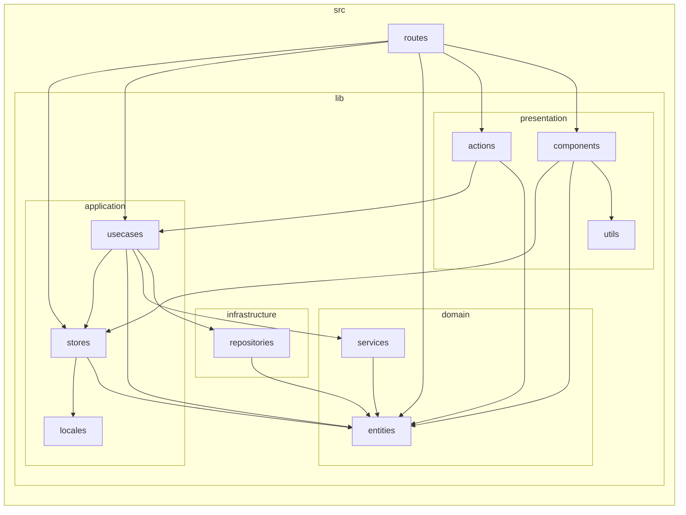

# Src Dependency Graph

`src/` 以下の各ファイルの import 依存関係を解析した結果グラフ。

```mermaid
graph LR
        subgraph "lib"
            subgraph "application"
                subgraph "locales"
                    src_lib_application_locales_en_ts["en.ts"]
                    src_lib_application_locales_ja_ts["ja.ts"]
                end
                subgraph "stores"
                    subgraph "episodeAddStore"
                        subgraph "fileEpisodeAddStore"
                            src_lib_application_stores_episodeAddStore_fileEpisodeAddStore_fileEpisodeAddStore_svelte_ts["fileEpisodeAddStore.svelte.ts"]
                            src_lib_application_stores_episodeAddStore_fileEpisodeAddStore_tsvConfigStore_svelte_ts["tsvConfigStore.svelte.ts"]
                            src_lib_application_stores_episodeAddStore_fileEpisodeAddStore_ttsConfigStore_svelte_ts["ttsConfigStore.svelte.ts"]
                        end
                        src_lib_application_stores_episodeAddStore_episodeAddStore_svelte_ts["episodeAddStore.svelte.ts"]
                        src_lib_application_stores_episodeAddStore_youtubeEpisodeAddStore_svelte_ts["youtubeEpisodeAddStore.svelte.ts"]
                    end
                    src_lib_application_stores_apiKeyStore_svelte_ts["apiKeyStore.svelte.ts"]
                    src_lib_application_stores_audioInfoCacheStore_svelte_ts["audioInfoCacheStore.svelte.ts"]
                    src_lib_application_stores_groupPathStore_svelte_ts["groupPathStore.svelte.ts"]
                    src_lib_application_stores_i18n_svelte_ts["i18n.svelte.ts"]
                    src_lib_application_stores_mediaPlayerStore_svelte_ts["mediaPlayerStore.svelte.ts"]
                end
                subgraph "usecases"
                    src_lib_application_usecases_addEpisodeGroup_ts["addEpisodeGroup.ts"]
                    src_lib_application_usecases_addNewEpisode_ts["addNewEpisode.ts"]
                    src_lib_application_usecases_addSentenceCards_ts["addSentenceCards.ts"]
                    src_lib_application_usecases_analyzeDialogueForMining_ts["analyzeDialogueForMining.ts"]
                    src_lib_application_usecases_deleteEpisode_ts["deleteEpisode.ts"]
                    src_lib_application_usecases_deleteGroupRecursive_ts["deleteGroupRecursive.ts"]
                    src_lib_application_usecases_fetchAlbumGroups_ts["fetchAlbumGroups.ts"]
                    src_lib_application_usecases_fetchAppInfo_ts["fetchAppInfo.ts"]
                    src_lib_application_usecases_fetchAvailableParentGroups_ts["fetchAvailableParentGroups.ts"]
                    src_lib_application_usecases_fetchEpisodeDetail_ts["fetchEpisodeDetail.ts"]
                    src_lib_application_usecases_fetchEpisodeGroups_ts["fetchEpisodeGroups.ts"]
                    src_lib_application_usecases_fetchEpisodes_ts["fetchEpisodes.ts"]
                    src_lib_application_usecases_fetchSettings_ts["fetchSettings.ts"]
                    src_lib_application_usecases_fetchTtsVoices_ts["fetchTtsVoices.ts"]
                    src_lib_application_usecases_fetchYoutubeMetadata_ts["fetchYoutubeMetadata.ts"]
                    src_lib_application_usecases_initializeApplication_ts["initializeApplication.ts"]
                    src_lib_application_usecases_moveEpisode_ts["moveEpisode.ts"]
                    src_lib_application_usecases_moveEpisodeGroup_ts["moveEpisodeGroup.ts"]
                    src_lib_application_usecases_previewScriptFile_ts["previewScriptFile.ts"]
                    src_lib_application_usecases_saveSettings_ts["saveSettings.ts"]
                    src_lib_application_usecases_softDeleteDialogue_ts["softDeleteDialogue.ts"]
                    src_lib_application_usecases_undoSoftDeleteDialogue_ts["undoSoftDeleteDialogue.ts"]
                    src_lib_application_usecases_updateDialogue_ts["updateDialogue.ts"]
                    src_lib_application_usecases_updateEpisodeGroupName_ts["updateEpisodeGroupName.ts"]
                    src_lib_application_usecases_updateEpisodeGroupsOrder_ts["updateEpisodeGroupsOrder.ts"]
                    src_lib_application_usecases_updateEpisodeName_ts["updateEpisodeName.ts"]
                    src_lib_application_usecases_updateEpisodesOrder_ts["updateEpisodesOrder.ts"]
                    subgraph "mediaPlayer"
                        src_lib_application_usecases_mediaPlayer_audioPlayer_ts["audioPlayer.ts"]
                        src_lib_application_usecases_mediaPlayer_mediaPlayer_ts["mediaPlayer.ts"]
                        src_lib_application_usecases_mediaPlayer_youtubePlayer_ts["youtubePlayer.ts"]
                    end
                end
            end
            subgraph "domain"
                subgraph "entities"
                    src_lib_domain_entities_appInfo_ts["appInfo.ts"]
                    src_lib_domain_entities_audioInfo_ts["audioInfo.ts"]
                    src_lib_domain_entities_dialogue_ts["dialogue.ts"]
                    src_lib_domain_entities_episode_ts["episode.ts"]
                    src_lib_domain_entities_episodeGroup_ts["episodeGroup.ts"]
                    src_lib_domain_entities_scriptPreview_ts["scriptPreview.ts"]
                    src_lib_domain_entities_sentenceAnalysisResult_ts["sentenceAnalysisResult.ts"]
                    src_lib_domain_entities_sentenceCard_ts["sentenceCard.ts"]
                    src_lib_domain_entities_settings_ts["settings.ts"]
                    src_lib_domain_entities_tsvConfig_ts["tsvConfig.ts"]
                    src_lib_domain_entities_ttsEvent_ts["ttsEvent.ts"]
                    src_lib_domain_entities_voice_ts["voice.ts"]
                    src_lib_domain_entities_youtubeMetadata_ts["youtubeMetadata.ts"]
                end
                subgraph "services"
                    src_lib_domain_services_buildEpisodeGroupTree_ts["buildEpisodeGroupTree.ts"]
                    src_lib_domain_services_generateEpisodeFilenames_ts["generateEpisodeFilenames.ts"]
                    src_lib_domain_services_groupTreeHelper_ts["groupTreeHelper.ts"]
                    src_lib_domain_services_parseScriptPreview_ts["parseScriptPreview.ts"]
                    src_lib_domain_services_parseSrtToDialogues_ts["parseSrtToDialogues.ts"]
                    src_lib_domain_services_parseSswtToDialogues_ts["parseSswtToDialogues.ts"]
                    src_lib_domain_services_parseTsvToDialogues_ts["parseTsvToDialogues.ts"]
                    src_lib_domain_services_parseVttToDialogues_ts["parseVttToDialogues.ts"]
                    src_lib_domain_services_youtubeUrlValidator_ts["youtubeUrlValidator.ts"]
                end
            end
            subgraph "infrastructure"
                src_lib_infrastructure_config_ts["config.ts"]
                subgraph "repositories"
                    src_lib_infrastructure_repositories_apiKeyRepository_ts["apiKeyRepository.ts"]
                    src_lib_infrastructure_repositories_appInfoRepository_ts["appInfoRepository.ts"]
                    src_lib_infrastructure_repositories_audioRepository_ts["audioRepository.ts"]
                    src_lib_infrastructure_repositories_dialogueRepository_ts["dialogueRepository.ts"]
                    src_lib_infrastructure_repositories_episodeGroupRepository_ts["episodeGroupRepository.ts"]
                    src_lib_infrastructure_repositories_episodeRepository_ts["episodeRepository.ts"]
                    src_lib_infrastructure_repositories_fileRepository_ts["fileRepository.ts"]
                    src_lib_infrastructure_repositories_llmRepository_ts["llmRepository.ts"]
                    src_lib_infrastructure_repositories_sentenceCardRepository_ts["sentenceCardRepository.ts"]
                    src_lib_infrastructure_repositories_settingsRepository_ts["settingsRepository.ts"]
                    src_lib_infrastructure_repositories_ttsRepository_ts["ttsRepository.ts"]
                    src_lib_infrastructure_repositories_youtubeRepository_ts["youtubeRepository.ts"]
                end
            end
            subgraph "presentation"
                subgraph "actions"
                    src_lib_presentation_actions_keyboardShortcuts_ts["keyboardShortcuts.ts"]
                end
                subgraph "components"
                    src_lib_presentation_components_AudioPlayer_svelte["AudioPlayer.svelte"]
                    src_lib_presentation_components_Breadcrumbs_svelte["Breadcrumbs.svelte"]
                    src_lib_presentation_components_ConfirmModal_svelte["ConfirmModal.svelte"]
                    src_lib_presentation_components_EpisodeAddModal_svelte["EpisodeAddModal.svelte"]
                    src_lib_presentation_components_EpisodeListTable_svelte["EpisodeListTable.svelte"]
                    src_lib_presentation_components_EpisodeMoveModal_svelte["EpisodeMoveModal.svelte"]
                    src_lib_presentation_components_EpisodeNameEditModal_svelte["EpisodeNameEditModal.svelte"]
                    src_lib_presentation_components_FileEpisodeForm_svelte["FileEpisodeForm.svelte"]
                    src_lib_presentation_components_FileSelect_svelte["FileSelect.svelte"]
                    src_lib_presentation_components_GroupAddModal_svelte["GroupAddModal.svelte"]
                    src_lib_presentation_components_GroupGrid_svelte["GroupGrid.svelte"]
                    src_lib_presentation_components_GroupMoveModal_svelte["GroupMoveModal.svelte"]
                    src_lib_presentation_components_GroupNameEditModal_svelte["GroupNameEditModal.svelte"]
                    src_lib_presentation_components_LanguageSelectionModal_svelte["LanguageSelectionModal.svelte"]
                    src_lib_presentation_components_SentenceCardList_svelte["SentenceCardList.svelte"]
                    src_lib_presentation_components_SentenceMiningModal_svelte["SentenceMiningModal.svelte"]
                    src_lib_presentation_components_TranscriptViewer_svelte["TranscriptViewer.svelte"]
                    src_lib_presentation_components_TsvConfigSection_svelte["TsvConfigSection.svelte"]
                    src_lib_presentation_components_TtsConfigSection_svelte["TtsConfigSection.svelte"]
                    src_lib_presentation_components_YoutubeEpisodeForm_svelte["YoutubeEpisodeForm.svelte"]
                end
                subgraph "utils"
                    src_lib_presentation_utils_dateFormatter_ts["dateFormatter.ts"]
                end
            end
            subgraph "utils"
                src_lib_utils_language_ts["language.ts"]
            end
        end
        subgraph "routes"
            subgraph "[...groupId]"
                src_routes_____groupId___page_svelte["+page.svelte"]
                src_routes_____groupId___page_ts["+page.ts"]
            end
            subgraph "episode"
                subgraph "[id]"
                    src_routes_episode__id___page_svelte["+page.svelte"]
                    src_routes_episode__id___page_ts["+page.ts"]
                end
            end
            subgraph "episode-list"
                subgraph "[groupId]"
                    src_routes_episode_list__groupId___page_svelte["+page.svelte"]
                    src_routes_episode_list__groupId___page_ts["+page.ts"]
                end
            end
            src_routes__layout_svelte["+layout.svelte"]
            src_routes__layout_ts["+layout.ts"]
            subgraph "settings"
                src_routes_settings__page_svelte["+page.svelte"]
                src_routes_settings__page_ts["+page.ts"]
            end
        end
src_lib_application_stores_audioInfoCacheStore_svelte_ts --> src_lib_domain_entities_audioInfo_ts
src_lib_application_stores_episodeAddStore_episodeAddStore_svelte_ts --> src_lib_application_stores_episodeAddStore_fileEpisodeAddStore_fileEpisodeAddStore_svelte_ts
src_lib_application_stores_episodeAddStore_episodeAddStore_svelte_ts --> src_lib_application_stores_episodeAddStore_youtubeEpisodeAddStore_svelte_ts
src_lib_application_stores_episodeAddStore_fileEpisodeAddStore_fileEpisodeAddStore_svelte_ts --> src_lib_application_stores_episodeAddStore_fileEpisodeAddStore_tsvConfigStore_svelte_ts
src_lib_application_stores_episodeAddStore_fileEpisodeAddStore_fileEpisodeAddStore_svelte_ts --> src_lib_application_stores_episodeAddStore_fileEpisodeAddStore_ttsConfigStore_svelte_ts
src_lib_application_stores_episodeAddStore_fileEpisodeAddStore_fileEpisodeAddStore_svelte_ts --> src_lib_application_stores_i18n_svelte_ts
src_lib_application_stores_episodeAddStore_fileEpisodeAddStore_fileEpisodeAddStore_svelte_ts --> src_lib_domain_entities_tsvConfig_ts
src_lib_application_stores_episodeAddStore_fileEpisodeAddStore_tsvConfigStore_svelte_ts --> src_lib_domain_entities_scriptPreview_ts
src_lib_application_stores_episodeAddStore_fileEpisodeAddStore_tsvConfigStore_svelte_ts --> src_lib_domain_entities_tsvConfig_ts
src_lib_application_stores_episodeAddStore_fileEpisodeAddStore_ttsConfigStore_svelte_ts --> src_lib_application_stores_i18n_svelte_ts
src_lib_application_stores_episodeAddStore_fileEpisodeAddStore_ttsConfigStore_svelte_ts --> src_lib_domain_entities_voice_ts
src_lib_application_stores_episodeAddStore_fileEpisodeAddStore_ttsConfigStore_svelte_ts --> src_lib_utils_language_ts
src_lib_application_stores_episodeAddStore_youtubeEpisodeAddStore_svelte_ts --> src_lib_application_stores_i18n_svelte_ts
src_lib_application_stores_episodeAddStore_youtubeEpisodeAddStore_svelte_ts --> src_lib_domain_entities_youtubeMetadata_ts
src_lib_application_stores_episodeAddStore_youtubeEpisodeAddStore_svelte_ts --> src_lib_utils_language_ts
src_lib_application_stores_groupPathStore_svelte_ts --> src_lib_domain_entities_episodeGroup_ts
src_lib_application_stores_i18n_svelte_ts --> src_lib_application_locales_en_ts
src_lib_application_stores_i18n_svelte_ts --> src_lib_application_locales_ja_ts
src_lib_application_usecases_addEpisodeGroup_ts --> src_lib_domain_entities_episodeGroup_ts
src_lib_application_usecases_addEpisodeGroup_ts --> src_lib_infrastructure_repositories_episodeGroupRepository_ts
src_lib_application_usecases_addNewEpisode_ts --> src_lib_domain_entities_dialogue_ts
src_lib_application_usecases_addNewEpisode_ts --> src_lib_domain_entities_youtubeMetadata_ts
src_lib_application_usecases_addNewEpisode_ts --> src_lib_domain_services_generateEpisodeFilenames_ts
src_lib_application_usecases_addNewEpisode_ts --> src_lib_domain_services_parseSrtToDialogues_ts
src_lib_application_usecases_addNewEpisode_ts --> src_lib_domain_services_parseSswtToDialogues_ts
src_lib_application_usecases_addNewEpisode_ts --> src_lib_domain_services_parseTsvToDialogues_ts
src_lib_application_usecases_addNewEpisode_ts --> src_lib_domain_services_parseVttToDialogues_ts
src_lib_application_usecases_addNewEpisode_ts --> src_lib_domain_services_youtubeUrlValidator_ts
src_lib_application_usecases_addNewEpisode_ts --> src_lib_infrastructure_repositories_dialogueRepository_ts
src_lib_application_usecases_addNewEpisode_ts --> src_lib_infrastructure_repositories_episodeRepository_ts
src_lib_application_usecases_addNewEpisode_ts --> src_lib_infrastructure_repositories_fileRepository_ts
src_lib_application_usecases_addNewEpisode_ts --> src_lib_infrastructure_repositories_youtubeRepository_ts
src_lib_application_usecases_addNewEpisode_ts --> src_lib_utils_language_ts
src_lib_application_usecases_addSentenceCards_ts --> src_lib_infrastructure_repositories_sentenceCardRepository_ts
src_lib_application_usecases_analyzeDialogueForMining_ts --> src_lib_application_stores_apiKeyStore_svelte_ts
src_lib_application_usecases_analyzeDialogueForMining_ts --> src_lib_domain_entities_dialogue_ts
src_lib_application_usecases_analyzeDialogueForMining_ts --> src_lib_domain_entities_sentenceAnalysisResult_ts
src_lib_application_usecases_analyzeDialogueForMining_ts --> src_lib_infrastructure_repositories_apiKeyRepository_ts
src_lib_application_usecases_analyzeDialogueForMining_ts --> src_lib_infrastructure_repositories_dialogueRepository_ts
src_lib_application_usecases_analyzeDialogueForMining_ts --> src_lib_infrastructure_repositories_llmRepository_ts
src_lib_application_usecases_analyzeDialogueForMining_ts --> src_lib_infrastructure_repositories_sentenceCardRepository_ts
src_lib_application_usecases_deleteEpisode_ts --> src_lib_infrastructure_repositories_dialogueRepository_ts
src_lib_application_usecases_deleteEpisode_ts --> src_lib_infrastructure_repositories_episodeRepository_ts
src_lib_application_usecases_deleteEpisode_ts --> src_lib_infrastructure_repositories_fileRepository_ts
src_lib_application_usecases_deleteEpisode_ts --> src_lib_infrastructure_repositories_sentenceCardRepository_ts
src_lib_application_usecases_deleteGroupRecursive_ts --> src_lib_application_usecases_deleteEpisode_ts
src_lib_application_usecases_deleteGroupRecursive_ts --> src_lib_domain_entities_episodeGroup_ts
src_lib_application_usecases_deleteGroupRecursive_ts --> src_lib_domain_services_groupTreeHelper_ts
src_lib_application_usecases_deleteGroupRecursive_ts --> src_lib_infrastructure_repositories_episodeGroupRepository_ts
src_lib_application_usecases_deleteGroupRecursive_ts --> src_lib_infrastructure_repositories_episodeRepository_ts
src_lib_application_usecases_fetchAlbumGroups_ts --> src_lib_domain_services_buildEpisodeGroupTree_ts
src_lib_application_usecases_fetchAlbumGroups_ts --> src_lib_infrastructure_repositories_episodeGroupRepository_ts
src_lib_application_usecases_fetchAppInfo_ts --> src_lib_domain_entities_appInfo_ts
src_lib_application_usecases_fetchAppInfo_ts --> src_lib_infrastructure_repositories_appInfoRepository_ts
src_lib_application_usecases_fetchAvailableParentGroups_ts --> src_lib_domain_entities_episodeGroup_ts
src_lib_application_usecases_fetchAvailableParentGroups_ts --> src_lib_domain_services_buildEpisodeGroupTree_ts
src_lib_application_usecases_fetchAvailableParentGroups_ts --> src_lib_domain_services_groupTreeHelper_ts
src_lib_application_usecases_fetchAvailableParentGroups_ts --> src_lib_infrastructure_repositories_episodeGroupRepository_ts
src_lib_application_usecases_fetchEpisodeDetail_ts --> src_lib_domain_entities_dialogue_ts
src_lib_application_usecases_fetchEpisodeDetail_ts --> src_lib_domain_entities_episode_ts
src_lib_application_usecases_fetchEpisodeDetail_ts --> src_lib_domain_entities_sentenceCard_ts
src_lib_application_usecases_fetchEpisodeDetail_ts --> src_lib_infrastructure_repositories_dialogueRepository_ts
src_lib_application_usecases_fetchEpisodeDetail_ts --> src_lib_infrastructure_repositories_episodeRepository_ts
src_lib_application_usecases_fetchEpisodeDetail_ts --> src_lib_infrastructure_repositories_sentenceCardRepository_ts
src_lib_application_usecases_fetchEpisodeGroups_ts --> src_lib_domain_entities_episodeGroup_ts
src_lib_application_usecases_fetchEpisodeGroups_ts --> src_lib_infrastructure_repositories_episodeGroupRepository_ts
src_lib_application_usecases_fetchEpisodes_ts --> src_lib_domain_entities_episode_ts
src_lib_application_usecases_fetchEpisodes_ts --> src_lib_domain_entities_episodeGroup_ts
src_lib_application_usecases_fetchEpisodes_ts --> src_lib_infrastructure_repositories_episodeGroupRepository_ts
src_lib_application_usecases_fetchEpisodes_ts --> src_lib_infrastructure_repositories_episodeRepository_ts
src_lib_application_usecases_fetchSettings_ts --> src_lib_application_stores_apiKeyStore_svelte_ts
src_lib_application_usecases_fetchSettings_ts --> src_lib_domain_entities_settings_ts
src_lib_application_usecases_fetchSettings_ts --> src_lib_infrastructure_repositories_apiKeyRepository_ts
src_lib_application_usecases_fetchSettings_ts --> src_lib_infrastructure_repositories_settingsRepository_ts
src_lib_application_usecases_fetchTtsVoices_ts --> src_lib_application_stores_episodeAddStore_fileEpisodeAddStore_fileEpisodeAddStore_svelte_ts
src_lib_application_usecases_fetchTtsVoices_ts --> src_lib_domain_entities_voice_ts
src_lib_application_usecases_fetchTtsVoices_ts --> src_lib_infrastructure_repositories_settingsRepository_ts
src_lib_application_usecases_fetchTtsVoices_ts --> src_lib_infrastructure_repositories_ttsRepository_ts
src_lib_application_usecases_fetchTtsVoices_ts --> src_lib_utils_language_ts
src_lib_application_usecases_fetchYoutubeMetadata_ts --> src_lib_application_stores_apiKeyStore_svelte_ts
src_lib_application_usecases_fetchYoutubeMetadata_ts --> src_lib_domain_entities_youtubeMetadata_ts
src_lib_application_usecases_fetchYoutubeMetadata_ts --> src_lib_domain_services_youtubeUrlValidator_ts
src_lib_application_usecases_fetchYoutubeMetadata_ts --> src_lib_infrastructure_repositories_apiKeyRepository_ts
src_lib_application_usecases_fetchYoutubeMetadata_ts --> src_lib_infrastructure_repositories_youtubeRepository_ts
src_lib_application_usecases_initializeApplication_ts --> src_lib_application_stores_i18n_svelte_ts
src_lib_application_usecases_initializeApplication_ts --> src_lib_infrastructure_repositories_settingsRepository_ts
src_lib_application_usecases_mediaPlayer_audioPlayer_ts --> src_lib_application_stores_audioInfoCacheStore_svelte_ts
src_lib_application_usecases_mediaPlayer_audioPlayer_ts --> src_lib_application_stores_mediaPlayerStore_svelte_ts
src_lib_application_usecases_mediaPlayer_audioPlayer_ts --> src_lib_application_usecases_mediaPlayer_mediaPlayer_ts
src_lib_application_usecases_mediaPlayer_audioPlayer_ts --> src_lib_domain_entities_audioInfo_ts
src_lib_application_usecases_mediaPlayer_audioPlayer_ts --> src_lib_infrastructure_repositories_audioRepository_ts
src_lib_application_usecases_mediaPlayer_youtubePlayer_ts --> src_lib_application_stores_mediaPlayerStore_svelte_ts
src_lib_application_usecases_mediaPlayer_youtubePlayer_ts --> src_lib_application_usecases_mediaPlayer_mediaPlayer_ts
src_lib_application_usecases_mediaPlayer_youtubePlayer_ts --> src_lib_domain_services_youtubeUrlValidator_ts
src_lib_application_usecases_moveEpisode_ts --> src_lib_infrastructure_repositories_episodeRepository_ts
src_lib_application_usecases_moveEpisodeGroup_ts --> src_lib_domain_entities_episodeGroup_ts
src_lib_application_usecases_moveEpisodeGroup_ts --> src_lib_domain_services_groupTreeHelper_ts
src_lib_application_usecases_moveEpisodeGroup_ts --> src_lib_infrastructure_repositories_episodeGroupRepository_ts
src_lib_application_usecases_previewScriptFile_ts --> src_lib_domain_entities_scriptPreview_ts
src_lib_application_usecases_previewScriptFile_ts --> src_lib_domain_services_parseScriptPreview_ts
src_lib_application_usecases_previewScriptFile_ts --> src_lib_infrastructure_repositories_fileRepository_ts
src_lib_application_usecases_saveSettings_ts --> src_lib_application_stores_i18n_svelte_ts
src_lib_application_usecases_saveSettings_ts --> src_lib_domain_entities_settings_ts
src_lib_application_usecases_saveSettings_ts --> src_lib_infrastructure_repositories_apiKeyRepository_ts
src_lib_application_usecases_saveSettings_ts --> src_lib_infrastructure_repositories_settingsRepository_ts
src_lib_application_usecases_softDeleteDialogue_ts --> src_lib_infrastructure_repositories_dialogueRepository_ts
src_lib_application_usecases_undoSoftDeleteDialogue_ts --> src_lib_infrastructure_repositories_dialogueRepository_ts
src_lib_application_usecases_updateDialogue_ts --> src_lib_infrastructure_repositories_dialogueRepository_ts
src_lib_application_usecases_updateEpisodeGroupName_ts --> src_lib_domain_entities_episodeGroup_ts
src_lib_application_usecases_updateEpisodeGroupName_ts --> src_lib_infrastructure_repositories_episodeGroupRepository_ts
src_lib_application_usecases_updateEpisodeGroupsOrder_ts --> src_lib_domain_entities_episodeGroup_ts
src_lib_application_usecases_updateEpisodeGroupsOrder_ts --> src_lib_infrastructure_repositories_episodeGroupRepository_ts
src_lib_application_usecases_updateEpisodeName_ts --> src_lib_domain_entities_episode_ts
src_lib_application_usecases_updateEpisodeName_ts --> src_lib_infrastructure_repositories_episodeRepository_ts
src_lib_application_usecases_updateEpisodesOrder_ts --> src_lib_domain_entities_episode_ts
src_lib_application_usecases_updateEpisodesOrder_ts --> src_lib_infrastructure_repositories_episodeRepository_ts
src_lib_domain_entities_sentenceAnalysisResult_ts --> src_lib_domain_entities_sentenceCard_ts
src_lib_domain_services_buildEpisodeGroupTree_ts --> src_lib_domain_entities_episodeGroup_ts
src_lib_domain_services_groupTreeHelper_ts --> src_lib_domain_entities_episodeGroup_ts
src_lib_domain_services_parseScriptPreview_ts --> src_lib_domain_entities_scriptPreview_ts
src_lib_domain_services_parseSrtToDialogues_ts --> src_lib_domain_entities_dialogue_ts
src_lib_domain_services_parseSswtToDialogues_ts --> src_lib_domain_entities_dialogue_ts
src_lib_domain_services_parseTsvToDialogues_ts --> src_lib_domain_entities_dialogue_ts
src_lib_domain_services_parseTsvToDialogues_ts --> src_lib_domain_entities_tsvConfig_ts
src_lib_domain_services_parseVttToDialogues_ts --> src_lib_domain_entities_dialogue_ts
src_lib_infrastructure_repositories_appInfoRepository_ts --> src_lib_domain_entities_appInfo_ts
src_lib_infrastructure_repositories_audioRepository_ts --> src_lib_domain_entities_audioInfo_ts
src_lib_infrastructure_repositories_dialogueRepository_ts --> src_lib_domain_entities_dialogue_ts
src_lib_infrastructure_repositories_dialogueRepository_ts --> src_lib_infrastructure_config_ts
src_lib_infrastructure_repositories_episodeGroupRepository_ts --> src_lib_domain_entities_episodeGroup_ts
src_lib_infrastructure_repositories_episodeGroupRepository_ts --> src_lib_infrastructure_config_ts
src_lib_infrastructure_repositories_episodeRepository_ts --> src_lib_domain_entities_episode_ts
src_lib_infrastructure_repositories_episodeRepository_ts --> src_lib_infrastructure_config_ts
src_lib_infrastructure_repositories_fileRepository_ts --> src_lib_infrastructure_config_ts
src_lib_infrastructure_repositories_llmRepository_ts --> src_lib_domain_entities_sentenceAnalysisResult_ts
src_lib_infrastructure_repositories_sentenceCardRepository_ts --> src_lib_domain_entities_sentenceAnalysisResult_ts
src_lib_infrastructure_repositories_sentenceCardRepository_ts --> src_lib_domain_entities_sentenceCard_ts
src_lib_infrastructure_repositories_sentenceCardRepository_ts --> src_lib_infrastructure_config_ts
src_lib_infrastructure_repositories_settingsRepository_ts --> src_lib_domain_entities_settings_ts
src_lib_infrastructure_repositories_ttsRepository_ts --> src_lib_domain_entities_ttsEvent_ts
src_lib_infrastructure_repositories_ttsRepository_ts --> src_lib_domain_entities_voice_ts
src_lib_infrastructure_repositories_youtubeRepository_ts --> src_lib_domain_entities_dialogue_ts
src_lib_infrastructure_repositories_youtubeRepository_ts --> src_lib_domain_entities_youtubeMetadata_ts
src_lib_presentation_actions_keyboardShortcuts_ts --> src_lib_application_usecases_mediaPlayer_mediaPlayer_ts
src_lib_presentation_actions_keyboardShortcuts_ts --> src_lib_domain_entities_dialogue_ts
src_lib_presentation_components_Breadcrumbs_svelte --> src_lib_application_stores_i18n_svelte_ts
src_lib_presentation_components_Breadcrumbs_svelte --> src_lib_domain_entities_episodeGroup_ts
src_lib_presentation_components_ConfirmModal_svelte --> src_lib_application_stores_i18n_svelte_ts
src_lib_presentation_components_EpisodeAddModal_svelte --> src_lib_application_stores_episodeAddStore_episodeAddStore_svelte_ts
src_lib_presentation_components_EpisodeAddModal_svelte --> src_lib_application_stores_i18n_svelte_ts
src_lib_presentation_components_EpisodeAddModal_svelte --> src_lib_presentation_components_FileEpisodeForm_svelte
src_lib_presentation_components_EpisodeAddModal_svelte --> src_lib_presentation_components_YoutubeEpisodeForm_svelte
src_lib_presentation_components_EpisodeListTable_svelte --> src_lib_application_stores_i18n_svelte_ts
src_lib_presentation_components_EpisodeListTable_svelte --> src_lib_domain_entities_episode_ts
src_lib_presentation_components_EpisodeListTable_svelte --> src_lib_presentation_utils_dateFormatter_ts
src_lib_presentation_components_EpisodeMoveModal_svelte --> src_lib_application_stores_i18n_svelte_ts
src_lib_presentation_components_EpisodeMoveModal_svelte --> src_lib_domain_entities_episode_ts
src_lib_presentation_components_EpisodeMoveModal_svelte --> src_lib_domain_entities_episodeGroup_ts
src_lib_presentation_components_EpisodeNameEditModal_svelte --> src_lib_application_stores_i18n_svelte_ts
src_lib_presentation_components_FileEpisodeForm_svelte --> src_lib_application_stores_episodeAddStore_episodeAddStore_svelte_ts
src_lib_presentation_components_FileEpisodeForm_svelte --> src_lib_application_stores_episodeAddStore_fileEpisodeAddStore_fileEpisodeAddStore_svelte_ts
src_lib_presentation_components_FileEpisodeForm_svelte --> src_lib_application_stores_i18n_svelte_ts
src_lib_presentation_components_FileEpisodeForm_svelte --> src_lib_presentation_components_FileSelect_svelte
src_lib_presentation_components_FileEpisodeForm_svelte --> src_lib_presentation_components_TsvConfigSection_svelte
src_lib_presentation_components_FileEpisodeForm_svelte --> src_lib_presentation_components_TtsConfigSection_svelte
src_lib_presentation_components_FileSelect_svelte --> src_lib_application_stores_i18n_svelte_ts
src_lib_presentation_components_GroupAddModal_svelte --> src_lib_application_stores_i18n_svelte_ts
src_lib_presentation_components_GroupAddModal_svelte --> src_lib_domain_entities_episodeGroup_ts
src_lib_presentation_components_GroupGrid_svelte --> src_lib_application_stores_i18n_svelte_ts
src_lib_presentation_components_GroupGrid_svelte --> src_lib_domain_entities_episodeGroup_ts
src_lib_presentation_components_GroupMoveModal_svelte --> src_lib_application_stores_i18n_svelte_ts
src_lib_presentation_components_GroupMoveModal_svelte --> src_lib_domain_entities_episodeGroup_ts
src_lib_presentation_components_GroupNameEditModal_svelte --> src_lib_application_stores_i18n_svelte_ts
src_lib_presentation_components_LanguageSelectionModal_svelte --> src_lib_application_stores_i18n_svelte_ts
src_lib_presentation_components_LanguageSelectionModal_svelte --> src_lib_utils_language_ts
src_lib_presentation_components_SentenceCardList_svelte --> src_lib_application_stores_i18n_svelte_ts
src_lib_presentation_components_SentenceCardList_svelte --> src_lib_domain_entities_sentenceCard_ts
src_lib_presentation_components_SentenceCardList_svelte --> src_lib_presentation_utils_dateFormatter_ts
src_lib_presentation_components_SentenceMiningModal_svelte --> src_lib_application_stores_i18n_svelte_ts
src_lib_presentation_components_SentenceMiningModal_svelte --> src_lib_domain_entities_dialogue_ts
src_lib_presentation_components_SentenceMiningModal_svelte --> src_lib_domain_entities_sentenceAnalysisResult_ts
src_lib_presentation_components_TranscriptViewer_svelte --> src_lib_application_stores_i18n_svelte_ts
src_lib_presentation_components_TranscriptViewer_svelte --> src_lib_domain_entities_dialogue_ts
src_lib_presentation_components_TsvConfigSection_svelte --> src_lib_application_stores_episodeAddStore_fileEpisodeAddStore_tsvConfigStore_svelte_ts
src_lib_presentation_components_TsvConfigSection_svelte --> src_lib_application_stores_i18n_svelte_ts
src_lib_presentation_components_TtsConfigSection_svelte --> src_lib_application_stores_episodeAddStore_fileEpisodeAddStore_ttsConfigStore_svelte_ts
src_lib_presentation_components_TtsConfigSection_svelte --> src_lib_application_stores_i18n_svelte_ts
src_lib_presentation_components_YoutubeEpisodeForm_svelte --> src_lib_application_stores_episodeAddStore_episodeAddStore_svelte_ts
src_lib_presentation_components_YoutubeEpisodeForm_svelte --> src_lib_application_stores_episodeAddStore_youtubeEpisodeAddStore_svelte_ts
src_lib_presentation_components_YoutubeEpisodeForm_svelte --> src_lib_application_stores_i18n_svelte_ts
src_lib_presentation_components_YoutubeEpisodeForm_svelte --> src_lib_utils_language_ts
src_routes__layout_ts --> src_lib_application_usecases_initializeApplication_ts
src_routes_____groupId___page_svelte --> src_lib_application_stores_groupPathStore_svelte_ts
src_routes_____groupId___page_svelte --> src_lib_application_stores_i18n_svelte_ts
src_routes_____groupId___page_svelte --> src_lib_application_usecases_addEpisodeGroup_ts
src_routes_____groupId___page_svelte --> src_lib_application_usecases_deleteGroupRecursive_ts
src_routes_____groupId___page_svelte --> src_lib_application_usecases_fetchAvailableParentGroups_ts
src_routes_____groupId___page_svelte --> src_lib_application_usecases_moveEpisodeGroup_ts
src_routes_____groupId___page_svelte --> src_lib_application_usecases_updateEpisodeGroupName_ts
src_routes_____groupId___page_svelte --> src_lib_application_usecases_updateEpisodeGroupsOrder_ts
src_routes_____groupId___page_svelte --> src_lib_domain_entities_episodeGroup_ts
src_routes_____groupId___page_svelte --> src_lib_presentation_components_Breadcrumbs_svelte
src_routes_____groupId___page_svelte --> src_lib_presentation_components_ConfirmModal_svelte
src_routes_____groupId___page_svelte --> src_lib_presentation_components_GroupAddModal_svelte
src_routes_____groupId___page_svelte --> src_lib_presentation_components_GroupGrid_svelte
src_routes_____groupId___page_svelte --> src_lib_presentation_components_GroupMoveModal_svelte
src_routes_____groupId___page_svelte --> src_lib_presentation_components_GroupNameEditModal_svelte
src_routes_____groupId___page_ts --> src_lib_application_usecases_fetchEpisodeGroups_ts
src_routes_episode_list__groupId___page_svelte --> src_lib_application_stores_episodeAddStore_episodeAddStore_svelte_ts
src_routes_episode_list__groupId___page_svelte --> src_lib_application_stores_groupPathStore_svelte_ts
src_routes_episode_list__groupId___page_svelte --> src_lib_application_stores_i18n_svelte_ts
src_routes_episode_list__groupId___page_svelte --> src_lib_application_usecases_addNewEpisode_ts
src_routes_episode_list__groupId___page_svelte --> src_lib_application_usecases_deleteEpisode_ts
src_routes_episode_list__groupId___page_svelte --> src_lib_application_usecases_fetchAlbumGroups_ts
src_routes_episode_list__groupId___page_svelte --> src_lib_application_usecases_fetchTtsVoices_ts
src_routes_episode_list__groupId___page_svelte --> src_lib_application_usecases_fetchYoutubeMetadata_ts
src_routes_episode_list__groupId___page_svelte --> src_lib_application_usecases_moveEpisode_ts
src_routes_episode_list__groupId___page_svelte --> src_lib_application_usecases_previewScriptFile_ts
src_routes_episode_list__groupId___page_svelte --> src_lib_application_usecases_updateEpisodeName_ts
src_routes_episode_list__groupId___page_svelte --> src_lib_application_usecases_updateEpisodesOrder_ts
src_routes_episode_list__groupId___page_svelte --> src_lib_domain_entities_episode_ts
src_routes_episode_list__groupId___page_svelte --> src_lib_domain_entities_episodeGroup_ts
src_routes_episode_list__groupId___page_svelte --> src_lib_presentation_components_Breadcrumbs_svelte
src_routes_episode_list__groupId___page_svelte --> src_lib_presentation_components_ConfirmModal_svelte
src_routes_episode_list__groupId___page_svelte --> src_lib_presentation_components_EpisodeAddModal_svelte
src_routes_episode_list__groupId___page_svelte --> src_lib_presentation_components_EpisodeListTable_svelte
src_routes_episode_list__groupId___page_svelte --> src_lib_presentation_components_EpisodeMoveModal_svelte
src_routes_episode_list__groupId___page_svelte --> src_lib_presentation_components_EpisodeNameEditModal_svelte
src_routes_episode_list__groupId___page_ts --> src_lib_application_usecases_fetchEpisodes_ts
src_routes_episode_list__groupId___page_ts --> src_lib_domain_entities_episode_ts
src_routes_episode__id___page_svelte --> src_lib_application_stores_i18n_svelte_ts
src_routes_episode__id___page_svelte --> src_lib_application_stores_mediaPlayerStore_svelte_ts
src_routes_episode__id___page_svelte --> src_lib_application_usecases_addSentenceCards_ts
src_routes_episode__id___page_svelte --> src_lib_application_usecases_analyzeDialogueForMining_ts
src_routes_episode__id___page_svelte --> src_lib_application_usecases_mediaPlayer_youtubePlayer_ts
src_routes_episode__id___page_svelte --> src_lib_application_usecases_softDeleteDialogue_ts
src_routes_episode__id___page_svelte --> src_lib_application_usecases_undoSoftDeleteDialogue_ts
src_routes_episode__id___page_svelte --> src_lib_application_usecases_updateDialogue_ts
src_routes_episode__id___page_svelte --> src_lib_domain_entities_dialogue_ts
src_routes_episode__id___page_svelte --> src_lib_domain_entities_sentenceAnalysisResult_ts
src_routes_episode__id___page_svelte --> src_lib_domain_entities_sentenceCard_ts
src_routes_episode__id___page_svelte --> src_lib_presentation_actions_keyboardShortcuts_ts
src_routes_episode__id___page_svelte --> src_lib_presentation_components_AudioPlayer_svelte
src_routes_episode__id___page_svelte --> src_lib_presentation_components_ConfirmModal_svelte
src_routes_episode__id___page_svelte --> src_lib_presentation_components_SentenceCardList_svelte
src_routes_episode__id___page_svelte --> src_lib_presentation_components_SentenceMiningModal_svelte
src_routes_episode__id___page_svelte --> src_lib_presentation_components_TranscriptViewer_svelte
src_routes_episode__id___page_ts --> src_lib_application_usecases_fetchEpisodeDetail_ts
src_routes_episode__id___page_ts --> src_lib_application_usecases_fetchSettings_ts
src_routes_episode__id___page_ts --> src_lib_application_usecases_mediaPlayer_audioPlayer_ts
src_routes_episode__id___page_ts --> src_lib_application_usecases_mediaPlayer_mediaPlayer_ts
src_routes_episode__id___page_ts --> src_lib_application_usecases_mediaPlayer_youtubePlayer_ts
src_routes_episode__id___page_ts --> src_lib_domain_entities_audioInfo_ts
src_routes_settings__page_svelte --> src_lib_application_stores_i18n_svelte_ts
src_routes_settings__page_svelte --> src_lib_application_usecases_saveSettings_ts
src_routes_settings__page_svelte --> src_lib_presentation_components_LanguageSelectionModal_svelte
src_routes_settings__page_svelte --> src_lib_utils_language_ts
src_routes_settings__page_ts --> src_lib_application_usecases_fetchAppInfo_ts
src_routes_settings__page_ts --> src_lib_application_usecases_fetchSettings_ts
```

# Src Folder-level Dependency Graph

`src/` 以下の各ディレクトリ間依存関係を解析した結果グラフ。


