# Frontend Dependency Graphs

# Presentation Layer Dependency Graph

Note: `src/lib/application/stores/i18n.svelte.ts` is omitted from presentation graphs to reduce noise.

### Screen: /[...groupId]

Dependencies for the `/[...groupId]` screen.


### Screen: /episode-list/[groupId]

Dependencies for the `/episode-list/[groupId]` screen.


### Screen: /episode/[id]

Dependencies for the `/episode/[id]` screen.


### Screen: /settings

Dependencies for the `/settings` screen.


## Application Layer: Use Case Dependencies
### Use Case: addEpisodeGroup.ts

Shows files that use the `addEpisodeGroup.ts` use case, and the files it depends on.


### Use Case: addNewEpisode.ts

Shows files that use the `addNewEpisode.ts` use case, and the files it depends on.


### Use Case: addSentenceCards.ts

Shows files that use the `addSentenceCards.ts` use case, and the files it depends on.


### Use Case: analyzeDialogueForMining.ts

Shows files that use the `analyzeDialogueForMining.ts` use case, and the files it depends on.


### Use Case: deleteEpisode.ts

Shows files that use the `deleteEpisode.ts` use case, and the files it depends on.


### Use Case: deleteGroupRecursive.ts

Shows files that use the `deleteGroupRecursive.ts` use case, and the files it depends on.


### Use Case: detectScriptLanguage.ts

Shows files that use the `detectScriptLanguage.ts` use case, and the files it depends on.


### Use Case: downloadTtsModel.ts

Shows files that use the `downloadTtsModel.ts` use case, and the files it depends on.


### Use Case: executeTts.ts

Shows files that use the `executeTts.ts` use case, and the files it depends on.


### Use Case: fetchAppInfo.ts

Shows files that use the `fetchAppInfo.ts` use case, and the files it depends on.


### Use Case: fetchAvailableParentGroups.ts

Shows files that use the `fetchAvailableParentGroups.ts` use case, and the files it depends on.


### Use Case: fetchAvailableTargetGroupsForEpisodeMove.ts

Shows files that use the `fetchAvailableTargetGroupsForEpisodeMove.ts` use case, and the files it depends on.


### Use Case: fetchEpisodeDetail.ts

Shows files that use the `fetchEpisodeDetail.ts` use case, and the files it depends on.

```mermaid
graph LR
        subgraph sg_lib ["lib"]
            subgraph sg_lib_application ["application"]
                subgraph sg_lib_application_usecases ["usecases"]
                    src_lib_application_usecases_fetchEpisodeDetail_ts["fetchEpisodeDetail.ts"]
                end
            end
            subgraph sg_lib_domain ["domain"]
                subgraph sg_lib_domain_entities ["entities"]
                    src_lib_domain_entities_dialogue_ts["dialogue.ts"]
                    src_lib_domain_entities_episode_ts["episode.ts"]
                    src_lib_domain_entities_sentenceCard_ts["sentenceCard.ts"]
                end
            end
            subgraph sg_lib_infrastructure ["infrastructure"]
                subgraph sg_lib_infrastructure_repositories ["repositories"]
                    src_lib_infrastructure_repositories_dialogueRepository_ts["dialogueRepository.ts"]
                    src_lib_infrastructure_repositories_episodeRepository_ts["episodeRepository.ts"]
                    src_lib_infrastructure_repositories_sentenceCardRepository_ts["sentenceCardRepository.ts"]
                end
            end
        end
        subgraph sg_routes ["routes"]
            subgraph sg_routes_episode ["episode"]
                subgraph sg_routes_episode__id_ ["[id]"]
                    src_routes_episode__id___page_ts["+page.ts"]
                end
            end
        end
    src_lib_application_usecases_fetchEpisodeDetail_ts --> src_lib_domain_entities_dialogue_ts
    src_lib_application_usecases_fetchEpisodeDetail_ts --> src_lib_domain_entities_episode_ts
    src_lib_application_usecases_fetchEpisodeDetail_ts --> src_lib_domain_entities_sentenceCard_ts
    src_lib_application_usecases_fetchEpisodeDetail_ts --> src_lib_infrastructure_repositories_dialogueRepository_ts
    src_lib_application_usecases_fetchEpisodeDetail_ts --> src_lib_infrastructure_repositories_episodeRepository_ts
    src_lib_application_usecases_fetchEpisodeDetail_ts --> src_lib_infrastructure_repositories_sentenceCardRepository_ts
    src_lib_infrastructure_repositories_dialogueRepository_ts --> src_lib_domain_entities_dialogue_ts
    src_lib_infrastructure_repositories_episodeRepository_ts --> src_lib_domain_entities_episode_ts
    src_lib_infrastructure_repositories_sentenceCardRepository_ts --> src_lib_domain_entities_sentenceCard_ts
    src_routes_episode__id___page_ts --> src_lib_application_usecases_fetchEpisodeDetail_ts
```


### Use Case: fetchEpisodeGroups.ts

Shows files that use the `fetchEpisodeGroups.ts` use case, and the files it depends on.


### Use Case: fetchEpisodes.ts

Shows files that use the `fetchEpisodes.ts` use case, and the files it depends on.


### Use Case: fetchSettings.ts

Shows files that use the `fetchSettings.ts` use case, and the files it depends on.


### Use Case: fetchTtsVoices.ts

Shows files that use the `fetchTtsVoices.ts` use case, and the files it depends on.

```mermaid
graph LR
        subgraph sg_lib ["lib"]
            subgraph sg_lib_application ["application"]
                subgraph sg_lib_application_usecases ["usecases"]
                    src_lib_application_usecases_fetchTtsVoices_ts["fetchTtsVoices.ts"]
                end
            end
            subgraph sg_lib_domain ["domain"]
                subgraph sg_lib_domain_entities ["entities"]
                    src_lib_domain_entities_voice_ts["voice.ts"]
                end
            end
            subgraph sg_lib_infrastructure ["infrastructure"]
                subgraph sg_lib_infrastructure_repositories ["repositories"]
                    src_lib_infrastructure_repositories_settingsRepository_ts["settingsRepository.ts"]
                    src_lib_infrastructure_repositories_ttsRepository_ts["ttsRepository.ts"]
                end
            end
            subgraph sg_lib_utils ["utils"]
                src_lib_utils_language_ts["language.ts"]
            end
        end
        subgraph sg_routes ["routes"]
            subgraph sg_routes_episode_list ["episode-list"]
                subgraph sg_routes_episode_list__groupId_ ["[groupId]"]
                    subgraph sg_routes_episode_list__groupId__container ["container"]
                        src_routes_episode_list__groupId__container_TtsEpisodeAddContainer_svelte["TtsEpisodeAddContainer.svelte"]
                    end
                end
            end
        end
    src_lib_application_usecases_fetchTtsVoices_ts --> src_lib_domain_entities_voice_ts
    src_lib_application_usecases_fetchTtsVoices_ts --> src_lib_infrastructure_repositories_settingsRepository_ts
    src_lib_application_usecases_fetchTtsVoices_ts --> src_lib_infrastructure_repositories_ttsRepository_ts
    src_lib_application_usecases_fetchTtsVoices_ts --> src_lib_utils_language_ts
    src_lib_infrastructure_repositories_ttsRepository_ts --> src_lib_domain_entities_voice_ts
    src_lib_infrastructure_repositories_ttsRepository_ts --> src_lib_utils_language_ts
    src_routes_episode_list__groupId__container_TtsEpisodeAddContainer_svelte --> src_lib_application_usecases_fetchTtsVoices_ts
```
### Use Case: fetchYoutubeMetadata.ts

Shows files that use the `fetchYoutubeMetadata.ts` use case, and the files it depends on.

```mermaid
graph LR
        subgraph sg_lib ["lib"]
            subgraph sg_lib_application ["application"]
                subgraph sg_lib_application_stores ["stores"]
                    src_lib_application_stores_apiKeyStore_svelte_ts["apiKeyStore.svelte.ts"]
                end
                subgraph sg_lib_application_usecases ["usecases"]
                    src_lib_application_usecases_fetchYoutubeMetadata_ts["fetchYoutubeMetadata.ts"]
                end
            end
            subgraph sg_lib_domain ["domain"]
                subgraph sg_lib_domain_entities ["entities"]
                    src_lib_domain_entities_youtubeMetadata_ts["youtubeMetadata.ts"]
                end
                subgraph sg_lib_domain_services ["services"]
                    src_lib_domain_services_youtubeUrlValidator_ts["youtubeUrlValidator.ts"]
                end
            end
            subgraph sg_lib_infrastructure ["infrastructure"]
                subgraph sg_lib_infrastructure_repositories ["repositories"]
                    src_lib_infrastructure_repositories_apiKeyRepository_ts["apiKeyRepository.ts"]
                    src_lib_infrastructure_repositories_youtubeRepository_ts["youtubeRepository.ts"]
                end
            end
        end
        subgraph sg_routes ["routes"]
            subgraph sg_routes_episode_list ["episode-list"]
                subgraph sg_routes_episode_list__groupId_ ["[groupId]"]
                    subgraph sg_routes_episode_list__groupId__container ["container"]
                        src_routes_episode_list__groupId__container_YoutubeEpisodeAddContainer_svelte["YoutubeEpisodeAddContainer.svelte"]
                    end
                end
            end
        end
    src_lib_application_usecases_fetchYoutubeMetadata_ts --> src_lib_application_stores_apiKeyStore_svelte_ts
    src_lib_application_usecases_fetchYoutubeMetadata_ts --> src_lib_domain_entities_youtubeMetadata_ts
    src_lib_application_usecases_fetchYoutubeMetadata_ts --> src_lib_domain_services_youtubeUrlValidator_ts
    src_lib_application_usecases_fetchYoutubeMetadata_ts --> src_lib_infrastructure_repositories_apiKeyRepository_ts
    src_lib_application_usecases_fetchYoutubeMetadata_ts --> src_lib_infrastructure_repositories_youtubeRepository_ts
    src_lib_infrastructure_repositories_youtubeRepository_ts --> src_lib_domain_entities_youtubeMetadata_ts
    src_routes_episode_list__groupId__container_YoutubeEpisodeAddContainer_svelte --> src_lib_application_usecases_fetchYoutubeMetadata_ts
    src_routes_episode_list__groupId__container_YoutubeEpisodeAddContainer_svelte --> src_lib_domain_entities_youtubeMetadata_ts
```
### Use Case: initializeApplication.ts

Shows files that use the `initializeApplication.ts` use case, and the files it depends on.

```mermaid
graph LR
        subgraph sg_lib ["lib"]
            subgraph sg_lib_application ["application"]
                subgraph sg_lib_application_stores ["stores"]
                    src_lib_application_stores_i18n_svelte_ts["i18n.svelte.ts"]
                end
                subgraph sg_lib_application_usecases ["usecases"]
                    src_lib_application_usecases_initializeApplication_ts["initializeApplication.ts"]
                end
            end
            subgraph sg_lib_infrastructure ["infrastructure"]
                subgraph sg_lib_infrastructure_repositories ["repositories"]
                    src_lib_infrastructure_repositories_settingsRepository_ts["settingsRepository.ts"]
                end
            end
        end
        subgraph sg_routes ["routes"]
            src_routes__layout_ts["+layout.ts"]
        end
    src_lib_application_usecases_initializeApplication_ts --> src_lib_application_stores_i18n_svelte_ts
    src_lib_application_usecases_initializeApplication_ts --> src_lib_infrastructure_repositories_settingsRepository_ts
    src_routes__layout_ts --> src_lib_application_usecases_initializeApplication_ts
```
### Use Case: audioPlayer.ts

Shows files that use the `audioPlayer.ts` use case, and the files it depends on.

```mermaid
graph LR
        subgraph sg_lib ["lib"]
            subgraph sg_lib_application ["application"]
                subgraph sg_lib_application_stores ["stores"]
                    src_lib_application_stores_audioInfoCacheStore_svelte_ts["audioInfoCacheStore.svelte.ts"]
                    src_lib_application_stores_mediaPlayerStore_svelte_ts["mediaPlayerStore.svelte.ts"]
                end
                subgraph sg_lib_application_usecases ["usecases"]
                    subgraph sg_lib_application_usecases_mediaPlayer ["mediaPlayer"]
                        src_lib_application_usecases_mediaPlayer_audioPlayer_ts["audioPlayer.ts"]
                        src_lib_application_usecases_mediaPlayer_mediaPlayer_ts["mediaPlayer.ts"]
                    end
                end
            end
            subgraph sg_lib_domain ["domain"]
                subgraph sg_lib_domain_entities ["entities"]
                    src_lib_domain_entities_audioInfo_ts["audioInfo.ts"]
                end
            end
            subgraph sg_lib_infrastructure ["infrastructure"]
                subgraph sg_lib_infrastructure_repositories ["repositories"]
                    src_lib_infrastructure_repositories_audioRepository_ts["audioRepository.ts"]
                end
            end
        end
        subgraph sg_routes ["routes"]
            subgraph sg_routes_episode ["episode"]
                subgraph sg_routes_episode__id_ ["[id]"]
                    src_routes_episode__id___page_ts["+page.ts"]
                end
            end
        end
    src_lib_application_usecases_mediaPlayer_audioPlayer_ts --> src_lib_application_stores_audioInfoCacheStore_svelte_ts
    src_lib_application_usecases_mediaPlayer_audioPlayer_ts --> src_lib_application_stores_mediaPlayerStore_svelte_ts
    src_lib_application_usecases_mediaPlayer_audioPlayer_ts --> src_lib_application_usecases_mediaPlayer_mediaPlayer_ts
    src_lib_application_usecases_mediaPlayer_audioPlayer_ts --> src_lib_domain_entities_audioInfo_ts
    src_lib_application_usecases_mediaPlayer_audioPlayer_ts --> src_lib_infrastructure_repositories_audioRepository_ts
    src_lib_application_stores_audioInfoCacheStore_svelte_ts --> src_lib_domain_entities_audioInfo_ts
    src_lib_infrastructure_repositories_audioRepository_ts --> src_lib_domain_entities_audioInfo_ts
    src_routes_episode__id___page_ts --> src_lib_application_usecases_mediaPlayer_audioPlayer_ts
    src_routes_episode__id___page_ts --> src_lib_application_usecases_mediaPlayer_mediaPlayer_ts
    src_routes_episode__id___page_ts --> src_lib_domain_entities_audioInfo_ts
```
### Use Case: mediaPlayer.ts

Shows files that use the `mediaPlayer.ts` use case, and the files it depends on.

```mermaid
graph LR
        subgraph sg_lib ["lib"]
            subgraph sg_lib_application ["application"]
                subgraph sg_lib_application_usecases ["usecases"]
                    subgraph sg_lib_application_usecases_mediaPlayer ["mediaPlayer"]
                        src_lib_application_usecases_mediaPlayer_mediaPlayer_ts["mediaPlayer.ts"]
                    end
                end
            end
            subgraph sg_lib_presentation ["presentation"]
                subgraph sg_lib_presentation_actions ["actions"]
                    src_lib_presentation_actions_keyboardShortcuts_ts["keyboardShortcuts.ts"]
                end
            end
        end
        subgraph sg_routes ["routes"]
            subgraph sg_routes_episode ["episode"]
                subgraph sg_routes_episode__id_ ["[id]"]
                    src_routes_episode__id___page_ts["+page.ts"]
                end
            end
        end
    src_routes_episode__id___page_ts --> src_lib_application_usecases_mediaPlayer_mediaPlayer_ts
    src_lib_presentation_actions_keyboardShortcuts_ts --> src_lib_application_usecases_mediaPlayer_mediaPlayer_ts
```
### Use Case: youtubePlayer.ts

Shows files that use the `youtubePlayer.ts` use case, and the files it depends on.

```mermaid
graph LR
        subgraph sg_lib ["lib"]
            subgraph sg_lib_application ["application"]
                subgraph sg_lib_application_stores ["stores"]
                    src_lib_application_stores_mediaPlayerStore_svelte_ts["mediaPlayerStore.svelte.ts"]
                end
                subgraph sg_lib_application_usecases ["usecases"]
                    subgraph sg_lib_application_usecases_mediaPlayer ["mediaPlayer"]
                        src_lib_application_usecases_mediaPlayer_mediaPlayer_ts["mediaPlayer.ts"]
                        src_lib_application_usecases_mediaPlayer_youtubePlayer_ts["youtubePlayer.ts"]
                    end
                end
            end
            subgraph sg_lib_domain ["domain"]
                subgraph sg_lib_domain_services ["services"]
                    src_lib_domain_services_youtubeUrlValidator_ts["youtubeUrlValidator.ts"]
                end
            end
        end
        subgraph sg_routes ["routes"]
            subgraph sg_routes_episode ["episode"]
                subgraph sg_routes_episode__id_ ["[id]"]
                    src_routes_episode__id___page_svelte["+page.svelte"]
                    src_routes_episode__id___page_ts["+page.ts"]
                end
            end
        end
    src_lib_application_usecases_mediaPlayer_youtubePlayer_ts --> src_lib_application_stores_mediaPlayerStore_svelte_ts
    src_lib_application_usecases_mediaPlayer_youtubePlayer_ts --> src_lib_application_usecases_mediaPlayer_mediaPlayer_ts
    src_lib_application_usecases_mediaPlayer_youtubePlayer_ts --> src_lib_domain_services_youtubeUrlValidator_ts
    src_routes_episode__id___page_ts --> src_lib_application_usecases_mediaPlayer_mediaPlayer_ts
    src_routes_episode__id___page_ts --> src_lib_application_usecases_mediaPlayer_youtubePlayer_ts
    src_routes_episode__id___page_svelte --> src_lib_application_stores_mediaPlayerStore_svelte_ts
    src_routes_episode__id___page_svelte --> src_lib_application_usecases_mediaPlayer_youtubePlayer_ts
```
### Use Case: moveEpisode.ts

Shows files that use the `moveEpisode.ts` use case, and the files it depends on.

```mermaid
graph LR
        subgraph sg_lib ["lib"]
            subgraph sg_lib_application ["application"]
                subgraph sg_lib_application_usecases ["usecases"]
                    src_lib_application_usecases_moveEpisode_ts["moveEpisode.ts"]
                end
            end
            subgraph sg_lib_infrastructure ["infrastructure"]
                subgraph sg_lib_infrastructure_repositories ["repositories"]
                    src_lib_infrastructure_repositories_episodeRepository_ts["episodeRepository.ts"]
                end
            end
        end
        subgraph sg_routes ["routes"]
            subgraph sg_routes_episode_list ["episode-list"]
                subgraph sg_routes_episode_list__groupId_ ["[groupId]"]
                    src_routes_episode_list__groupId___page_svelte["+page.svelte"]
                end
            end
        end
    src_lib_application_usecases_moveEpisode_ts --> src_lib_infrastructure_repositories_episodeRepository_ts
    src_routes_episode_list__groupId___page_svelte --> src_lib_application_usecases_moveEpisode_ts
```
### Use Case: moveEpisodeGroup.ts

Shows files that use the `moveEpisodeGroup.ts` use case, and the files it depends on.

```mermaid
graph LR
        subgraph sg_lib ["lib"]
            subgraph sg_lib_application ["application"]
                subgraph sg_lib_application_usecases ["usecases"]
                    src_lib_application_usecases_moveEpisodeGroup_ts["moveEpisodeGroup.ts"]
                end
            end
            subgraph sg_lib_domain ["domain"]
                subgraph sg_lib_domain_entities ["entities"]
                    src_lib_domain_entities_episodeGroup_ts["episodeGroup.ts"]
                end
                subgraph sg_lib_domain_services ["services"]
                    src_lib_domain_services_groupTreeHelper_ts["groupTreeHelper.ts"]
                end
            end
            subgraph sg_lib_infrastructure ["infrastructure"]
                subgraph sg_lib_infrastructure_repositories ["repositories"]
                    src_lib_infrastructure_repositories_episodeGroupRepository_ts["episodeGroupRepository.ts"]
                end
            end
        end
        subgraph sg_routes ["routes"]
            subgraph sg_routes_____groupId_ ["[...groupId]"]
                src_routes_____groupId___page_svelte["+page.svelte"]
            end
        end
    src_lib_application_usecases_moveEpisodeGroup_ts --> src_lib_domain_entities_episodeGroup_ts
    src_lib_application_usecases_moveEpisodeGroup_ts --> src_lib_domain_services_groupTreeHelper_ts
    src_lib_application_usecases_moveEpisodeGroup_ts --> src_lib_infrastructure_repositories_episodeGroupRepository_ts
    src_lib_domain_services_groupTreeHelper_ts --> src_lib_domain_entities_episodeGroup_ts
    src_lib_infrastructure_repositories_episodeGroupRepository_ts --> src_lib_domain_entities_episodeGroup_ts
    src_routes_____groupId___page_svelte --> src_lib_application_usecases_moveEpisodeGroup_ts
    src_routes_____groupId___page_svelte --> src_lib_domain_entities_episodeGroup_ts
```
### Use Case: previewScriptFile.ts

Shows files that use the `previewScriptFile.ts` use case, and the files it depends on.

```mermaid
graph LR
        subgraph sg_lib ["lib"]
            subgraph sg_lib_application ["application"]
                subgraph sg_lib_application_usecases ["usecases"]
                    src_lib_application_usecases_previewScriptFile_ts["previewScriptFile.ts"]
                end
            end
            subgraph sg_lib_domain ["domain"]
                subgraph sg_lib_domain_entities ["entities"]
                    src_lib_domain_entities_scriptPreview_ts["scriptPreview.ts"]
                end
                subgraph sg_lib_domain_services ["services"]
                    src_lib_domain_services_parseScriptPreview_ts["parseScriptPreview.ts"]
                end
            end
            subgraph sg_lib_infrastructure ["infrastructure"]
                subgraph sg_lib_infrastructure_repositories ["repositories"]
                    src_lib_infrastructure_repositories_fileRepository_ts["fileRepository.ts"]
                end
            end
        end
        subgraph sg_routes ["routes"]
            subgraph sg_routes_episode_list ["episode-list"]
                subgraph sg_routes_episode_list__groupId_ ["[groupId]"]
                    subgraph sg_routes_episode_list__groupId__container ["container"]
                        src_routes_episode_list__groupId__container_tsvConfigController_svelte_ts["tsvConfigController.svelte.ts"]
                    end
                end
            end
        end
    src_lib_application_usecases_previewScriptFile_ts --> src_lib_domain_entities_scriptPreview_ts
    src_lib_application_usecases_previewScriptFile_ts --> src_lib_domain_services_parseScriptPreview_ts
    src_lib_application_usecases_previewScriptFile_ts --> src_lib_infrastructure_repositories_fileRepository_ts
    src_lib_domain_services_parseScriptPreview_ts --> src_lib_domain_entities_scriptPreview_ts
    src_routes_episode_list__groupId__container_tsvConfigController_svelte_ts --> src_lib_application_usecases_previewScriptFile_ts
    src_routes_episode_list__groupId__container_tsvConfigController_svelte_ts --> src_lib_domain_entities_scriptPreview_ts
```
### Use Case: saveSettings.ts

Shows files that use the `saveSettings.ts` use case, and the files it depends on.

```mermaid
graph LR
        subgraph sg_lib ["lib"]
            subgraph sg_lib_application ["application"]
                subgraph sg_lib_application_stores ["stores"]
                    src_lib_application_stores_i18n_svelte_ts["i18n.svelte.ts"]
                end
                subgraph sg_lib_application_usecases ["usecases"]
                    src_lib_application_usecases_saveSettings_ts["saveSettings.ts"]
                end
            end
            subgraph sg_lib_domain ["domain"]
                subgraph sg_lib_domain_entities ["entities"]
                    src_lib_domain_entities_settings_ts["settings.ts"]
                end
            end
            subgraph sg_lib_infrastructure ["infrastructure"]
                subgraph sg_lib_infrastructure_repositories ["repositories"]
                    src_lib_infrastructure_repositories_apiKeyRepository_ts["apiKeyRepository.ts"]
                    src_lib_infrastructure_repositories_settingsRepository_ts["settingsRepository.ts"]
                end
            end
        end
        subgraph sg_routes ["routes"]
            subgraph sg_routes_settings ["settings"]
                src_routes_settings__page_svelte["+page.svelte"]
            end
        end
    src_lib_application_usecases_saveSettings_ts --> src_lib_application_stores_i18n_svelte_ts
    src_lib_application_usecases_saveSettings_ts --> src_lib_domain_entities_settings_ts
    src_lib_application_usecases_saveSettings_ts --> src_lib_infrastructure_repositories_apiKeyRepository_ts
    src_lib_application_usecases_saveSettings_ts --> src_lib_infrastructure_repositories_settingsRepository_ts
    src_lib_infrastructure_repositories_settingsRepository_ts --> src_lib_domain_entities_settings_ts
    src_routes_settings__page_svelte --> src_lib_application_stores_i18n_svelte_ts
    src_routes_settings__page_svelte --> src_lib_application_usecases_saveSettings_ts
    src_routes_settings__page_svelte --> src_lib_domain_entities_settings_ts
```
### Use Case: softDeleteDialogue.ts

Shows files that use the `softDeleteDialogue.ts` use case, and the files it depends on.

```mermaid
graph LR
        subgraph sg_lib ["lib"]
            subgraph sg_lib_application ["application"]
                subgraph sg_lib_application_usecases ["usecases"]
                    src_lib_application_usecases_softDeleteDialogue_ts["softDeleteDialogue.ts"]
                end
            end
            subgraph sg_lib_infrastructure ["infrastructure"]
                subgraph sg_lib_infrastructure_repositories ["repositories"]
                    src_lib_infrastructure_repositories_dialogueRepository_ts["dialogueRepository.ts"]
                end
            end
        end
        subgraph sg_routes ["routes"]
            subgraph sg_routes_episode ["episode"]
                subgraph sg_routes_episode__id_ ["[id]"]
                    src_routes_episode__id___page_svelte["+page.svelte"]
                end
            end
        end
    src_lib_application_usecases_softDeleteDialogue_ts --> src_lib_infrastructure_repositories_dialogueRepository_ts
    src_routes_episode__id___page_svelte --> src_lib_application_usecases_softDeleteDialogue_ts
```
### Use Case: undoSoftDeleteDialogue.ts

Shows files that use the `undoSoftDeleteDialogue.ts` use case, and the files it depends on.

```mermaid
graph LR
        subgraph sg_lib ["lib"]
            subgraph sg_lib_application ["application"]
                subgraph sg_lib_application_usecases ["usecases"]
                    src_lib_application_usecases_undoSoftDeleteDialogue_ts["undoSoftDeleteDialogue.ts"]
                end
            end
            subgraph sg_lib_infrastructure ["infrastructure"]
                subgraph sg_lib_infrastructure_repositories ["repositories"]
                    src_lib_infrastructure_repositories_dialogueRepository_ts["dialogueRepository.ts"]
                end
            end
        end
        subgraph sg_routes ["routes"]
            subgraph sg_routes_episode ["episode"]
                subgraph sg_routes_episode__id_ ["[id]"]
                    src_routes_episode__id___page_svelte["+page.svelte"]
                end
            end
        end
    src_lib_application_usecases_undoSoftDeleteDialogue_ts --> src_lib_infrastructure_repositories_dialogueRepository_ts
    src_routes_episode__id___page_svelte --> src_lib_application_usecases_undoSoftDeleteDialogue_ts
```
### Use Case: updateDialogue.ts

Shows files that use the `updateDialogue.ts` use case, and the files it depends on.

```mermaid
graph LR
        subgraph sg_lib ["lib"]
            subgraph sg_lib_application ["application"]
                subgraph sg_lib_application_usecases ["usecases"]
                    src_lib_application_usecases_updateDialogue_ts["updateDialogue.ts"]
                end
            end
            subgraph sg_lib_infrastructure ["infrastructure"]
                subgraph sg_lib_infrastructure_repositories ["repositories"]
                    src_lib_infrastructure_repositories_dialogueRepository_ts["dialogueRepository.ts"]
                end
            end
        end
        subgraph sg_routes ["routes"]
            subgraph sg_routes_episode ["episode"]
                subgraph sg_routes_episode__id_ ["[id]"]
                    src_routes_episode__id___page_svelte["+page.svelte"]
                end
            end
        end
    src_lib_application_usecases_updateDialogue_ts --> src_lib_infrastructure_repositories_dialogueRepository_ts
    src_routes_episode__id___page_svelte --> src_lib_application_usecases_updateDialogue_ts
```
### Use Case: updateEpisodeGroupName.ts

Shows files that use the `updateEpisodeGroupName.ts` use case, and the files it depends on.

```mermaid
graph LR
        subgraph sg_lib ["lib"]
            subgraph sg_lib_application ["application"]
                subgraph sg_lib_application_usecases ["usecases"]
                    src_lib_application_usecases_updateEpisodeGroupName_ts["updateEpisodeGroupName.ts"]
                end
            end
            subgraph sg_lib_domain ["domain"]
                subgraph sg_lib_domain_entities ["entities"]
                    src_lib_domain_entities_episodeGroup_ts["episodeGroup.ts"]
                end
            end
            subgraph sg_lib_infrastructure ["infrastructure"]
                subgraph sg_lib_infrastructure_repositories ["repositories"]
                    src_lib_infrastructure_repositories_episodeGroupRepository_ts["episodeGroupRepository.ts"]
                end
            end
        end
        subgraph sg_routes ["routes"]
            subgraph sg_routes_____groupId_ ["[...groupId]"]
                src_routes_____groupId___page_svelte["+page.svelte"]
            end
        end
    src_lib_application_usecases_updateEpisodeGroupName_ts --> src_lib_domain_entities_episodeGroup_ts
    src_lib_application_usecases_updateEpisodeGroupName_ts --> src_lib_infrastructure_repositories_episodeGroupRepository_ts
    src_lib_infrastructure_repositories_episodeGroupRepository_ts --> src_lib_domain_entities_episodeGroup_ts
    src_routes_____groupId___page_svelte --> src_lib_application_usecases_updateEpisodeGroupName_ts
    src_routes_____groupId___page_svelte --> src_lib_domain_entities_episodeGroup_ts
```
### Use Case: updateEpisodeGroupsOrder.ts

Shows files that use the `updateEpisodeGroupsOrder.ts` use case, and the files it depends on.

```mermaid
graph LR
        subgraph sg_lib ["lib"]
            subgraph sg_lib_application ["application"]
                subgraph sg_lib_application_usecases ["usecases"]
                    src_lib_application_usecases_updateEpisodeGroupsOrder_ts["updateEpisodeGroupsOrder.ts"]
                end
            end
            subgraph sg_lib_domain ["domain"]
                subgraph sg_lib_domain_entities ["entities"]
                    src_lib_domain_entities_episodeGroup_ts["episodeGroup.ts"]
                end
            end
            subgraph sg_lib_infrastructure ["infrastructure"]
                subgraph sg_lib_infrastructure_repositories ["repositories"]
                    src_lib_infrastructure_repositories_episodeGroupRepository_ts["episodeGroupRepository.ts"]
                end
            end
        end
        subgraph sg_routes ["routes"]
            subgraph sg_routes_____groupId_ ["[...groupId]"]
                src_routes_____groupId___page_svelte["+page.svelte"]
            end
        end
    src_lib_application_usecases_updateEpisodeGroupsOrder_ts --> src_lib_domain_entities_episodeGroup_ts
    src_lib_application_usecases_updateEpisodeGroupsOrder_ts --> src_lib_infrastructure_repositories_episodeGroupRepository_ts
    src_lib_infrastructure_repositories_episodeGroupRepository_ts --> src_lib_domain_entities_episodeGroup_ts
    src_routes_____groupId___page_svelte --> src_lib_application_usecases_updateEpisodeGroupsOrder_ts
    src_routes_____groupId___page_svelte --> src_lib_domain_entities_episodeGroup_ts
```
### Use Case: updateEpisodeName.ts

Shows files that use the `updateEpisodeName.ts` use case, and the files it depends on.

```mermaid
graph LR
        subgraph sg_lib ["lib"]
            subgraph sg_lib_application ["application"]
                subgraph sg_lib_application_usecases ["usecases"]
                    src_lib_application_usecases_updateEpisodeName_ts["updateEpisodeName.ts"]
                end
            end
            subgraph sg_lib_domain ["domain"]
                subgraph sg_lib_domain_entities ["entities"]
                    src_lib_domain_entities_episode_ts["episode.ts"]
                end
            end
            subgraph sg_lib_infrastructure ["infrastructure"]
                subgraph sg_lib_infrastructure_repositories ["repositories"]
                    src_lib_infrastructure_repositories_episodeRepository_ts["episodeRepository.ts"]
                end
            end
        end
        subgraph sg_routes ["routes"]
            subgraph sg_routes_episode_list ["episode-list"]
                subgraph sg_routes_episode_list__groupId_ ["[groupId]"]
                    src_routes_episode_list__groupId___page_svelte["+page.svelte"]
                end
            end
        end
    src_lib_application_usecases_updateEpisodeName_ts --> src_lib_domain_entities_episode_ts
    src_lib_application_usecases_updateEpisodeName_ts --> src_lib_infrastructure_repositories_episodeRepository_ts
    src_lib_infrastructure_repositories_episodeRepository_ts --> src_lib_domain_entities_episode_ts
    src_routes_episode_list__groupId___page_svelte --> src_lib_application_usecases_updateEpisodeName_ts
    src_routes_episode_list__groupId___page_svelte --> src_lib_domain_entities_episode_ts
```
### Use Case: updateEpisodesOrder.ts

Shows files that use the `updateEpisodesOrder.ts` use case, and the files it depends on.

```mermaid
graph LR
        subgraph sg_lib ["lib"]
            subgraph sg_lib_application ["application"]
                subgraph sg_lib_application_usecases ["usecases"]
                    src_lib_application_usecases_updateEpisodesOrder_ts["updateEpisodesOrder.ts"]
                end
            end
            subgraph sg_lib_domain ["domain"]
                subgraph sg_lib_domain_entities ["entities"]
                    src_lib_domain_entities_episode_ts["episode.ts"]
                end
            end
            subgraph sg_lib_infrastructure ["infrastructure"]
                subgraph sg_lib_infrastructure_repositories ["repositories"]
                    src_lib_infrastructure_repositories_episodeRepository_ts["episodeRepository.ts"]
                end
            end
        end
        subgraph sg_routes ["routes"]
            subgraph sg_routes_episode_list ["episode-list"]
                subgraph sg_routes_episode_list__groupId_ ["[groupId]"]
                    src_routes_episode_list__groupId___page_svelte["+page.svelte"]
                end
            end
        end
    src_lib_application_usecases_updateEpisodesOrder_ts --> src_lib_domain_entities_episode_ts
    src_lib_application_usecases_updateEpisodesOrder_ts --> src_lib_infrastructure_repositories_episodeRepository_ts
    src_lib_infrastructure_repositories_episodeRepository_ts --> src_lib_domain_entities_episode_ts
    src_routes_episode_list__groupId___page_svelte --> src_lib_application_usecases_updateEpisodesOrder_ts
    src_routes_episode_list__groupId___page_svelte --> src_lib_domain_entities_episode_ts
```

# Src Folder-level Dependency Graph

Dependency graph showing relationships between directories under `src/`.

```mermaid
graph LR
        subgraph sg_src ["src"]
            src_routes["routes"]
            subgraph sg_src_lib ["lib"]
                subgraph sg_src_lib_application ["application"]
                    src_lib_application_locales["locales"]
                    src_lib_application_stores["stores"]
                    src_lib_application_usecases["usecases"]
                end
                subgraph sg_src_lib_domain ["domain"]
                    src_lib_domain_entities["entities"]
                    src_lib_domain_services["services"]
                end
                subgraph sg_src_lib_infrastructure ["infrastructure"]
                    src_lib_infrastructure_repositories["repositories"]
                end
                subgraph sg_src_lib_presentation ["presentation"]
                    src_lib_presentation_actions["actions"]
                    src_lib_presentation_components["components"]
                    src_lib_presentation_utils["utils"]
                end
            end
        end
    src_lib_application_stores --> src_lib_application_locales
    src_lib_application_stores --> src_lib_application_usecases
    src_lib_application_stores --> src_lib_domain_entities
    src_lib_application_usecases --> src_lib_application_stores
    src_lib_application_usecases --> src_lib_domain_entities
    src_lib_application_usecases --> src_lib_domain_services
    src_lib_application_usecases --> src_lib_infrastructure_repositories
    src_lib_domain_services --> src_lib_domain_entities
    src_lib_infrastructure_repositories --> src_lib_domain_entities
    src_lib_presentation_actions --> src_lib_application_usecases
    src_lib_presentation_actions --> src_lib_domain_entities
    src_lib_presentation_components --> src_lib_application_stores
    src_lib_presentation_components --> src_lib_domain_entities
    src_routes --> src_lib_application_stores
    src_routes --> src_lib_application_usecases
    src_routes --> src_lib_domain_entities
    src_routes --> src_lib_presentation_actions
    src_routes --> src_lib_presentation_components
    src_routes --> src_lib_presentation_utils
```
