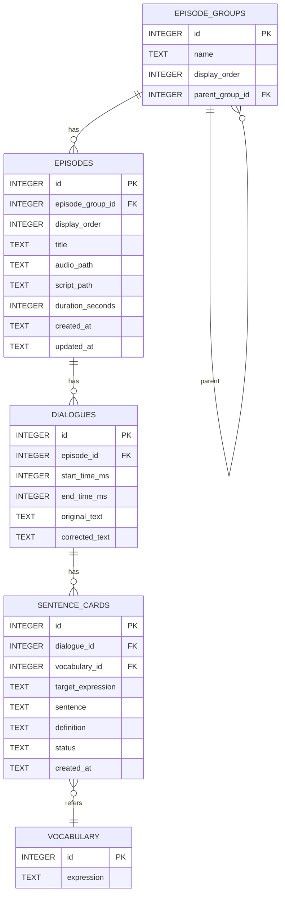

# Immersion Learning 自動支援アプリ v1.0 技術仕様書

## 1. 概要 (Overview)

本ドキュメントは「Immersion Learning 自動支援アプリ ver1」の技術的な仕様を定義するものである。要件定義書に基づき、AI Agentによるコード生成を円滑に行うことを目的として、データ構造、コンポーネント設計、処理フローを明確化する。

### 1.1. システムアーキテクチャ

- **フレームワーク**: Tauri 2.x
  - **バックエンド**: Rust
  - **フロントエンド**: Svelte 5 (SvelteKit, TypeScript)
- **UIライブラリ**: Flowbite Svelte (+ Tailwind CSS)
- **データベース**: SQLite
  - **Tauri SQL Plugin** を利用。DBとの通信はフロントエンドの`Infrastructure`レイヤーに集約する。
- **LLM連携**: Google Gemini API
  - APIキーの秘匿化のため、バックエンド(Rust)からAPIを呼び出すTauriコマンドを実装する。

### 1.2. ディレクトリ構成

Tauriの標準構成とフロントエンドのレイヤードアーキテクチャを組み合わせる。

```plaintext
/
├── src/                      # SvelteKit フロントエンド
│   ├── lib/
│   │   ├── presentation/   # UI層: SvelteコンポーネントとUIロジック
│   │   │   ├── components/   # 再利用可能なUIコンポーネント
│   │   │   ├── types/        # UI表示用データ型
│   │   │   └── ...
│   │   ├── application/    # アプリケーション層: ユースケースと状態管理
│   │   │   ├── usecases/     # ユーザー操作を起点とする処理フロー
│   │   │   └── stores/       # アプリケーション全体の状態(Svelte Stores)
│   │   ├── domain/         # ドメイン層: アプリケーションの核となるルールとデータ構造
│   │   │   ├── entities/     # アプリケーションの核となるデータ型(エンティティ)
│   │   │   └── services/     # ドメイン固有のロジック
│   │   └── infrastructure/ # インフラ層: 外部システムとの連携
│   │       ├── contracts/    # 外部との通信に使われるデータ型(API契約)
│   │       └── repositories/ # DBやRustバックエンドとの通信処理
│   ├── routes/             # SvelteKitのルーティング (Presentation層の一部)
│   │   ├── +page.svelte
│   │   └── episode/[id]/
│   │       └── +page.svelte
│   └── app.html
├── src-tauri/                # Rust バックエンド
│   ├── src/
│   │   ├── main.rs               # エントリーポイント
│   │   ├── db.rs                 # DB関連のTauriコマンド (複雑な処理担当)
│   │   ├── models.rs             # Rust側で扱うデータ構造体
│   │   ├── commands.rs           # ファイルI/OやLLM連携などのTauriコマンド
│   │   └── llm.rs                # LLM API連携関連
│   └── tauri.conf.json
└── ...
```

```mermaid
graph TD
    classDef cssTypes fill:#352;
    classDef cssComponents fill:#325;
    classDef cssPure fill:#535;
    classDef cssExternal fill:#333;
    
    User([User]):::cssExternal

    subgraph Presentation
        components[components]:::cssComponents
        routes[routes]:::cssComponents
        types[types]:::cssTypes
    end

    subgraph Application
        usecases[usecases]
        stores[stores]
    end

    subgraph Domain
        entities[entities]:::cssTypes
        services[services]:::cssPure
    end

    subgraph Infrastructure
        contracts[contracts]:::cssTypes
        repositories[repositories]:::cssPure
    end

    ExternalSystems([External Systems]):::cssExternal

    User ---> components
    routes --> components
    routes ---> usecases
    routes ---> stores
    routes --> types
    components --> types
    usecases --> entities
    usecases --> stores
    usecases ---> services
    usecases ---> repositories
    stores ---> entities
    services ---> entities
    repositories ---> entities
    repositories --> contracts
    repositories ---> ExternalSystems

    Components:::cssComponents
    PureTypeScript[Pure TypeScript Code]:::cssPure
    TypeDefinitions[Type Definitions]:::cssTypes
```



---

## 2. データベース設計 (Database Schema)

ローカルのSQLiteデータベースに以下のテーブルを定義する。

### ER図 (Mermaid)



### 2.1. `episode_groups` テーブル
エピソードを任意のグループ（入れ子構造可）に分類する。

| カラム名         | 型      | 説明                         |
|------------------|---------|------------------------------|
| `id`             | INTEGER | PRIMARY KEY, AUTOINCREMENT   |
| `name`           | TEXT    | グループ名                   |
| `display_order`  | INTEGER | グループの表示順序           |
| `parent_group_id`| INTEGER | 親グループID（NULLでルート） |

- `parent_group_id`は自己参照外部キー。NULLの場合はルートグループ。
- 初期状態では`name`が"Default"かつ`parent_group_id`がNULLのグループが1つだけ存在する。

### 2.2. `episodes` テーブル
エピソード（音声コンテンツとスクリプトのセット）を管理する。

| カラム名        | 型          | 説明                               |
|-----------------|-------------|------------------------------------|
| `id`            | INTEGER     | PRIMARY KEY, AUTOINCREMENT         |
| `episode_group_id` | INTEGER  | `episode_groups.id`への外部キー    |
| `display_order` | INTEGER     | グループ内でのエピソードの表示順序 |
| `title`         | TEXT        | エピソードのタイトル               |
| `audio_path`    | TEXT        | 音声ファイルの絶対パス             |
| `script_path`   | TEXT        | スクリプトファイルの絶対パス       |
| `duration_seconds` | INTEGER  | 音声の再生時間（秒）               |
| `created_at`    | TEXT        | 作成日時 (ISO 8601)                |
| `updated_at`    | TEXT        | 更新日時 (ISO 8601)                |

### 2.3. `dialogues` テーブル
スクリプト内の各セリフを管理する。

| カラム名          | 型          | 説明                               |
|-------------------|-------------|------------------------------------|
| `id`              | INTEGER     | PRIMARY KEY, AUTOINCREMENT         |
| `episode_id`      | INTEGER     | `episodes.id`への外部キー          |
| `start_time_ms`   | INTEGER     | セリフの開始時間（ミリ秒）         |
| `end_time_ms`     | INTEGER     | セリフの終了時間（ミリ秒）         |
| `original_text`   | TEXT        | スクリプトから取り込んだ元のテキスト |
| `corrected_text`  | TEXT        | ユーザーが修正した後のテキスト     |

### 2.4. `sentence_cards` テーブル
Sentence Miningによって作成されたカードを管理する。

| カラム名        | 型          | 説明                               |
|-----------------|-------------|------------------------------------|
| `id`            | INTEGER     | PRIMARY KEY, AUTOINCREMENT         |
| `dialogue_id`   | INTEGER     | `dialogues.id`への外部キー         |
| `vocabulary_id` | INTEGER     | `vocabulary.id`への外部キー        |
| `target_expression` | TEXT    | 抽出対象の単語/イディオム          |
| `sentence`      | TEXT        | 抽出対象を含むセンテンス全体       |
| `definition`    | TEXT        | LLMによって生成された意味・説明    |
| `status`        | TEXT        | `active`, `suspended` (保留) などの状態 |
| `created_at`    | TEXT        | 作成日時 (ISO 8601)                |

### 2.5. `vocabulary` テーブル
これまでにSentence Miningされた単語/イディオムのマスターリスト。

- `expression` カラムには FTS5 仮想テーブルを利用し、全文検索インデックスを構築する。
    - これにより、複数単語による柔軟な検索や部分一致検索が可能となる。
    - 例: `CREATE VIRTUAL TABLE vocabulary USING fts5(expression);`
- 単語の順序や部分列一致など、より高度な検索条件（例: "pick up [-]" のようなパターン）は、アプリケーション側でトークン化・フィルタリング処理を行う。
- words テーブルや多対多テーブルは設けず、vocabulary テーブルのみで管理する。

| カラム名       | 型      | 説明                                            |
|----------------|---------|-------------------------------------------------|
| `id`           | INTEGER | PRIMARY KEY, AUTOINCREMENT                      |
| `expression`   | TEXT    | 単語/イディオムの綴り (e.g., "take off")        |

---

## 3. エピソードグループの入れ子構造・エピソード移動

### 3.1. エピソードグループの入れ子構造
- エピソードグループは親子関係を持つツリー構造とする。
- グループ作成・編集時に親グループを指定可能。
- グループ取得APIは子グループも含めて再帰的に返す。
- UIはグループ階層をツリー表示し、サブグループの追加・編集・削除をサポートする。
- グループの階層の深さ制限や循環参照防止のバリデーションを行う。

### 3.2. アプリ初期状態
- データベース初期化時、`name`が"Default"かつ`parent_group_id`がNULLのグループを1つだけ作成する。
- すべてのエピソードは初期状態でこのグループに属する。

### 3.3. エピソードのグループ間移動
- エピソードは任意のグループに所属できる。
- エピソードの`episode_group_id`を更新することで、他のグループへ移動できる。
- UI上でエピソードをドラッグ＆ドロップ等で別グループに移動できる操作を提供する。

---

## 4. フロントエンド レイヤー別責務とAPI設計

### 4.1. フロントエンド レイヤー別責務

- **Presentation (`src/routes`, `src/lib/presentation/`)**: Svelteコンポーネントで構成。ユーザーからの入力を受け取り、`Application`層のユースケースを呼び出す。ユースケースから返された結果や`stores`の状態を画面に描画することに専念する。
- **Application (`src/lib/application/`)**: ユースケースを実装する層。例えば「新しいSentence Cardを作成する」というユースケースは、`Domain`のデータ構造を使い、`Infrastructure`のリポジトリを呼び出して永続化を行う、といった一連の処理フローを定義する。`stores`を用いてUIにまたがる状態を管理する。
- **Domain (`src/lib/domain/`)**: アプリケーションのビジネスロジックの核。外部のライブラリやフレームワークに依存しない、純粋なTypeScriptで記述される。
  - **`entities/`**: アプリケーションの核となるデータ型、エンティティ（例: `Episode`, `SentenceCard`）の型定義。
  - `services/`: 特定のエンティティに属さない、ドメイン固有のルールや計算を行うロジック。
- **Infrastructure (`src/lib/infrastructure/`)**: 外部システムとの通信を担当する層。
  - **`contracts/`**: 外部システムとの「契約」を定義するデータ型。Tauriコマンドの引数や戻り値となるData Transfer Object (DTO)などをここに置く。
  - `repositories/`: Tauri SQL Pluginを介したDB操作や、RustバックエンドのTauriコマンドを呼び出す処理を実装する。`Application`層はここのインターフェースを通じて外部と通信する。

### 4.2. バックエンド API (Tauri Commands)

Rustで実装し、フロントエンドの`Infrastructure`レイヤーから呼び出される関数群。

- `add_episode(title: String, audio_path: String, script_path: String) -> Result<EpisodeContract, String>`
- `delete_episode(episode_id: i32) -> Result<(), String>`
- `create_sentence_card(card_data: NewCardContract) -> Result<SentenceCardContract, String>`
- `get_definition_from_llm(context_sentence: String, target_expression: String) -> Result<String, String>`
- `save_api_key(api_key: String) -> Result<(), String>`
- `get_api_key() -> Result<Option<String>, String>`
- `move_episode(episode_id: i32, new_group_id: i32) -> Result<(), String>`
- `create_group(name: String, parent_group_id: Option<i32>, display_order: Option<i32>) -> Result<GroupContract, String>`
- `update_group(group_id: i32, name: Option<String>, parent_group_id: Option<i32>, display_order: Option<i32>) -> Result<(), String>`
- `delete_group(group_id: i32) -> Result<(), String>`
- `get_all_groups() -> Result<Vec<GroupContract>, String>`

---

## 5. フロントエンド コンポーネント設計 (Component Design)

- **`src/routes/+page.svelte`**:
  - `load`関数内で`application/usecases/episode/getAllEpisodes.ts`を呼び出す。
- **`src/routes/episode/[id]/+page.svelte`**:
  - `load`関数内で`application/usecases/episode/getEpisodeDetails.ts`を呼び出す。
  - 画面は`lib/presentation/components/`内のコンポーネントで構成される。
    - **左ペイン**: `ScriptEditor.svelte`
    - **右ペイン**: `SentenceCardList.svelte`
    - **下部**: `AudioPlayer.svelte`
- **`src/lib/presentation/components/MiningModal.svelte`**:
  - 「カード作成」ボタンクリック時に`application/usecases/card/createNewSentenceCard.ts`を呼び出す。

---

## 6. 主要機能の処理フロー (Key Feature Workflows)

### 6.1. 新規エピソードの追加フロー

1.  **User**: `src/routes/+page.svelte`で「新規追加」ボタンをクリック。
2.  **Presentation**: ファイル選択ダイアログを表示し、ユーザーにファイルを選択させる。
3.  **Presentation**: `application/usecases/episode/addNewEpisode.ts` を、選択されたファイルパスとタイトルを引数にして呼び出す。
4.  **Application (usecase)**:
    a. `infrastructure/repositories/episodeRepository.ts` を通じて、バックエンドのTauriコマンド `add_episode` を呼び出す。
5.  **Backend (Rust)**:
    a. ファイルI/Oを行い、スクリプトをパース。
    b. DBトランザクションを開始し、`episodes`と`dialogues`テーブルにデータを挿入・コミット。
    c. 結果をContract(DTO)としてフロントエンドに返す。
6.  **Application (usecase)**:
    a. `application/stores/episodeStore.ts`の状態を更新する。
7.  **Presentation**: `episodeStore`の変更を検知し、UIに新しいエピソードを自動的に表示する。

### 6.2. Sentence Mining フロー

1.  **User**: `ScriptEditor.svelte`上で不明な単語をハイライトする。
2.  **Presentation**: `MiningModal.svelte`を開き、選択されたテキストとセンテンスを渡す。
3.  **Presentation (MiningModal)**: `application/usecases/card/fetchDefinition.ts` を呼び出す。
4.  **Application (usecase)**:
    a. `infrastructure/repositories/llmRepository.ts` を通じて、バックエンドのTauriコマンド `get_definition_from_llm` を呼び出す。
5.  **Backend (Rust)**: Gemini APIにリクエストを送信し、結果を返す。
6.  **Presentation (MiningModal)**: ユースケースから返された結果（意味・説明）を画面に表示する。
7.  **User**: 内容を確認・修正し、「カード作成」ボタンをクリックする。
8.  **Presentation (MiningModal)**: `application/usecases/card/createNewSentenceCard.ts` を呼び出す。
9.  **Application (usecase)**:
    a. `infrastructure/repositories/cardRepository.ts` を通じて、バックエンドのTauriコマンド `create_sentence_card` を呼び出す。
10. **Backend (Rust)**: DBトランザクション内で`sentence_cards`, `vocabulary`, `vocabulary_instances`テーブルを更新する。
11. **Application (usecase)**:
    a. ユースケースが成功したら、関連する`store`（例: `cardStore`）を更新する。
12. **Presentation**: `store`の変更を検知し、`SentenceCardList.svelte`に新しいカードが自動的に表示される。

### 6.3. エピソードグループ管理フロー

#### 6.3.1. グループ作成フロー

1.  **User**: グループ作成UIで新しいグループの名前を入力し、「作成」ボタンをクリック。
2.  **Presentation**: `application/usecases/group/createGroup.ts` を呼び出す。
3.  **Application (usecase)**:
    a. `infrastructure/repositories/groupRepository.ts` を通じて、バックエンドのTauriコマンド `create_group` を呼び出す。
4.  **Backend (Rust)**: DBに新しいグループを追加し、結果を返す。
5.  **Application (usecase)**:
    a. `application/stores/groupStore.ts`の状態を更新する。
6.  **Presentation**: `groupStore`の変更を検知し、UIに新しいグループを自動的に表示する。

#### 6.3.2. グループ編集フロー

1.  **User**: グループ一覧から編集したいグループを選択。
2.  **Presentation**: 選択されたグループの情報をUIに表示。
3.  **User**: グループ名や親グループ、表示順序を編集し、「保存」ボタンをクリック。
4.  **Presentation**: `application/usecases/group/updateGroup.ts` を呼び出す。
5.  **Application (usecase)**:
    a. `infrastructure/repositories/groupRepository.ts` を通じて、バックエンドのTauriコマンド `update_group` を呼び出す。
6.  **Backend (Rust)**: DBのグループ情報を更新し、結果を返す。
7.  **Application (usecase)**:
    a. `groupStore`の該当グループの情報を更新する。
8.  **Presentation**: `groupStore`の変更を検知し、UIに反映する。

#### 6.3.3. グループ削除フロー

1.  **User**: グループ一覧から削除したいグループを選択。
2.  **Presentation**: 選択されたグループの情報をUIに表示。
3.  **User**: 「削除」ボタンをクリック。
4.  **Presentation**: 確認ダイアログを表示。
5.  **User**: 「はい」を選択。
6.  **Presentation**: `application/usecases/group/deleteGroup.ts` を呼び出す。
7.  **Application (usecase)**:
    a. `infrastructure/repositories/groupRepository.ts` を通じて、バックエンドのTauriコマンド `delete_group` を呼び出す。
8.  **Backend (Rust)**: DBからグループを削除し、結果を返す。
9.  **Application (usecase)**:
    a. `groupStore`から該当グループを削除する。
10. **Presentation**: `groupStore`の変更を検知し、UIからグループを削除する。

#### 6.3.4. グループ階層表示フロー

1.  **User**: グループ一覧ページを開く。
2.  **Presentation**: `application/usecases/group/getAllGroups.ts` を呼び出す。
3.  **Application (usecase)**:
    a. `infrastructure/repositories/groupRepository.ts` を通じて、バックエンドのTauriコマンド `get_all_groups` を呼び出す。
4.  **Backend (Rust)**: DBからすべてのグループを取得し、結果を返す。
5.  **Application (usecase)**:
    a. 取得したグループデータをツリー構造に変換する。
6.  **Presentation**: ツリー構造をもとにグループ階層をUIに表示する。

#### 6.3.5. エピソードのグループ間移動フロー

1.  **User**: エピソード一覧から移動させたいエピソードを選択。
2.  **Presentation**: エピソードの詳細情報を表示し、移動先グループを選択するUIを表示。
3.  **User**: 移動先グループを選択し、「移動」ボタンをクリック。
4.  **Presentation**: `application/usecases/episode/moveEpisode.ts` を呼び出す。
5.  **Application (usecase)**:
    a. `infrastructure/repositories/episodeRepository.ts` を通じて、バックエンドのTauriコマンド `move_episode` を呼び出す。
6.  **Backend (Rust)**: エピソードのグループIDを更新し、結果を返す。
7.  **Application (usecase)**:
    a. `episodeStore`の該当エピソードのグループ情報を更新する。
8.  **Presentation**: `episodeStore`の変更を検知し、UIに反映する。