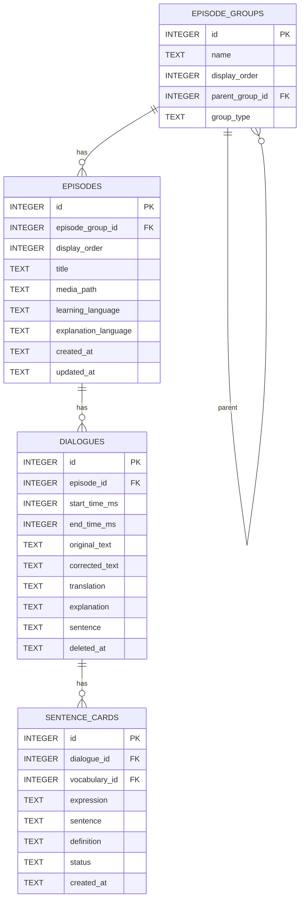

# Kotonoha v1.0 技術仕様書

## 1. 概要 (Overview)

本ドキュメントは「Kotonoha v1」の技術的な仕様を定義するものである。要件定義書に基づき、AI Agentによるコード生成を円滑に行うことを目的として、データ構造、コンポーネント設計、処理フローを明確化する。

### 1.1. システムアーキテクチャ

- **フレームワーク**: Tauri 2.x
  - **バックエンド**: Rust
  - **フロントエンド**: Svelte 5 (SvelteKit, TypeScript)
- **UIライブラリ**: Flowbite Svelte (+ Tailwind CSS)
- **データベース**: SQLite
  - [Tauri SQL Plugin](https://tauri.app/plugin/sql/) を利用。DBとの通信はフロントエンドの`Infrastructure`レイヤーに集約する。
- **LLM連携**: Google Gemini API
  - APIキーの秘匿化のため、バックエンド(Rust)からAPIを呼び出すTauriコマンドを実装する。
  - **APIキーの永続化には [Tauri Stronghold Plugin](https://tauri.app/plugin/stronghold/) を利用する。**
    - **Salt**: Strongholdインスタンスを初期化するためのSaltとして、初回起動時に16バイトの乱数を生成し、アプリケーションのローカルデータディレクトリにファイルとして保存する。
    - **パスワード**: Strongholdをロック/アンロックするためのパスワードとして、初回起動時に32文字のランダムな文字列を生成し、OS標準のKeyring（Windows Credential Manager, macOS Keychain, Linux Secret Service）に安全に格納する。
    - これにより、ユーザーが手動でキーを管理する必要なく、セキュアにAPIキーを保管できる。
    - フロントエンドでは、取得したAPIキーをSvelteのストアにキャッシュし、LLMへのリクエストのたびにStrongholdから読み込むオーバーヘッドを避ける。

### 1.2. ディレクトリ構成

Tauriの標準構成とフロントエンドのレイヤードアーキテクチャを組み合わせる。

```plaintext
/
├── src/                                # SvelteKit フロントエンド
│   ├── lib/
│   │   ├── presentation/             # UI層: SvelteコンポーネントとUIロジック
│   │   │   ├── components/           # 再利用可能なUIコンポーネント
│   │   │   │   ├── AudioPlayer.svelte
│   │   │   │   ├── Breadcrumbs.svelte
│   │   │   │   └── ...
│   │   │   ├── utils/                # UIで利用するユーティリティ関数
│   │   │   │   ├── dateFormatter.ts
│   │   │   │   └── ...
│   │   │   └── types/                # UI表示用データ型 (将来追加する可能性あり)
│   │   ├── application/              # アプリケーション層: ユースケースと状態管理
│   │   │   ├── locales/              # 多言語対応
│   │   │   │   ├── en.ts
│   │   │   │   ├── ja.ts
│   │   │   │   └── ...
│   │   │   ├── usecases/             # ユーザー操作を起点とする処理フロー
│   │   │   │   ├── addEpisodeGroup.ts
│   │   │   │   └── ...
│   │   │   └── stores/               # アプリケーション全体の状態(Svelte Stores)
│   │   │       ├── groupPathStore.svelte.ts
│   │   │       └── ...
│   │   ├── domain/                   # ドメイン層: アプリケーションの核となるルールとデータ構造
│   │   │   ├── entities/             # アプリケーションの核となるデータ型(エンティティ)
│   │   │   │   ├── dialogue.ts
│   │   │   │   └── ...
│   │   │   └── services/             # ドメイン固有のロジック（単体テストが容易な純粋関数）
│   │   │       ├── buildEpisodeGroupTree.ts
│   │   │       └── ...
│   │   └── infrastructure/           # インフラ層: 外部システムとの連携
│   │       ├── config.ts             # 設定ファイル
│   │       ├── contracts/            # 外部との通信に使われるデータ型(API契約) (将来追加する可能性あり)
│   │       └── repositories/         # DBやRustバックエンドとの通信処理
│   │           ├── dialogueRepository.ts
│   │           └── ...
│   ├── routes/                       # SvelteKitのルーティング (Presentation層の一部)
│   │   ├── +layout.svelte
│   │   ├── [...groupId]/
│   │   │   ├── +page.svelte
│   │   │   └── +page.ts
│   │   ├── episode/[id]/
│   │   │   └── ...
│   │   ├── episode-list/[groupId]/
│   │   │   └── ...
│   │   └── settings/
│   │       └── ...
│   └── app.html
├── src-tauri/                        # Rust バックエンド
│   ├── src/
│   │   ├── main.rs                   # エントリーポイント
│   │   ├── lib.rs                    # ライブラリとしてのエントリーポイント
│   │   ├── llm.rs                    # LLM API連携関連
│   │   ├── stronghold.rs             # Stronghold関連
│   │   └── migrations.rs             # DBマイグレーション関連
│   └── tauri.conf.json
└── ...
```

#### 各階層の依存関係

```mermaid
graph TD
    classDef cssTypes fill:#352;
    classDef cssComponents fill:#325;
    classDef cssPure fill:#535;
    classDef cssExternal fill:#333;
    
    User([User]):::cssExternal

    subgraph Presentation
        components[components]:::cssComponents
        routes[routes]:::cssComponents
        actions[actions]:::cssPure
    end

    subgraph Application
        usecases[usecases]:::cssPure
        stores[stores]
    end

    subgraph Domain
        entities[entities]:::cssTypes
        services[services]:::cssPure
    end

    subgraph Infrastructure
        repositories[repositories]:::cssPure
    end

    ExternalSystems([External Systems]):::cssExternal

    User ---> components
    routes --> components
    routes ---> usecases
    routes ---> stores
    routes ---> actions
    routes ---> entities
    components --> actions
    components ---> stores
    components ---> entities
    actions ---> entities
    usecases --> entities
    usecases --> stores
    usecases ---> services
    usecases ---> repositories
    stores ---> entities
    services ---> entities
    repositories ---> entities
    repositories ---> ExternalSystems

    Components:::cssComponents
    PureTypeScript[Pure TypeScript Code]:::cssPure
    TypeDefinitions[Type Definitions]:::cssTypes
```



---

## 2. データベース設計 (Database Schema)

ローカルのSQLiteデータベースに以下のテーブルを定義する。

### ER図 (Mermaid)



### 2.1. `episode_groups` テーブル
エピソードを任意のグループ（入れ子構造可）に分類する。

| カラム名         | 型      | NULL許容 | 説明                         |
|------------------|---------|----------|------------------------------|
| `id`             | INTEGER |          | PRIMARY KEY, AUTOINCREMENT   |
| `name`           | TEXT    |          | グループ名                   |
| `display_order`  | INTEGER |          | グループの表示順序           |
| `parent_group_id`| INTEGER | ●        | 親グループID（NULLでルート） |
| `group_type`     | TEXT    |          | グループ種別: "album"（エピソード格納可）または "folder"（サブグループのみ格納可） |

- `parent_group_id`は自己参照外部キー。NULLの場合はルートグループ。
- `group_type` でグループの種別を区別する。`album` はエピソードを格納でき、`folder` はサブグループのみ格納できる。

### 2.2. `episodes` テーブル
エピソード（音声コンテンツとスクリプトのセット）を管理する。

| カラム名        | 型          | NULL許容 | 説明                               |
|-----------------|-------------|----------|------------------------------------|
| `id`            | INTEGER     |          | PRIMARY KEY, AUTOINCREMENT         |
| `episode_group_id` | INTEGER  |          | `episode_groups.id`への外部キー    |
| `display_order` | INTEGER     |          | グループ内でのエピソードの表示順序 |
| `title`         | TEXT        |          | エピソードのタイトル               |
| `media_path`    | TEXT        |          | メディアファイルのパス             |
| `learning_language` | TEXT    |          | 学習ターゲット言語 (例: 'English') |
| `explanation_language` | TEXT  |          | 説明言語 (例: 'Japanese')        |
| `created_at`    | TEXT        |          | 作成日時 (ISO 8601)                |
| `updated_at`    | TEXT        |          | 更新日時 (ISO 8601)                |

### 2.3. `dialogues` テーブル
スクリプト内の各セリフを管理する。

| カラム名          | 型          | NULL許容 | 説明                               |
|-------------------|-------------|----------|------------------------------------|
| `id`              | INTEGER     |          | PRIMARY KEY, AUTOINCREMENT         |
| `episode_id`      | INTEGER     |          | `episodes.id`への外部キー          |
| `start_time_ms`   | INTEGER     |          | セリフの開始時間（ミリ秒）         |
| `end_time_ms`     | INTEGER     | ●        | セリフの終了時間（ミリ秒）         |
| `original_text`   | TEXT        |          | スクリプトから取り込んだ元のテキスト |
| `corrected_text`  | TEXT        | ●        | ユーザーが修正した後のテキスト     |
| `translation`     | TEXT        | ●        | LLMが生成した翻訳                  |
| `explanation`     | TEXT        | ●        | LLMが生成した翻訳の解説            |
| `sentence`        | TEXT        | ●        | LLMが抽出した文                    |
| `deleted_at`      | TEXT        | ●        | 削除日時 (ISO 8601), NULLの場合は未削除 |

### 2.4. `sentence_cards` テーブル
Sentence Miningによって作成されたカードを管理する。

| カラム名        | 型          | NULL許容 | 説明                               |
|-----------------|-------------|----------|------------------------------------|
| `id`            | INTEGER     |          | PRIMARY KEY, AUTOINCREMENT         |
| `dialogue_id`   | INTEGER     |          | `dialogues.id`への外部キー         |
| `part_of_speech`| TEXT        |          | 品詞                         |
| `expression`    | TEXT        |          | 抽出対象の単語/イディオム          |
| `sentence`      | TEXT        |          | 抽出対象を含むセンテンス全体（該当箇所を強調）       |
| `contextual_definition`    | TEXT        |          | LLMによって生成された文脈上の意味    |
| `core_meaning`    | TEXT        |          | LLMによって生成された核となる意味    |
| `status`        | TEXT        |          | `active` (学習中), `suspended` (保留), `cache` (LLM解析結果のキャッシュ) などの状態 |
| `created_at`    | TEXT        |          | 作成日時 (ISO 8601)                |

---

## 3. エピソードグループの入れ子構造・エピソード移動

### 3.1. エピソードグループの入れ子構造
- エピソードグループは親子関係を持つツリー構造とする。
- グループ作成・編集時に親グループを指定可能。
- グループ取得APIは子グループも含めて再帰的に返す。
- UIはグループ階層をツリー表示し、サブグループの追加・編集・削除をサポートする。
- グループの階層の深さ制限や循環参照防止のバリデーションを行う。

### 3.2. アプリ初期状態
- データベース初期化時、`name`が"Default"かつ`parent_group_id`がNULLのグループを1つだけ作成する。
- すべてのエピソードは初期状態でこのグループに属する。

### 3.3. エピソードのグループ間移動
- エピソードは任意のグループに所属できる。
- エピソードの`episode_group_id`を更新することで、他のグループへ移動できる。
- UI上でエピソードをドラッグ＆ドロップ等で別グループに移動できる操作を提供する。

---

## 4. フロントエンド レイヤー別責務とAPI設計

### 4.1. フロントエンド レイヤー別責務

- **Presentation (`src/routes`, `src/lib/presentation/`)**: Svelteコンポーネントで構成。ユーザーからの入力を受け取り、`Application`層のユースケースを呼び出す。ユースケースから返された結果や`stores`の状態を画面に描画することに専念する。
- **Application (`src/lib/application/`)**: ユースケースを実装する層。ユースケースは、`Domain`のデータ構造やサービスを使い、`Infrastructure`のリポジトリを呼び出して永続化を行う、といった一連の処理フローを定義する。`stores`を用いてUIにまたがる状態を管理する。
- **Domain (`src/lib/domain/`)**: アプリケーションのビジネスロジックの核。外部のライブラリやフレームワークに依存しない、純粋なTypeScriptで記述される。
  - **`entities/`**: アプリケーションの核となるデータ型、エンティティ（例: `Episode`, `SentenceCard`）の型定義。
  - **`services/`**: ドメイン固有のルールや計算を行うロジック。
- **Infrastructure (`src/lib/infrastructure/`)**: 外部システムとの通信を担当する層。
  - **`contracts/`**: 外部システムとの「契約」を定義するデータ型。Tauriコマンドの引数や戻り値となるData Transfer Object (DTO)などをここに置く。
  - **`repositories/`**: Tauri SQL Pluginを介したDB操作や、RustバックエンドのTauriコマンドを呼び出す処理を実装する。`Application`層はここのインターフェースを通じて外部と通信する。

### 4.2. バックエンド API (Tauri Commands)

Rustで実装し、フロントエンドの`Infrastructure`レイヤーから呼び出される関数群。
Tauriのプラグインを利用するなどしてフロントエンド側で実装可能と判断したものは、必ずしも Rust 側で実装しなくても良い。

#### LLM

- `analyze_sentence_with_llm(api_key: String, learning_language: String, explanation_language: String, part_of_speech_options: Vec<String>, context: String, target_sentence: String) -> Result<SentenceMiningResult, String>`
  - センテンスを解析し、単語や表現の情報をLLMから取得する。
  - `SentenceMiningResult` は `translation`, `explanation`, `items` を含む。

#### Stronghold (Secure Storage)

- `get_stronghold_password() -> Result<String, String>`
  - OSのキーチェーンからStrongholdのパスワードを取得または生成して返す。

#### Audio Playback

- `open_audio(path: String) -> Result<(), String>`
  - 指定されたパスの音声ファイルを開き、アプリケーションの状態にロードする（再生準備のみ、解析は行わない）。
- `analyze_audio(path: String, max_peaks: usize) -> Result<AudioInfo, String>`
  - 指定されたパスの音声ファイルを解析し、波形データ（peaks）と再生時間（duration）を返す。
  - `AudioInfo` は `duration`, `peaks` を含む。
- `play_audio() -> Result<(), String>`
  - `open_audio` で開かれた音声の再生を開始する。
- `pause_audio() -> Result<(), String>`
  - 音声の再生を一時停止する。
- `resume_audio() -> Result<(), String>`
  - 一時停止した音声の再生を再開する。
- `stop_audio() -> Result<(), String>`
  - 音声の再生を停止する。
- `seek_audio(position_ms: u32) -> Result<(), String>`
  - 音声の再生位置を指定された時間（ミリ秒）に移動する。
- `copy_audio_file(src_path: String, dest_path: String) -> Result<(), String>`
  - 指定した音声ファイル（アプリ管理外の絶対パス）を別のパス（アプリ管理下の相対パス）にコピーする。

#### Download

- `download_file_with_progress(url: String, file_path: String, download_id: String) -> Result<(), String>`
  - 指定されたURLからファイルをダウンロードし、指定されたパスに保存する。進捗状況をフロントエンドに通知する。
- `cancel_download(download_id: String) -> Result<(), String>`
  - 指定されたダウンロードIDのダウンロードをキャンセルする。

#### TTS (Text-to-Speech)

- `start_tts(app_handle: AppHandle, transcript: String, config_path: String) -> Result<String, String>`
  - 指定されたtranscriptとconfigでTTSを実行し、一時ファイル(ogg)のパスを返す。
  - 進捗は`tts-progress`イベントで通知される。
- `cancel_tts() -> Result<(), String>`
  - 実行中のTTSをキャンセルする。

#### Language Detection

- `detect_language_from_text(text: String) -> Option<String>`
  - 入力テキストの言語をBCP-47形式で返す。検出できない場合は`None`を返す。

#### Utility

- `read_text_file(path: String) -> Result<String, String>`
  - 指定したテキストファイルを読み込み、その内容を返す。

### 4.3. データフェッチ・状態管理戦略

本アプリケーションでは、データフェッチおよび状態管理に関して以下の戦略を採用する。

- **原則としてキャッシュレスなデータアクセス**:
  フロントエンドのストア（Svelte Stores）は、データベースに永続化されているデータをキャッシュしない。データはコンポーネントの表示やユーザー操作が必要とするタイミングで、都度`Infrastructure`レイヤーを通じてデータベースから取得（フェッチ）する。

- **背景と理由**:
  バックエンドはローカルのSQLiteデータベースを使用し、ファイルベースのアクセスは極めて高速である。一般的なWebアプリケーションと異なり、ネットワーク遅延を考慮する必要がないため、パフォーマンス向上のためのクライアントサイドキャッシュは不要と判断する。

- **メリット**:
  このアプローチにより、ストア上のキャッシュデータとデータベース上の実データとの間で発生しうる不整合を考慮する必要がなくなり、状態管理のロジックを大幅に簡素化できる。常にデータベースを信頼できる唯一の情報源（Single Source of Truth）として扱う。

- **ストアの責務範囲**:
  `src/lib/application/stores` の責務は、永続化されない「クライアントサイドの状態」の管理に限定する。具体的には、以下のようなデータが対象となる。
    - 複数のコンポーネントにまたがるUIの状態（例: フォームの入力値、選択中のアイテムID、UIの表示/非表示フラグなど）
    - APIから一時的に取得した、永続化を前提としないデータ

---

## 5. ファイル管理仕様 (File Management Specification)

本アプリケーションでは、ユーザーがアップロードした音声ファイルをアプリケーションの管理下にある特定のディレクトリに保存する。
データベースとファイルの整合性を保ち、管理を容易にするため、以下の仕様を定める。

### 5.1. ファイル保存場所 (Storage Location)

- 各エピソードに関連するファイル群は、TauriのFile System プラグイン (`@tauri-apps/plugin-fs`) を利用し、`BaseDirectory.AppLocalData` を基準として、エピソード固有のUUIDを持つディレクトリ内にまとめて格納する。
- **基準パス**: `media/{UUID}/` ディレクトリ内に格納する。

### 5.2. ファイル命名規則 (Naming Convention)

- ファイル名は固定とする。
  - **音声ファイルのパス例**: `media/{UUID}/full.mp3`
- この`BaseDirectory.AppLocalData`からの**相対パス**を、データベースの `episodes` テーブルにある `media_path` カラムに保存する。これにより、データベースレコードと実ファイルが一意に紐づけられる。
- UUIDの重複チェックは、新しいエピソードを追加する際に `media/{UUID}` ディレクトリが存在するかどうかで確認する。存在する場合は、新しいUUIDを再生成する。

### 5.3. エピソード削除時の処理

- `deleteEpisode` ユースケースは、まずデータベース上のレコードを削除する。
- データベースの削除が成功したら、続けて `media/{UUID}` ディレクトリを**再帰的に**物理削除する。これにより、関連する音声ファイルやスクリプトファイルが一括でクリーンアップされる。
