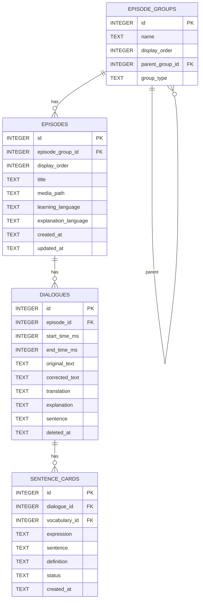

# Kotonoha v1.0 技術仕様書

## 1. 概要 (Overview)

本ドキュメントは「Kotonoha v1」の技術的な仕様を定義するものである。要件定義書に基づき、AI Agentによるコード生成を円滑に行うことを目的として、データ構造、コンポーネント設計、処理フローを明確化する。

### 1.1. システムアーキテクチャ

- **フレームワーク**: Tauri 2.x
  - **バックエンド**: Rust
  - **フロントエンド**: Svelte 5 (SvelteKit, TypeScript)
- **UIライブラリ**: Flowbite Svelte (+ Tailwind CSS)
- **データベース**: SQLite
  - [Tauri SQL Plugin](https://tauri.app/plugin/sql/) を利用。DBとの通信はフロントエンドの`Infrastructure`レイヤーに集約する。
- **LLM連携**: Google Gemini API
  - APIキーの秘匿化のため、バックエンド(Rust)からAPIを呼び出すTauriコマンドを実装する。
  - **APIキーの永続化には [Tauri Stronghold Plugin](https://tauri.app/plugin/stronghold/) を利用する。**
    - **Salt**: Strongholdインスタンスを初期化するためのSaltとして、初回起動時に16バイトの乱数を生成し、アプリケーションのローカルデータディレクトリにファイルとして保存する。
    - **パスワード**: Strongholdをロック/アンロックするためのパスワードとして、初回起動時に32文字のランダムな文字列を生成し、OS標準のKeyring（Windows Credential Manager, macOS Keychain, Linux Secret Service）に安全に格納する。
    - これにより、ユーザーが手動でキーを管理する必要なく、セキュアにAPIキーを保管できる。
    - フロントエンドでは、取得したAPIキーをSvelteのストアにキャッシュし、LLMへのリクエストのたびにStrongholdから読み込むオーバーヘッドを避ける。

### 1.2. ディレクトリ構成

Tauriの標準構成とフロントエンドのレイヤードアーキテクチャを組み合わせる。

```plaintext
/
├── src/                                # SvelteKit フロントエンド
│   ├── lib/
│   │   ├── presentation/             # UI層: SvelteコンポーネントとUIロジック
│   │   │   ├── components/           # 再利用可能なUIコンポーネント
│   │   │   │   ├── AudioPlayer.svelte
│   │   │   │   ├── Breadcrumbs.svelte
│   │   │   │   └── ...
│   │   │   ├── utils/                # UIで利用するユーティリティ関数
│   │   │   │   ├── dateFormatter.ts
│   │   │   │   └── ...
│   │   │   └── types/                # UI表示用データ型 (将来追加する可能性あり)
│   │   ├── application/              # アプリケーション層: ユースケースと状態管理
│   │   │   ├── locales/              # 多言語対応
│   │   │   │   ├── en.ts
│   │   │   │   ├── ja.ts
│   │   │   │   └── ...
│   │   │   ├── usecases/             # ユーザー操作を起点とする処理フロー
│   │   │   │   ├── addEpisodeGroup.ts
│   │   │   │   └── ...
│   │   │   └── stores/               # アプリケーション全体の状態(Svelte Stores)
│   │   │       ├── groupPathStore.svelte.ts
│   │   │       └── ...
│   │   ├── domain/                   # ドメイン層: アプリケーションの核となるルールとデータ構造
│   │   │   ├── entities/             # アプリケーションの核となるデータ型(エンティティ)
│   │   │   │   ├── dialogue.ts
│   │   │   │   └── ...
│   │   │   └── services/             # ドメイン固有のロジック（単体テストが容易な純粋関数）
│   │   │       ├── buildEpisodeGroupTree.ts
│   │   │       └── ...
│   │   └── infrastructure/           # インフラ層: 外部システムとの連携
│   │       ├── config.ts             # 設定ファイル
│   │       ├── contracts/            # 外部との通信に使われるデータ型(API契約) (将来追加する可能性あり)
│   │       └── repositories/         # DBやRustバックエンドとの通信処理
│   │           ├── dialogueRepository.ts
│   │           └── ...
│   ├── routes/                       # SvelteKitのルーティング (Presentation層の一部)
│   │   ├── +layout.svelte
│   │   ├── [...groupId]/
│   │   │   ├── +page.svelte
│   │   │   └── +page.ts
│   │   ├── episode/[id]/
│   │   │   └── ...
│   │   ├── episode-list/[groupId]/
│   │   │   └── ...
│   │   └── settings/
│   │       └── ...
│   └── app.html
├── src-tauri/                        # Rust バックエンド
│   ├── src/
│   │   ├── main.rs                   # エントリーポイント
│   │   ├── lib.rs                    # ライブラリとしてのエントリーポイント
│   │   ├── llm.rs                    # LLM API連携関連
│   │   ├── stronghold.rs             # Stronghold関連
│   │   └── migrations.rs             # DBマイグレーション関連
│   └── tauri.conf.json
└── ...
```

#### 各階層の依存関係

```mermaid
graph TD
    classDef cssTypes fill:#352;
    classDef cssComponents fill:#325;
    classDef cssPure fill:#535;
    classDef cssExternal fill:#333;
    
    User([User]):::cssExternal

    subgraph Presentation
        components[components]:::cssComponents
        routes[routes]:::cssComponents
        actions[actions]:::cssPure
    end

    subgraph Application
        usecases[usecases]:::cssPure
        stores[stores]
    end

    subgraph Domain
        entities[entities]:::cssTypes
        services[services]:::cssPure
    end

    subgraph Infrastructure
        repositories[repositories]:::cssPure
    end

    ExternalSystems([External Systems]):::cssExternal

    User ---> components
    routes --> components
    routes ----> usecases
    routes --> stores
    routes --> actions
    routes ---> entities
    components --> actions
    components ---> stores
    components ---> entities
    actions ---> entities
    usecases --> stores
    usecases ---> entities
    usecases --> services
    usecases ---> repositories
    stores ---> entities
    services ---> entities
    repositories ---> entities
    repositories --> ExternalSystems

    Components:::cssComponents
    PureTypeScript[Pure TypeScript Code]:::cssPure
    TypeDefinitions[Type Definitions]:::cssTypes
```



- routes は SvelteKit のルーティング機能を利用した画面単位のコンポーネント群で、components の画面部品を束ねる。ビジネスロジックはできるだけ Application レイヤーの usecases に委譲する。
- components には各画面の個々の部品を格納し、ビジネスロジックを持たせない。usecases の呼び出しは routes から行う。ただし Props のバケツリレーを避けるため、stores への直接アクセスは許容する。
- stores はアプリケーション全体の状態管理を担う。特に複数のコンポーネントにまたがる UI 状態を管理する役割を果たす。あくまで状態管理に専念し、ビジネスロジックは持たせず、usecases を呼び出すことはしない。
- usecases はアプリケーションのユースケースを実装し、処理全体のオーケストレーションを担う。Domain レイヤーの services や Infrastructure レイヤーの repositories を呼び出す。routes 経由でのバケツリレーを避けるため、stores への直接アクセスを許容する。
- entities は純粋なデータ型定義のみを含み、ロジックを持たせない。
- services は純粋関数として entities にのみ依存するロジックを実装する。
- repositories は Tauri コマンドの呼び出しや DB 操作、ファイルシステム操作、HTTP 通信などを実装する。Infrastructure レイヤーに外部システムとの通信ロジックを集約する。

Domain と言いつつ、それほど大規模なビジネスロジックが存在しないため、Domain レイヤーは薄くなる見込み。
４層あるが、上下関係が Presentation → Application → Domain → Infrastructure にはなっていない点に注意。実際には Presentation → Application → Infrastructure という３階層である。Domain には全ての層が依存している。
ただし全ての層が依存してよいのは entities であり、services を利用するのは usecases だけである。
Infrastructure が Domain に依存する方向になっているが、Clean Architecture のような依存関係逆転を用いているわけではない。前述したように実質的に処理の流れの階層としては３階層であり、Application (usecases) が Infrastructure (repositories)  を直接呼び出すシンプルな構成となっている。

---

## 2. データベース設計 (Database Schema)

ローカルのSQLiteデータベースに以下のテーブルを定義する。

### ER図 (Mermaid)



### 2.1. `episode_groups` テーブル
エピソードを任意のグループ（入れ子構造可）に分類する。

| カラム名         | 型      | NULL許容 | 説明                         |
|------------------|---------|----------|------------------------------|
| `id`             | INTEGER |          | PRIMARY KEY, AUTOINCREMENT   |
| `name`           | TEXT    |          | グループ名                   |
| `display_order`  | INTEGER |          | グループの表示順序           |
| `parent_group_id`| INTEGER | ●        | 親グループID（NULLでルート） |
| `group_type`     | TEXT    |          | グループ種別: "album"（エピソード格納可）または "folder"（サブグループのみ格納可） |

- `parent_group_id`は自己参照外部キー。NULLの場合はルートグループ。
- `group_type` でグループの種別を区別する。`album` はエピソードを格納でき、`folder` はサブグループのみ格納できる。

### 2.2. `episodes` テーブル
エピソード（音声コンテンツとスクリプトのセット）を管理する。

| カラム名        | 型          | NULL許容 | 説明                               |
|-----------------|-------------|----------|------------------------------------|
| `id`            | INTEGER     |          | PRIMARY KEY, AUTOINCREMENT         |
| `episode_group_id` | INTEGER  |          | `episode_groups.id`への外部キー    |
| `display_order` | INTEGER     |          | グループ内でのエピソードの表示順序 |
| `title`         | TEXT        |          | エピソードのタイトル               |
| `media_path`    | TEXT        |          | メディアファイルのパス             |
| `learning_language` | TEXT    |          | 学習ターゲット言語 (例: 'English') |
| `explanation_language` | TEXT  |          | 説明言語 (例: 'Japanese')        |
| `created_at`    | TEXT        |          | 作成日時 (ISO 8601)                |
| `updated_at`    | TEXT        |          | 更新日時 (ISO 8601)                |

### 2.3. `dialogues` テーブル
スクリプト内の各セリフを管理する。

| カラム名          | 型          | NULL許容 | 説明                               |
|-------------------|-------------|----------|------------------------------------|
| `id`              | INTEGER     |          | PRIMARY KEY, AUTOINCREMENT         |
| `episode_id`      | INTEGER     |          | `episodes.id`への外部キー          |
| `start_time_ms`   | INTEGER     |          | セリフの開始時間（ミリ秒）         |
| `end_time_ms`     | INTEGER     | ●        | セリフの終了時間（ミリ秒）         |
| `original_text`   | TEXT        |          | スクリプトから取り込んだ元のテキスト |
| `corrected_text`  | TEXT        | ●        | ユーザーが修正した後のテキスト     |
| `translation`     | TEXT        | ●        | LLMが生成した翻訳                  |
| `explanation`     | TEXT        | ●        | LLMが生成した翻訳の解説            |
| `sentence`        | TEXT        | ●        | LLMが抽出した文                    |
| `deleted_at`      | TEXT        | ●        | 削除日時 (ISO 8601), NULLの場合は未削除 |

### 2.4. `sentence_cards` テーブル
Sentence Miningによって作成されたカードを管理する。

| カラム名        | 型          | NULL許容 | 説明                               |
|-----------------|-------------|----------|------------------------------------|
| `id`            | INTEGER     |          | PRIMARY KEY, AUTOINCREMENT         |
| `dialogue_id`   | INTEGER     |          | `dialogues.id`への外部キー         |
| `part_of_speech`| TEXT        |          | 品詞                         |
| `expression`    | TEXT        |          | 抽出対象の単語/イディオム          |
| `sentence`      | TEXT        |          | 抽出対象を含むセンテンス全体（該当箇所を強調）       |
| `contextual_definition`    | TEXT        |          | LLMによって生成された文脈上の意味    |
| `core_meaning`    | TEXT        |          | LLMによって生成された核となる意味    |
| `status`        | TEXT        |          | `active` (学習中), `suspended` (保留), `cache` (LLM解析結果のキャッシュ) などの状態 |
| `created_at`    | TEXT        |          | 作成日時 (ISO 8601)                |

---

## 3. エピソードグループの入れ子構造・エピソード移動

### 3.1. エピソードグループの入れ子構造
- エピソードグループは親子関係を持つツリー構造とする。
- グループ作成・編集時に親グループを指定可能。
- グループ取得APIは子グループも含めて再帰的に返す。
- UIはグループ階層をツリー表示し、サブグループの追加・編集・削除をサポートする。
- グループの階層の深さ制限や循環参照防止のバリデーションを行う。

### 3.2. アプリ初期状態
- データベース初期化時、`name`が"Default"かつ`parent_group_id`がNULLのグループを1つだけ作成する。
- すべてのエピソードは初期状態でこのグループに属する。

### 3.3. エピソードのグループ間移動
- エピソードは任意のグループに所属できる。
- エピソードの`episode_group_id`を更新することで、他のグループへ移動できる。
- UI上でエピソードをドラッグ＆ドロップ等で別グループに移動できる操作を提供する。

---

## 4. フロントエンド レイヤー別責務とAPI設計

### 4.1. フロントエンド レイヤー別責務

- **Presentation (`src/routes`, `src/lib/presentation/`)**: Svelteコンポーネントで構成。ユーザーからの入力を受け取り、`Application`層のユースケースを呼び出す。ユースケースから返された結果や`stores`の状態を画面に描画することに専念する。
- **Application (`src/lib/application/`)**: ユースケースを実装する層。ユースケースは、`Domain`のデータ構造やサービスを使い、`Infrastructure`のリポジトリを呼び出して永続化を行う、といった一連の処理フローを定義する。`stores`を用いてUIにまたがる状態を管理する。
- **Domain (`src/lib/domain/`)**: アプリケーションのビジネスロジックの核。外部のライブラリやフレームワークに依存しない、純粋なTypeScriptで記述される。
  - **`entities/`**: アプリケーションの核となるデータ型、エンティティ（例: `Episode`, `SentenceCard`）の型定義。
  - **`services/`**: ドメイン固有のルールや計算を行うロジック。
- **Infrastructure (`src/lib/infrastructure/`)**: 外部システムとの通信を担当する層。
  - **`contracts/`**: 外部システムとの「契約」を定義するデータ型。Tauriコマンドの引数や戻り値となるData Transfer Object (DTO)などをここに置く。
  - **`repositories/`**: Tauri SQL Pluginを介したDB操作や、RustバックエンドのTauriコマンドを呼び出す処理を実装する。`Application`層はここのインターフェースを通じて外部と通信する。

### 4.2. バックエンド API (Tauri Commands)

Rustで実装し、フロントエンドの`Infrastructure`レイヤーから呼び出される関数群。
Tauriのプラグインを利用するなどしてフロントエンド側で実装可能と判断したものは、必ずしも Rust 側で実装しなくても良い。

#### LLM

- `analyze_sentence_with_llm(api_key: String, learning_language: String, explanation_language: String, context: String, target_sentence: String) -> Result<SentenceMiningResult, String>`
  - センテンスを解析し、単語や表現の情報をLLMから取得する。
  - `SentenceMiningResult` は `translation`, `explanation`, `items` を含む。

#### Stronghold (Secure Storage)

- `get_stronghold_password() -> Result<String, String>`
  - OSのキーチェーンからStrongholdのパスワードを取得または生成して返す。

#### Audio Playback

- `open_audio(path: String) -> Result<(), String>`
  - 指定されたパスの音声ファイルを開き、アプリケーションの状態にロードする（再生準備のみ、解析は行わない）。
- `analyze_audio(path: String, max_peaks: usize) -> Result<AudioInfo, String>`
  - 指定されたパスの音声ファイルを解析し、波形データ（peaks）と再生時間（duration）を返す。
  - `AudioInfo` は `duration`, `peaks` を含む。
- `play_audio() -> Result<(), String>`
  - `open_audio` で開かれた音声の再生を開始する。
- `pause_audio() -> Result<(), String>`
  - 音声の再生を一時停止する。
- `resume_audio() -> Result<(), String>`
  - 一時停止した音声の再生を再開する。
- `stop_audio() -> Result<(), String>`
  - 音声の再生を停止する。
- `seek_audio(position_ms: u32) -> Result<(), String>`
  - 音声の再生位置を指定された時間（ミリ秒）に移動する。
- `copy_audio_file(src_path: String, dest_path: String) -> Result<(), String>`
  - 指定した音声ファイル（アプリ管理外の絶対パス）を別のパス（アプリ管理下の相対パス）にコピーする。

#### Download

- `download_file_with_progress(url: String, file_path: String, download_id: String) -> Result<(), String>`
  - 指定されたURLからファイルをダウンロードし、指定されたパスに保存する。進捗状況をフロントエンドに通知する。
- `cancel_download(download_id: String) -> Result<(), String>`
  - 指定されたダウンロードIDのダウンロードをキャンセルする。

#### TTS (Text-to-Speech)

 - `start_tts(transcript: String, config_path: String, speaker_id: u32) -> Result<{ audio_path: String, script_path: String }, String>`
  - 指定されたtranscriptとconfigでTTSを実行し、生成された一時OGGファイルのパス (`audio_path`) と、対応するSSWTスクリプトのパス (`script_path`) を返す。
  - 進捗は`tts-progress`イベントで通知される。
- `cancel_tts() -> Result<(), String>`
  - 実行中のTTSをキャンセルする。

#### Language Detection

- `detect_language_from_text(text: String) -> Option<String>`
  - 入力テキストの言語をBCP-47形式で返す。検出できない場合は`None`を返す。

#### YouTube 字幕取得

- `fetch_youtube_subtitle(video_id: String, language: String, track_kind: String) -> Result<Vec<AtomicDialogue>, String>`
  - YouTubeから指定したvideo_idの字幕データを取得して返す。戻り値は `AtomicDialogue` の配列で、各要素は `start_time_ms`, `end_time_ms` (optional), `original_text` を含む。

#### Utility

- `read_text_file(path: String) -> Result<String, String>`
  - 指定したテキストファイルを読み込み、その内容を返す。

---

### 4.3. データフェッチ・状態管理戦略

本アプリケーションでは、データフェッチおよび状態管理に関して以下の戦略を採用する。

- **原則としてキャッシュレスなデータアクセス**:
  フロントエンドのストア（Svelte Stores）は、データベースに永続化されているデータをキャッシュしない。データはコンポーネントの表示やユーザー操作が必要とするタイミングで、都度`Infrastructure`レイヤーを通じてデータベースから取得（フェッチ）する。

- **背景と理由**:
  バックエンドはローカルのSQLiteデータベースを使用し、ファイルベースのアクセスは極めて高速である。一般的なWebアプリケーションと異なり、ネットワーク遅延を考慮する必要がないため、パフォーマンス向上のためのクライアントサイドキャッシュは不要と判断する。

- **メリット**:
  このアプローチにより、ストア上のキャッシュデータとデータベース上の実データとの間で発生しうる不整合を考慮する必要がなくなり、状態管理のロジックを大幅に簡素化できる。常にデータベースを信頼できる唯一の情報源（Single Source of Truth）として扱う。

- **ストアの責務範囲**:
  `src/lib/application/stores` の責務は、永続化されない「クライアントサイドの状態」の管理に限定する。具体的には、以下のようなデータが対象となる。
    - 複数のコンポーネントにまたがるUIの状態（例: フォームの入力値、選択中のアイテムID、UIの表示/非表示フラグなど）
    - APIから一時的に取得した、永続化を前提としないデータ

---

## 5. ファイル管理仕様 (File Management Specification)

本アプリケーションでは、ユーザーがアップロードした音声ファイルをアプリケーションの管理下にある特定のディレクトリに保存する。
データベースとファイルの整合性を保ち、管理を容易にするため、以下の仕様を定める。

### 5.1. ファイル保存場所 (Storage Location)

- 各エピソードに関連するファイル群は、TauriのFile System プラグイン (`@tauri-apps/plugin-fs`) を利用し、`BaseDirectory.AppLocalData` を基準として、エピソード固有のUUIDを持つディレクトリ内にまとめて格納する。
- **基準パス**: `media/{UUID}/` ディレクトリ内に格納する。

### 5.2. ファイル命名規則 (Naming Convention)

- ファイル名は固定とする。
  - **音声ファイルのパス例**: `media/{UUID}/full.mp3`
- この`BaseDirectory.AppLocalData`からの**相対パス**を、データベースの `episodes` テーブルにある `media_path` カラムに保存する。これにより、データベースレコードと実ファイルが一意に紐づけられる。
- UUIDの重複チェックは、新しいエピソードを追加する際に `media/{UUID}` ディレクトリが存在するかどうかで確認する。存在する場合は、新しいUUIDを再生成する。

### 5.3. エピソード削除時の処理

- `deleteEpisode` ユースケースは、まずデータベース上のレコードを削除する。
- データベースの削除が成功したら、続けて `media/{UUID}` ディレクトリを**再帰的に**物理削除する。これにより、関連する音声ファイルやスクリプトファイルが一括でクリーンアップされる。

---

### 4.4 動作確認環境

#### 開発モード

- **コマンド**: `npm run dev`
- **説明**: Tauri 開発モードでアプリケーションを起動

#### ブラウザ開発モード（Vite alias を利用した Tauri モック）

フロントエンドの高速な UI 開発やブラウザ上での確認のため、本プロジェクトは Vite の alias 機能を使用して Tauri とそのプラグインをローカルのモック実装に置き換える「ブラウザ開発モード」を提供する。これは UI レイアウトの調整、コンポーネント単位の確認、軽量な統合テストに有用である。

- 有効化方法:
  - 次のスクリプトを実行:
    ```bash
    npm run dev:browser
    ```
  - スクリプトは環境変数 `VITE_RUN_MODE=browser` を設定し、`vite.config.js` 内の alias マッピングが有効になる。
- 置き換え対象の例:
  - `vite.config.js` は多くの Tauri インポートを `src/mocks/*` にマッピング。代表例:
    - `@tauri-apps/plugin-store`
    - `@tauri-apps/api/app`
    - `@tauri-apps/plugin-stronghold`
    - `@tauri-apps/api/core`
    - `@tauri-apps/api/event`
    - `@tauri-apps/api/path`
    - `@tauri-apps/plugin-log`
    - `@tauri-apps/plugin-sql`
    - `@tauri-apps/plugin-fs`
    - `@tauri-apps/plugin-http`
    - `@tauri-apps/plugin-dialog`
  - 正確な一覧は `vite.config.js` を参照。
- モックの場所と拡張方法:
  - モック実装は `src/mocks/` に配置。各ファイルはフロントエンドが期待する最小限の API をエミュレート。必要に応じてこれらのファイルを編集して追加の振る舞いを実装。
- 利用上の注意（制約）:
 - 利用上の注意（制約）:
  - ブラウザモードでは多くのネイティブ固有の機能が正確に再現されない可能性がある。これらを含む機能はフル Tauri 環境（`npm run dev`）での確認が必要。

#### Vitest ブラウザモードテスト環境 (Vitest Browser Mode Testing)

フロントエンド全体の統合テストおよびコンポーネント単体テストを行うため、Vitest Browser Mode を使用したテスト環境を提供する。

- **テストフレームワーク**: Vitest + WebdriverIO (Chrome)
- **テスト構成ファイル**: `vitest.config.browser.ts`
- **テストファイルの命名規則**: `*.browser.test.ts`

**テストの種類と配置:**

1. **コンポーネント単体テスト**:
   - 配置場所: テスト対象のコンポーネントと同じディレクトリ
   - 例: `src/lib/presentation/components/Breadcrumbs.browser.test.ts`
   - 目的: 個別のコンポーネントの UI および振る舞いを検証

2. **ルート統合テスト** (重点):
   - 配置場所: 各ルートディレクトリ内に `integration.browser.test.ts` という名前で配置
   - 例: `src/routes/settings/integration.browser.test.ts`
   - 目的: ページ全体のワークフロー（データ取得、表示、エラーハンドリング）を統合的に検証

**モック戦略:**

- Tauri (Rust) 部分は Vitest の `vi.mock()` 機能を使用してモック化
- 共通のモックヘルパー関数を `src/lib/testing/` に配置
  - `mockFactories.ts`: Tauri プラグイン (Store, Stronghold など) のモックファクトリー関数を提供
  - 各テストでは、これらのファクトリーを使って必要なモックを構成してから `vi.mock()` で適用

**実行コマンド:**

- すべてのブラウザモードテストを実行: `npm run test:browser`
- ウォッチモードで実行: `npm run test:browser:watch`
- すべてのテスト（単体 + ブラウザモード）を実行: `npm run test:all`

**利用上の注意:**

- ブラウザモードテストは実際のブラウザ環境で実行されるが、Tauri のネイティブ機能（Rust 側の処理）はモックされる。
- フロントエンドロジックとコンポーネントの統合を検証する際に有効。
- Rust コマンドを含む完全なアプリケーションスタックの検証が必要な場合は、E2E テストを使用する。

#### E2Eテスト環境 (End-to-End Testing Environment)

アプリケーション全体の統合テストを行うため、WebdriverIO + Mocha を使用した E2E テスト環境を提供する。

- **テストフレームワーク**: WebdriverIO + Mocha
- **テストコードの配置**: `e2e-tests/` ディレクトリ
- **環境分離**: E2E テスト実行時は、リリース版や開発版とは別の環境を使用し、データファイルの競合を防ぐ。

- **E2E テストの目的と範囲**:
  - フロントエンド + Tauri バックエンド + Rust コマンドを含む完全なアプリケーションスタックの動作を検証する。
  - 複数レイヤーにまたがる変更を行った後、重要なユーザーワークフローをエンドツーエンドで確認するために使用する。
  - E2E テストは単体テストや統合テストよりも実行時間が長いため、テストスイートは必須シナリオに絞って構成する。

- **テストの使い分け**:
  - **Vitest Browser Mode**: フロントエンドの統合テスト、コンポーネント単体テスト（Rust 側はモック）
  - **E2E テスト**: フロントエンド + Tauri バックエンド + Rust コマンドを含む完全なアプリケーションスタックの検証

- **詳細情報**:
  - 詳細については、`e2e-tests/README.md` を参照。
