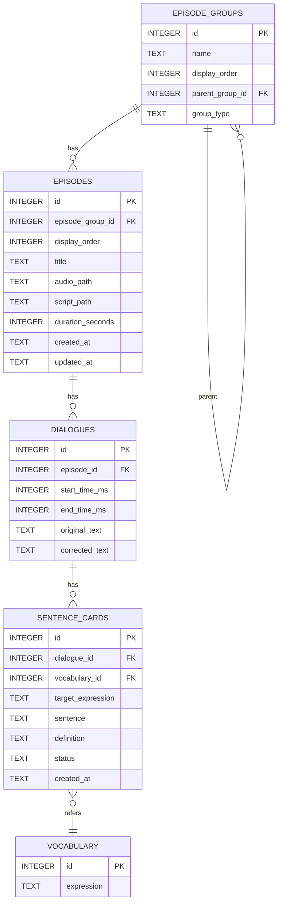

# Immersion Learning 自動支援アプリ v1.0 技術仕様書

## 1. 概要 (Overview)

本ドキュメントは「Immersion Learning 自動支援アプリ ver1」の技術的な仕様を定義するものである。要件定義書に基づき、AI Agentによるコード生成を円滑に行うことを目的として、データ構造、コンポーネント設計、処理フローを明確化する。

### 1.1. システムアーキテクチャ

- **フレームワーク**: Tauri 2.x
  - **バックエンド**: Rust
  - **フロントエンド**: Svelte 5 (SvelteKit, TypeScript)
- **UIライブラリ**: Flowbite Svelte (+ Tailwind CSS)
- **データベース**: SQLite
  - **Tauri SQL Plugin** を利用。DBとの通信はフロントエンドの`Infrastructure`レイヤーに集約する。
- **LLM連携**: Google Gemini API
  - APIキーの秘匿化のため、バックエンド(Rust)からAPIを呼び出すTauriコマンドを実装する。

### 1.2. ディレクトリ構成

Tauriの標準構成とフロントエンドのレイヤードアーキテクチャを組み合わせる。

```plaintext
/
├── src/                      # SvelteKit フロントエンド
│   ├── lib/
│   │   ├── presentation/   # UI層: SvelteコンポーネントとUIロジック
│   │   │   ├── components/   # 再利用可能なUIコンポーネント
│   │   │   ├── types/        # UI表示用データ型
│   │   │   └── ...
│   │   ├── application/    # アプリケーション層: ユースケースと状態管理
│   │   │   ├── usecases/     # ユーザー操作を起点とする処理フロー
│   │   │   └── stores/       # アプリケーション全体の状態(Svelte Stores)
│   │   ├── domain/         # ドメイン層: アプリケーションの核となるルールとデータ構造
│   │   │   ├── entities/     # アプリケーションの核となるデータ型(エンティティ)
│   │   │   └── services/     # ドメイン固有のロジック
│   │   └── infrastructure/ # インフラ層: 外部システムとの連携
│   │       ├── contracts/    # 外部との通信に使われるデータ型(API契約)
│   │       └── repositories/ # DBやRustバックエンドとの通信処理
│   ├── routes/             # SvelteKitのルーティング (Presentation層の一部)
│   │   ├── +page.svelte
│   │   └── episode/[id]/
│   │       └── +page.svelte
│   └── app.html
├── src-tauri/                # Rust バックエンド
│   ├── src/
│   │   ├── main.rs               # エントリーポイント
│   │   ├── db.rs                 # DB関連のTauriコマンド (複雑な処理担当)
│   │   ├── models.rs             # Rust側で扱うデータ構造体
│   │   ├── commands.rs           # ファイルI/OやLLM連携などのTauriコマンド
│   │   └── llm.rs                # LLM API連携関連
│   └── tauri.conf.json
└── ...
```


---

## 2. データベース設計 (Database Schema)

ローカルのSQLiteデータベースに以下のテーブルを定義する。

### ER図 (Mermaid)



### 2.1. `episode_groups` テーブル
エピソードを任意のグループ（入れ子構造可）に分類する。

| カラム名         | 型      | 説明                         |
|------------------|---------|------------------------------|
| `id`             | INTEGER | PRIMARY KEY, AUTOINCREMENT   |
| `name`           | TEXT    | グループ名                   |
| `display_order`  | INTEGER | グループの表示順序           |
| `parent_group_id`| INTEGER | 親グループID（NULLでルート） |
| `group_type`     | TEXT    | グループ種別: "album"（エピソード格納可）または "folder"（サブグループのみ格納可） |

- `parent_group_id`は自己参照外部キー。NULLの場合はルートグループ。
- `group_type` でグループの種別を区別する。`album` はエピソードを格納でき、`folder` はサブグループのみ格納できる。
- 初期状態では`name`が"Default"かつ`parent_group_id`がNULLのグループが1つだけ存在し、`group_type`は`album`とする。

### 2.2. `episodes` テーブル
エピソード（音声コンテンツとスクリプトのセット）を管理する。

| カラム名        | 型          | 説明                               |
|-----------------|-------------|------------------------------------|
| `id`            | INTEGER     | PRIMARY KEY, AUTOINCREMENT         |
| `episode_group_id` | INTEGER  | `episode_groups.id`への外部キー    |
| `display_order` | INTEGER     | グループ内でのエピソードの表示順序 |
| `title`         | TEXT        | エピソードのタイトル               |
| `audio_path`    | TEXT        | 音声ファイルの絶対パス             |
| `script_path`   | TEXT        | スクリプトファイルの絶対パス       |
| `duration_seconds` | INTEGER  | 音声の再生時間（秒）               |
| `created_at`    | TEXT        | 作成日時 (ISO 8601)                |
| `updated_at`    | TEXT        | 更新日時 (ISO 8601)                |

### 2.3. `dialogues` テーブル
スクリプト内の各セリフを管理する。

| カラム名          | 型          | 説明                               |
|-------------------|-------------|------------------------------------|
| `id`              | INTEGER     | PRIMARY KEY, AUTOINCREMENT         |
| `episode_id`      | INTEGER     | `episodes.id`への外部キー          |
| `start_time_ms`   | INTEGER     | セリフの開始時間（ミリ秒）         |
| `end_time_ms`     | INTEGER     | セリフの終了時間（ミリ秒）         |
| `original_text`   | TEXT        | スクリプトから取り込んだ元のテキスト |
| `corrected_text`  | TEXT        | ユーザーが修正した後のテキスト     |

### 2.4. `sentence_cards` テーブル
Sentence Miningによって作成されたカードを管理する。

| カラム名        | 型          | 説明                               |
|-----------------|-------------|------------------------------------|
| `id`            | INTEGER     | PRIMARY KEY, AUTOINCREMENT         |
| `dialogue_id`   | INTEGER     | `dialogues.id`への外部キー         |
| `vocabulary_id` | INTEGER     | `vocabulary.id`への外部キー        |
| `target_expression` | TEXT    | 抽出対象の単語/イディオム          |
| `sentence`      | TEXT        | 抽出対象を含むセンテンス全体       |
| `definition`    | TEXT        | LLMによって生成された意味・説明    |
| `status`        | TEXT        | `active`, `suspended` (保留) などの状態 |
| `created_at`    | TEXT        | 作成日時 (ISO 8601)                |

### 2.5. `vocabulary` テーブル
これまでにSentence Miningされた単語/イディオムのマスターリスト。

- `expression` カラムには FTS5 仮想テーブルを利用し、全文検索インデックスを構築する。
    - これにより、複数単語による柔軟な検索や部分一致検索が可能となる。
    - 例: `CREATE VIRTUAL TABLE vocabulary USING fts5(expression);`
- 単語の順序や部分列一致など、より高度な検索条件（例: "pick up [-]" のようなパターン）は、アプリケーション側でトークン化・フィルタリング処理を行う。
- words テーブルや多対多テーブルは設けず、vocabulary テーブルのみで管理する。

| カラム名       | 型      | 説明                                            |
|----------------|---------|-------------------------------------------------|
| `id`           | INTEGER | PRIMARY KEY, AUTOINCREMENT                      |
| `expression`   | TEXT    | 単語/イディオムの綴り (e.g., "take off")        |

---

## 3. エピソードグループの入れ子構造・エピソード移動

### 3.1. エピソードグループの入れ子構造
- エピソードグループは親子関係を持つツリー構造とする。
- グループ作成・編集時に親グループを指定可能。
- グループ取得APIは子グループも含めて再帰的に返す。
- UIはグループ階層をツリー表示し、サブグループの追加・編集・削除をサポートする。
- グループの階層の深さ制限や循環参照防止のバリデーションを行う。

### 3.2. アプリ初期状態
- データベース初期化時、`name`が"Default"かつ`parent_group_id`がNULLのグループを1つだけ作成する。
- すべてのエピソードは初期状態でこのグループに属する。

### 3.3. エピソードのグループ間移動
- エピソードは任意のグループに所属できる。
- エピソードの`episode_group_id`を更新することで、他のグループへ移動できる。
- UI上でエピソードをドラッグ＆ドロップ等で別グループに移動できる操作を提供する。

---

## 4. フロントエンド レイヤー別責務とAPI設計

### 4.1. フロントエンド レイヤー別責務

- **Presentation (`src/routes`, `src/lib/presentation/`)**: Svelteコンポーネントで構成。ユーザーからの入力を受け取り、`Application`層のユースケースを呼び出す。ユースケースから返された結果や`stores`の状態を画面に描画することに専念する。
- **Application (`src/lib/application/`)**: ユースケースを実装する層。例えば「新しいSentence Cardを作成する」というユースケースは、`Domain`のデータ構造を使い、`Infrastructure`のリポジトリを呼び出して永続化を行う、といった一連の処理フローを定義する。`stores`を用いてUIにまたがる状態を管理する。
- **Domain (`src/lib/domain/`)**: アプリケーションのビジネスロジックの核。外部のライブラリやフレームワークに依存しない、純粋なTypeScriptで記述される。
  - **`entities/`**: アプリケーションの核となるデータ型、エンティティ（例: `Episode`, `SentenceCard`）の型定義。
  - `services/`: ドメイン固有のルールや計算を行うロジック。
- **Infrastructure (`src/lib/infrastructure/`)**: 外部システムとの通信を担当する層。
  - **`contracts/`**: 外部システムとの「契約」を定義するデータ型。Tauriコマンドの引数や戻り値となるData Transfer Object (DTO)などをここに置く。
  - `repositories/`: Tauri SQL Pluginを介したDB操作や、RustバックエンドのTauriコマンドを呼び出す処理を実装する。`Application`層はここのインターフェースを通じて外部と通信する。

### 4.2. バックエンド API (Tauri Commands)

Rustで実装し、フロントエンドの`Infrastructure`レイヤーから呼び出される関数群。
Tauriのプラグインを利用するなどしてフロントエンド側で実装可能と判断したものは、必ずしも Rust 側で実装しなくても良い。

- `get_definition_from_llm(context_sentence: String, target_expression: String) -> Result<String, String>`
- `save_api_key(api_key: String) -> Result<(), String>`
- `get_api_key() -> Result<Option<String>, String>`

### 4.3. データフェッチ・状態管理戦略

本アプリケーションでは、データフェッチおよび状態管理に関して以下の戦略を採用する。

- **原則としてキャッシュレスなデータアクセス**:
  フロントエンドのストア（Svelte Stores）は、データベースに永続化されているデータをキャッシュしない。データはコンポーネントの表示やユーザー操作が必要とするタイミングで、都度`Infrastructure`レイヤーを通じてデータベースから取得（フェッチ）する。

- **背景と理由**:
  バックエンドはローカルのSQLiteデータベースを使用し、ファイルベースのアクセスは極めて高速である。一般的なWebアプリケーションと異なり、ネットワーク遅延を考慮する必要がないため、パフォーマンス向上のためのクライアントサイドキャッシュは不要と判断する。

- **メリット**:
  このアプローチにより、ストア上のキャッシュデータとデータベース上の実データとの間で発生しうる不整合を考慮する必要がなくなり、状態管理のロジックを大幅に簡素化できる。常にデータベースを信頼できる唯一の情報源（Single Source of Truth）として扱う。

- **ストアの責務範囲**:
  `src/lib/application/stores` の責務は、永続化されない「クライアントサイドの状態」の管理に限定する。具体的には、以下のようなデータが対象となる。
    - 複数のコンポーネントにまたがるUIの状態（例: フォームの入力値、選択中のアイテムID、UIの表示/非表示フラグなど）
    - APIから一時的に取得した、永続化を前提としないデータ

---

## 5. ファイル管理仕様 (File Management Specification)

本アプリケーションでは、ユーザーがアップロードした音声ファイルおよびスクリプト（SRTファイル）をアプリケーションの管理下にある特定のディレクトリに保存する。
データベースとファイルの整合性を保ち、管理を容易にするため、以下の仕様を定める。

### 5.1. ファイル保存場所 (Storage Location)

* ファイルはTauriのFile System API (`@tauri-apps/api/fs`) を利用し、`BaseDirectory.AppData` を基準ディレクトリとして保存する。
* ユーザーデータの一元管理を容易にするため、`media/episodes/` というサブディレクトリを作成し、その中に全ての関連ファイルを格納する。

### 5.2. ファイル命名規則 (Naming Convention)

* ファイル名の衝突を完全に回避し、OSのファイルシステムで問題となりうる特殊文字を排除するため、**UUID (Universally Unique Identifier) v4** をファイル名のベースとして採用する。
* 音声ファイルとスクリプトファイルは、このUUIDを共有し、拡張子のみが異なる同一のファイル名で保存される。
    * **相対パスの例:** `media/episodes/<UUID>.mp3`
* この`BaseDirectory.AppData`からの**相対パス**を、データベースの `episodes` テーブルにある `audio_path` と `script_path` カラムにそれぞれ保存する。これにより、データベースレコードと実ファイルが一意に紐づけられる。
* 既に同じUUIDのファイルが存在する場合は、新しいUUIDを生成して保存する。

### 5.3. エピソード削除時の処理

* `deleteEpisode` ユースケースは、まずデータベース上のレコードを削除する。
* データベースの削除が成功したら、続けてTypeScript側で `audio_path` と `script_path` に記録されている相対パスのファイルを `BaseDirectory.AppData` から物理的に削除する。これにより、不要なファイルがストレージに残ることを防ぐ。
